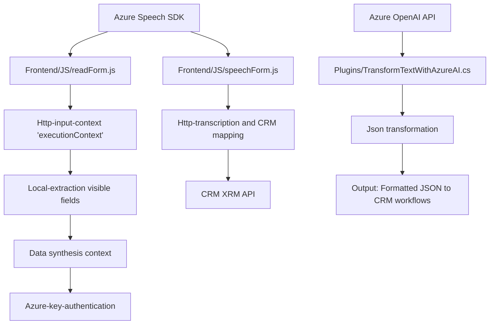

### Breve resumen técnico
El repositorio contiene tres archivos principales que muestran la implementación de una solución tecnológica que integra entrada/salida de voz, transcripción con tecnología avanzada de IA y procesamiento de texto. Utiliza tanto funciones JavaScript orientadas a formularios y con interacción en tiempo real, como un plugin en C# que actúa sobre el ecosistema de Microsoft Dynamics CRM. Entre las tecnologías clave están `Azure Speech SDK` y `Azure OpenAI API`.

---

### Descripción de arquitectura
La funcionalidad general parece estar diseñada siguiendo una arquitectura **modular orientada a microservicios y SDK adaptativos**:
1. **Frontend - Frontend/JS:**
   - Proporciona interacción con la interfaz de usuario y fomenta la simplicidad del código mediante funciones separadas que abarcan tareas específicas.  
   - Integra un servicio de voz (Azure Speech SDK) a través de llamadas dinámicas a un CDN.  

2. **Backend Plugin - Plugins/TransformTextWithAzureAI.cs:**  
   - Aplicación modular diseñada para interactuar en eventos de CRM mediante el patrón de arquitectura **plugin**.  
   - Abstrae el uso de Microsoft Dynamics CRM (`Xrm API`) y realiza llamadas REST específicas a un servicio de IA basado en Azure OpenAI GPT.  

**En conjunto:** La solución está compuesta por módulos independientes que integran un frontend con SDKs y un backend que actúa como una extensión del CRM. Esto sugiere que la arquitectura está diseñada como un **multicapa orientada a servicios**.

---

### Tecnologías usadas
**Frontend (JavaScript):**
- Lenguaje: JavaScript (ES6)
- Frameworks/librerías: 
  - Azure Speech SDK
  - API DOM para manipulación de documentos

**Backend (C#):**
- Lenguaje: C#
- Librerías utilizadas:
  - Sistema integrado de SDK CRM (`Microsoft.Xrm.Sdk`)
  - Integración con external APIs mediante `System.Net.Http`
  - JSON parsing: `System.Text.Json` y potencialmente `Newtonsoft.Json`

**Servicios externos:**
- Azure Speech Services
- Azure OpenAI GPT API

**Patrones:**
- Modularidad
- Callbacks/event-driven (asociado a manejo de eventos asíncronos)
- Facade (simplificación de interacción con APIs externas)
- Plugin-based para CRM

### Diagrama Mermaid

---

### Conclusión final
El repositorio es una **solución modular híbrida** que combina frontend en JavaScript y backend en C# CRM plugins para integrar tecnologías punteras como Azure Speech SDK y Azure OpenAI API. La arquitectura demuestra flexibilidad mediante el uso de SDKs y manejo de APIs dinámico, promoviendo la modularidad y reusabilidad. Es probable que se utilice en entornos empresariales que requieren interacción avanzada (como entrada de voz) y procesamiento de datos inteligente en sistemas CRM.