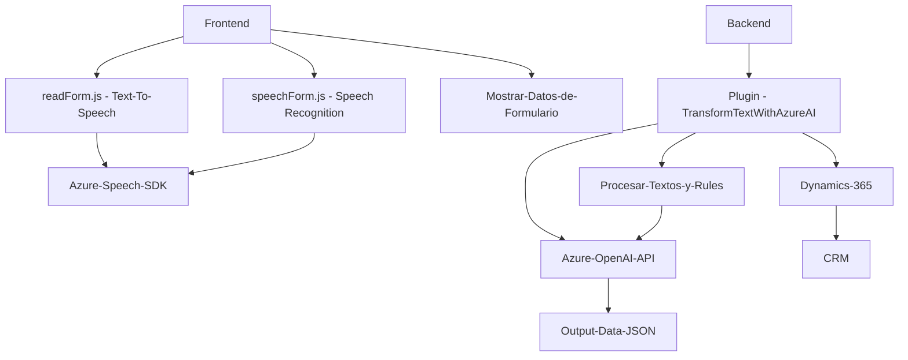

### Breve resumen técnico

El repositorio contiene tres archivos clave:

1. **readForm.js**: Proporciona una funcionalidad para leer los datos visibles de un formulario y realizar una síntesis de texto a voz mediante el SDK de Azure Speech.
2. **speechForm.js**: Implementa el reconocimiento de voz para transcribir el audio en tiempo real, asignando valores a los campos del formulario en un sistema CRM, y utiliza inteligencia artificial para analizar datos y buscar entidades relacionadas.
3. **TransformTextWithAzureAI.cs**: Define un plugin de Dynamics 365 que utiliza la API de Azure OpenAI para transformar texto según normas predefinidas.

---

### Descripción de arquitectura

1. **Arquitectura del sistema**:
   - **Estilo principal**: **Arquitectura basada en microservicios**.
   - Cada componente del repositorio tiene un propósito específico y se comunica mediante APIs o servicios externos (Azure Speech y Azure OpenAI). Esto encaja con las características y beneficios de la arquitectura de microservicios.

2. **Detalles de los componentes**:
   - **Frontend**: Compuesto por `readForm.js` y `speechForm.js`, enfocados en accesibilidad y reconocimiento de comandos para manipular formularios.
   - **Backend**: Compuesto por el plugin `TransformTextWithAzureAI.cs`, diseñado para ser ejecutado por Dynamics 365. Este utiliza la interacción con el servicio externo de Azure OpenAI para procesamiento avanzado de texto.

---

### Tecnologías usadas

1. **Programación Frontend (JS)**:
   - Lenguaje: JavaScript.
   - Integración con **Azure Speech SDK** para síntesis y reconocimiento de voz.
   - Dinámica de páginas web y formularios en contexto CRM (Dynamics 365).

2. **Backend (C#)**:
   - Lenguaje: C#.
   - Framework: **Microsoft.Xrm.Sdk** y **Microsoft.Xrm.Sdk.Query** para trabajar con Dynamics 365.
   - Integración con **Azure OpenAI API** para procesamiento de texto.
   - Uso de bibliotecas estándar como **System.Net.Http**, **Newtonsoft.Json.Linq**, y **System.Text.Json** para manejar solicitudes y respuestas en formato JSON.

3. **Azure Services**:
   - **Azure Speech SDK**: Reconocimiento de entrada de voz, texto a voz.
   - **Azure OpenAI API**: Transformación de texto y generación de respuestas en JSON.

---

### Diagrama Mermaid compatible con GitHub Markdown

---

### Conclusión final

Este repositorio presenta una solución basada en microservicios que busca mejorar la interacción y accesibilidad en entornos CRM mediante tecnología avanzada de reconocimiento de voz y procesamiento de texto asistido por inteligencia artificial. A través de la integración con el SDK de Azure Speech y la API de Azure OpenAI, las funcionalidades abarcan:

- **Text-to-speech** para transmitir información de formularios, promoviendo accesibilidad.
- **Speech recognition** para permitir interacciones con el sistema mediante comandos de voz, optimizando procesos en entornos corporativos.
- **Text transformation** con capacidad para generar respuestas JSON basadas en reglas predefinidas gracias a Azure OpenAI.

La solución muestra una separación efectiva entre frontend y backend, implementa patrones modulares y utiliza servicios externos escalables (Azure). Sin embargo, incluye potenciales áreas de mejora, como el manejo más seguro de claves y configuración dinámica del endpoint de la API externa.