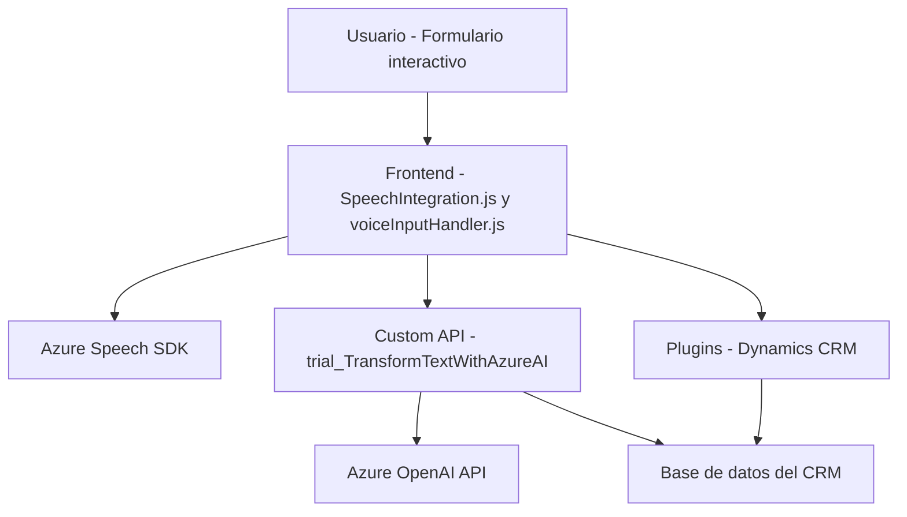

## Breve resumen técnico

El repositorio contiene varios módulos que integran servicios como Azure Speech SDK y Azure OpenAI con formularios interactivos, probablemente de una plataforma CRM como Microsoft Dynamics. El objetivo principal es habilitar funcionalidades de entrada y salida de voz, transformación de texto mediante inteligencia artificial y manipulación de datos en contextos dinámicos. Esto incluye el uso de plugins en .NET para extender la funcionalidad del backend.

---

## Descripción de la arquitectura

La solución parece estar organizada en tres componentes principales:

1. **Frontend**:
    - Implementado en JavaScript, permite interacción directa con los usuarios mediante formularios dinámicos.
    - Facilita el reconocimiento de voz (entrada) y síntesis de voz (salida) utilizando Azure Speech SDK.
    - Modularización orientada hacia tareas específicas, como la extracción de datos de formularios y su aplicación posterior.

2. **Middleware/API personalizada**:
    - Utiliza servicios proporcionados por Azure OpenAI para transformar texto en JSON estructurado.
    - Reside en forma de un plugin que interactúa con Dynamics CRM.
    - Comunica formularios frontend con las APIs externas y el sistema central del CRM.

3. **Dependencia externa**:
    - Servicios de Azure como Speech SDK y OpenAI son la base de las capacidades de voz e inteligencia artificial del sistema.

La arquitectura puede interpretarse como un **sistema de integración n capas**:
- Capa de presentación/control (frontend JavaScript).
- Capa de lógica empresarial (Azure OpenAI a través del plugin .NET).
- Capa de almacenamiento y contexto (formularios y entidades de CRM).

---

## Tecnologías usadas

### Frontend
- **Lenguaje**: JavaScript.
- **SDK externo**: Azure Speech SDK (manipulación dinámica e integración con funciones de entrada/salida de voz).
- Patrones: Modularización funcional y gestión dinámica de SDKs.

### Middleware/API
- **Lenguaje**: C# en .NET Framework.
- **SDK externo**: Azure OpenAI API, Newtonsoft JSON, System.Net.Http.
- **Framework**:
    - Microsoft Dynamics CRM SDK (`IPlugin`).
- Patrones: Plugin pattern y cliente HTTP.

### Otros
- **Servicios principales**:
    - Azure Speech SDK: Reconocimiento y síntesis de voz.
    - Azure OpenAI API: Transformación de texto usando inteligencia artificial.
- **Control de flujo**: Uso de promesas y callbacks para operaciones asíncronas en el frontend.

---

## Diagrama Mermaid

---

## Conclusión final

La solución demuestra ser una integración avanzada que aprovecha servicios de Azure y funciones extendidas en Dynamics CRM para proporcionar una experiencia interactiva basada en voz e inteligencia artificial. Aunque el frontend es relativamente simple y funcional, el verdadero núcleo de la solución radica en la lógica del plugin y en la integración con servicios externos como Azure Speech y OpenAI. Este repositorio representa una arquitectura n capas enfocada en interoperabilidad y procesamiento asíncrono con servicios cloud.