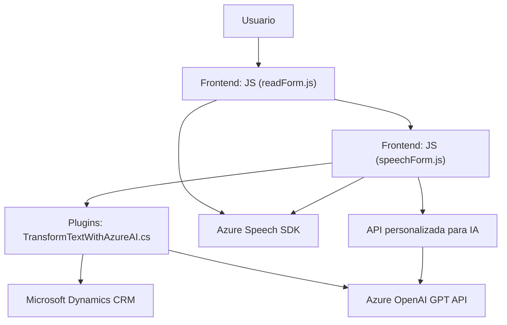

### Breve resumen técnico

El repositorio está dividido en tres componentes: 
1. **Frontend**: implementado en JavaScript, que maneja la interacción entre el usuario y el sistema, ejecuta funciones como lectura de formularios y conversión de texto a voz usando Azure Speech SDK.
2. **Voice Input Functions**: centraliza la lógica relacionada con la parte cognitiva de voz y texto, como reconocimiento de comandos hablados y su procesamiento mediante IA de Azure.
3. **Backend Plugin**: implementado en C#, desarrolla un plugin para Microsoft Dynamics que integra Azure OpenAI Service para transformar texto y manejar la lógica avanzada del sistema CRM.

---

### Descripción de arquitectura
La solución implementa una arquitectura híbrida:
1. **Cliente-Servidor (Para interacción entre el Frontend y el Plugin del backend):**  
   El cliente envía comandos (como datos del formulario y transcripciones habladas) hacia una API o Plugin para ser procesados y recibir respuestas transformadas. 

2. **Orientada a servicios (SOA):**  
   Hace uso extensivo de servicios de terceros externos como Azure Speech SDK y Azure OpenAI Service.

3. **N-capas/MVC:**  
   El backend tiene una capa específica en el plugin que interactúa directamente con Microsoft Dynamics CRM. El frontend actúa siguiendo separación lógica por roles, manteniendo un enfoque modular.

---

### Tecnologías usadas

#### Frontend:
- **Lenguaje:** JavaScript.
- **Framework/SDK:** Azure Speech SDK.
  - Carga dinámica del SDK por medio de la URL pública de Microsoft.
  - Uso para sintetizar texto hablado y ejecutar comandos con reconocimiento de voz.
- **API de Microsoft Dynamics CRM (Xrm):** permite la ejecución de operaciones y manipulación de datos relacionados con el formulario.

#### Backend Plugin:
- **Lenguaje:** C#.
- **Framework/Toolkits:** Microsoft Dynamics CRM SDK.
  - Integration con servicios del CRM para gestión del contexto del formulario.
- **Plataformas externas:**
  - **Azure OpenAI Service** con el modelo GPT, utilizado para procesamiento avanzado de texto siguiendo normas.
- **Librerías de manejo de datos:**
  - `System.Net.Http` para solicitudes HTTP.
  - `System.Text.Json` y `Newtonsoft.Json.Linq` para tratamiento y serialización/deserialización de datos JSON.

---

### Diagrama Mermaid ⬇️

---

### Conclusión final
La solución implementada en el repositorio combina un **frontend** basado en JavaScript con interacción mediante Azure Speech SDK y un **backend** utilizando Microsoft Dynamics CRM SDK. Además, está extensible con el uso de **plugins personalizados** en C# para realizar operaciones complejas y utilizar servicios avanzados como **Azure OpenAI GPT API**.

El diseño híbrido con separadas responsabilidades y alta modularidad define una arquitectura basada en **N-capas**. Destaca la integración con servicios externos y el manejo dinámico de APIs, siguiendo principios de orientación a servicios y separación de intereses (SoC). Es una solución extensible adecuada para sistemas empresariales de alto nivel.