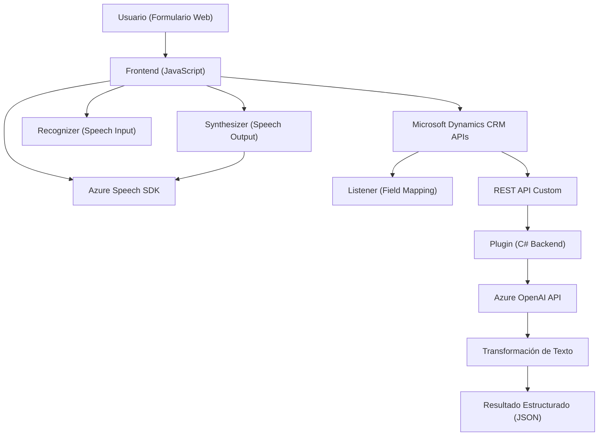

### Breve resumen técnico:
El repositorio contiene tres archivos diferenciados que implementan funcionalidades para sistemas frontend y backend que interactúan con Microsoft Dynamics CRM y los servicios Azure (Speech SDK y OpenAI). Específicamente, los scripts manejan síntesis y reconocimiento de voz, procesamiento de formularios en un entorno CRM, y transformación de texto mediante un plugin que utiliza Azure OpenAI.

---

### Descripción de arquitectura:
La arquitectura general parece ser una **n capas (2-Tier)** con interacción entre frontend y backend sobre APIs de Dynamics CRM y servicios de Azure. La lógica se distribuye en diferentes módulos:
1. **Frontend**:
   - Maneja la interacción del usuario mediante formularios y procesos de voz y texto en el navegador (JavaScript).
   - Carga dinámica de SDKs y eventos asincrónicos permiten manejar dependencias en tiempo de ejecución.
2. **Backend (Plugin/CRM)**:
   - Implementa procesamiento de texto avanzado usando Azure OpenAI en el contexto de un plugin definido bajo la estructura de Dynamics CRM.
   - Su responsabilidad recae en transformar texto de usuario según normas específicas.

El enfoque de arquitectura está basado en la **integración de servicios externos**, utilizando una separación clara entre capas de presentación (frontend) y procesamiento lógico (plugin en el backend).

---

### Tecnologías usadas:
1. **Frontend**:
   - **JavaScript**: Manejo del DOM, procesamiento de datos de formularios y carga de dependencias.
   - **Azure Speech SDK**: Para síntesis y reconocimiento del habla.
   - **Dynamics CRM context execution APIs**: Proveen acceso a datos del formulario en el frontend.

2. **Backend (plugin)**:
   - **C#/.NET Framework**: Desarrollo del plugin para Dynamics CRM.
   - **Microsoft Dynamics CRM SDK**: Acceso y manipulación de datos de CRM.
   - **Azure OpenAI**: Lógica avanzada para procesar texto mediante servicios de Inteligencia Artificial.
   - **Newtonsoft.Json**: Serialización/deserialización de JSON.
   - **HttpClient** (en C#): Para realizar solicitudes a APIs externas.

---

### Diagrama **Mermaid**:
Representa el flujo general de interacción entre frontend y backend, así como las dependencias externas:

---

### Conclusión final:
La solución integra tecnologías modernas para mejorar la experiencia del usuario en un entorno Dynamics CRM mediante la implementación de módulos de voz (Azure Speech SDK) y procesamiento textual avanzado (Azure OpenAI). La arquitectura n capas asegura una separación de responsabilidades entre frontend y backend, siguiendo principios de modularidad y responsabilidad única. Además, el uso de patrones como **carga dinámica de SDKs**, el mecanismo de plugins en el backend y la interacción asincrónica con APIs externas como Azure destaca la capacidad extensible del sistema.