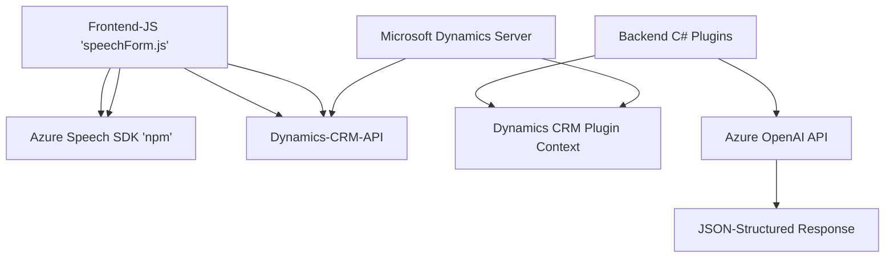

### Breve resumen técnico
El repositorio parece ser una solución híbrida que integra una interfaz web (frontend Javascript) y una arquitectura de servicios (backend con plugins en C#). Está orientada al trabajo con formularios de Microsoft Dynamics CRM, mejorando la interacción a través de sintetización de voz y el procesamiento de texto con IA de Azure (Azure Speech SDK y OpenAI).

---

### Descripción de arquitectura
La arquitectura sigue el patrón clásico de **n capas** combinado con una integración de servicios externos (API de Azure Speech SDK para síntesis y reconocimiento de voz, y Azure OpenAI para procesamiento de texto). Las capas principales son:
- **Frontend**: Realiza la gestión de formularios en Dynamics y sintetiza voz para mejorar la accesibilidad.
- **Backend (Plugins)**: Transformación de texto con Azure OpenAI y gestión con Dynamics CRM SDK.
- **Integrador de servicios externos**: Conexión a SDK y APIs de Azure, como Speech SDK y OpenAI.

Patrones adicionales detectados:
- **Event-driven architecture**: Tanto el frontend como los plugins dependen de eventos específicos (SDK cargado, transcripción perfecta, activación mediante triggers en Dynamics).
- **Lazy Loading**: El Azure Speech SDK sólo se carga cuando se necesita.
- **Protocolos desacoplados**: Los plugins en C# interactúan con Azure OpenAI sin bloquear la lógica interna del CRM.

---

### Tecnologías y frameworks usados
1. **Frontend (Javascript)**:
   - **Frameworks y APIs**:
     - Azure Speech SDK para reconocimiento y síntesis de voz.
     - Microsoft Dynamics API (`Xrm.WebApi`) para el manejo de datos del formulario.
   - **Patrón**: Modular con integración en Dynamics Forms.

2. **Plugins (Backend, C#, .NET)**:
   - Azure OpenAI para transformación de texto.
   - Microsoft Dynamics CRM SDK para interacción con entidades del CRM.
   - Newtonsoft.Json para manejo avanzado de JSON.
   - .NET Framework estándar para manejo de servicios.

3. **Patrones de diseño**:
   - **Adapter pattern**: Ajusta formato de mensajes entre Dynamics CRM y APIs de Azure.
   - **Microservices architecture** (indirecta): Plugins operando como capas de integración con servicios de IA.

---

### Diagrama **Mermaid** válido para GitHub

---

### Conclusión final
Esta solución integra una arquitectura basada en eventos y n capas, específicamente diseñada para Microsoft Dynamics CRM. Mejora la experiencia del usuario mediante accesibilidad basada en voz y procesamiento de texto estructurado con IA. Las tecnologías, libros de trabajo y APIs implementadas (Azure Speech y Azure OpenAI) confirman un enfoque híbrido, potencialmente útil para su implementación en entornos corporativos. Integrar dependencias externas como Azure Speech SDK y Dynamics CRM SDK garantiza flexibilidad y accesibilidad avanzada.