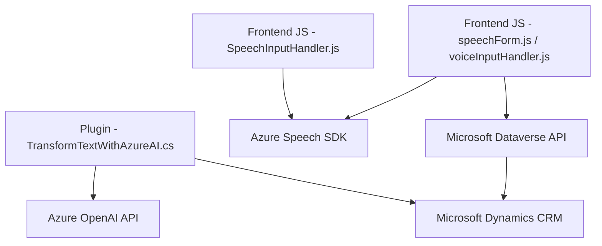

### Análisis Técnico

#### Resumen Técnico:
El repositorio consiste en módulos y scripts diseñados para interactuar con datos de formularios y procesar tanto entrada de voz como texto en sistemas relacionados con Microsoft Dynamics CRM. Se utiliza un enfoque basado en servicios de terceros como **Azure Speech SDK** y **Azure OpenAI**, integrando funcionalidades avanzadas como síntesis de voz, reconocimiento vocal y transformación de texto en estructuras JSON mediante IA.

---

### Descripción de Arquitectura:
La solución tiene componentes que pueden clasificarse como:
1. **Frontend Web Scripts**: Archivos JavaScript utilizados para procesamiento de datos en formularios (entrada de voz, texto).
2. **Backend Plugin**: Plugin personalizado de Dynamics CRM que actúa en el servidor y transforma texto a objetos JSON utilizando servicios como **Azure OpenAI**.

La arquitectura es **n capas** con integración de servicios externos. Las capas identificadas son:
- **Capa Frontend**: Código en JavaScript interactúa directamente con los usuarios y los datos del formulario.
- **Capa Backend**: Plugin en C# que opera en el servidor de Dynamics CRM y procesa datos mediante Azure AI.
- **Capa de Servicios Externos**:
  - **Azure Speech SDK** para entrada y síntesis de voz.
  - **Azure OpenAI** para generación de contenido inteligente basado en texto.

---

### Tecnologías Usadas:
1. **Frontend**:
   - **JavaScript**:
     - Scripts que procesan datos de formularios y trabajan con entrada de voz.
   - **Azure Speech SDK**: Se integra dinámicamente para habilitar entrada de voz y síntesis.
   - **Microsoft Dynamics Dataverse API** (indirecto vía `Xrm.WebApi`).
2. **Plugin Backend**:
   - **C# con Microsoft Dynamics SDK**:
     - Interfaz `IPlugin`.
     - Servicios de organización (`IOrganizationService`) y consultas SQL (`Microsoft.Xrm.Sdk.Query`).
   - **Azure OpenAI**:
     - Servicio GPT-4 integrado mediante llamadas HTTP.
3. **Dependencias compartidas**:
   - **Newtonsoft.Json** y **System.Text.Json**: Manejo de datos JSON.
   - **HTTP API Client**: Conexión con APIs externas.
4. **Patrones**:
   - Principios sólidos como SRP (Single Responsibility Principle) y delegación por callbacks.
   - **Carga dinámica de SDK externo** para garantizar disponibilidad y redundancia.

---

### Diagrama Mermaid

---

### Conclusión Final:
La solución está diseñada para trabajar en sistemas Microsoft Dynamics CRM y se extiende mediante plugins y scripts frontend que integran servicios de inteligencia artificial (Azure AI). La arquitectura de **n capas** y el uso de servicios externos es adecuada para soportar la interacción avanzada con formularios mediante voz y manipulación de texto. Además, fomenta la separación de responsabilidades entre frontend y backend, asegurando robustez en el desarrollo y mantenimiento.

La implementación puede beneficiarse de:
1. **Optimización de acceso API**: Centralización de claves e implementaciones seguras.
2. **Modularización**: Inclusión de pruebas unitarias y funcionalidades desacopladas para mejorar mantenibilidad.
3. **Escalabilidad**: Potencial migración a una arquitectura más distribuida (Microservicios) si los volúmenes de procesamiento crecen.