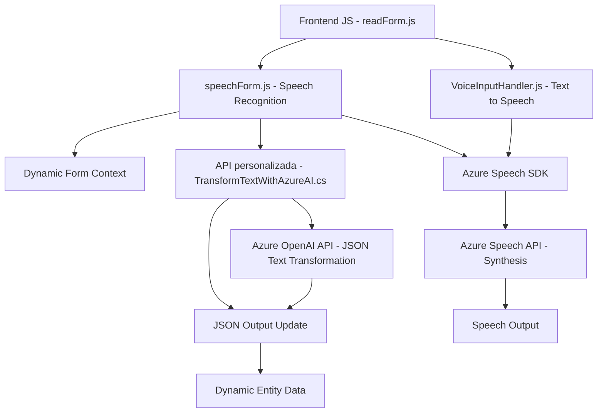

### Resumen técnico
El repositorio contiene archivos que integran un frontend (JavaScript) y un plugin backend (.NET) para trabajar con formularios en un entorno de CRM (Customer Relationship Management) como Microsoft Dynamics. Los archivos implementan funcionalidades avanzadas como reconocimiento y síntesis de voz, inteligencia artificial, y transformaciones estructuradas de texto usando Azure Speech SDK y Azure OpenAI.

---

### Descripción de arquitectura
La solución sigue una arquitectura híbrida combinando:
- **Multicapa (n capas):** Separación de responsabilidades en frontend y backend y comunicación con APIs externas (Azure Speech, Azure OpenAI).
- **Integración de servicios externos:** El backend actúa como middleware entre Dynamics CRM y los servicios de procesamiento de texto con Azure OpenAI.
- **Patrones de carga dinámica y modularidad:** Los scripts de JavaScript cargan SDK y procesan eventos en tiempo de ejecución para mejorar la eficiencia.
- **Plugins escalables:** Para operaciones personalizadas en entornos de Dynamics CRM.

---

### Tecnologías usadas
- **Frontend:** JavaScript con Azure Speech SDK, Dynamic Form Context.
- **Backend:** C# .NET usando plugins de Dynamics CRM con integración hacia Azure OpenAI API.
- **SDK utilizados:**
  - Azure Speech SDK: Reconocimiento y síntesis de voz.
  - XRM SDK: Manipulación de entidades y formularios en Dynamics CRM.
- **APIs externas:**
  - Azure OpenAI API: Procesamiento avanzado de texto con modelos GPT.
- **Patrones implementados:**
  - Modularidad funcional por archivo y método.
  - Observador indirecto para cargar dinámicamente dependencias (SDK).
  - Servicio Plugin para extender eventos internos de CRM.

---

### Diagrama Mermaid válido para GitHub

---

### Conclusión final
La solución combina tecnologías frontend y backend para añadir funcionalidades avanzadas de reconocimiento/síntesis de voz y procesamiento de texto en un entorno de CRM, utilizando Azure Speech SDK y Azure OpenAI. Sigue una arquitectura modular con capas bien definidas y patrones de integración robustos. Este diseño habilita la extensibilidad y escalabilidad para múltiples escenarios empresariales basados en automatización y colaboración humano-máquina.