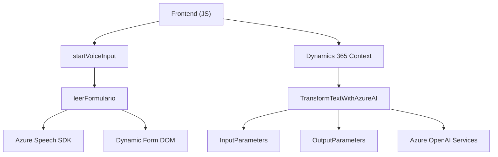

### Breve resumen técnico

1. **Tipo de solución:** Este repositorio forma parte de una solución integrada que contiene:
   - Un frontend manejando la interacción con formularios y entrada de voz en Dynamics 365 Customer Engagement.
   - Un backend que extiende la funcionalidad de Dynamics mediante un plug-in para procesar texto con Azure OpenAI.

2. **Tecnologías y frameworks usados:**
   - **Frontend:** 
     - JavaScript (modular, dinámico).
     - Azure Speech SDK para reconocimiento y síntesis de voz.
   - **Backend:**
     - C# en el contexto del Microsoft Dynamics CRM API/SDK.
     - Azure OpenAI Services para transformación de texto.
   - **Contexto adicional:** Dependencias internas para interacción con DOM, promesas y llamadas HTTP en el frontend. En el backend, uso de SDKs y librerías para manipulación de JSON.

3. **Arquitectura usada:**
   - **Frontend:** Modular orientado a funciones, siguiendo una arquitectura basada en facades y callbacks/promesas.
   - **Backend:** Componente orientado a plug-ins con una integración tipo microservicio externa (Azure OpenAI).

4. **Dependencias detectadas:**
   - **Externas:** Azure Speech SDK, Azure OpenAI, Dynamics CRM SDK.
   - **Internas:** Lógicas del DOM y mapeo de campos/formularios en Dynamics.

---

### Descripción de arquitectura

La solución tiene una arquitectura separada para el frontend y el backend.

- **Frontend:**
  Es una estructura modular que utiliza funciones específicas para la interacción con formularios en Dynamics y la síntesis de voz. Sigue patrones de encapsulación y orquestación basada en facades (`startVoiceInput`) y promesas. No hay una separación de capas explícita, pero la interacción con dependencias externas (Azure Speech SDK) está bien organizada.

- **Backend:**
  Implementa plug-ins para Dynamics CRM, siguiendo el patrón de diseño basado en `IPlugin`. Está diseñado para integrarse con servicios externos como Azure OpenAI, funcionando como microservicios dentro del mismo contexto del CRM.

---

### Tecnologías usadas

1. **Frontend:**
   - JavaScript (sintaxis ECMAScript moderna).
   - Funciones y promesas asíncronas.
   - Azure Speech SDK (integración dinámica vía `<script>` elemento DOM).

2. **Backend:**
   - C# (.NET Framework) orientado a Dynamics CRM.
   - Azure OpenAI Services para procesamiento de texto.
   - Dynamics SDK para manipulación de datos y contexto del CRM (e.g., `IPlugin`, `InputParameters`).

3. Patrones arquitectónicos específicos:
   - **Facade:** En el frontend, ciertas funciones actúan como puntos de acceso únicos que simplifican la interacción compleja con API externas.
   - **Microservicio:** La integración con Azure OpenAI se comporta como un microservicio aislado.
   - **Callback/promesas:** En el frontend, se manejan asíncronamente las operaciones complejas (SDK).

---

### Diagrama Mermaid

---

### Conclusión final

Esta solución representa una integración avanzada en Dynamics 365 con capacidades ampliadas de inteligencia artificial y procesamiento de voz, que combina frontend modular con un backend basado en plug-ins. La arquitectura está orientada a servicios y presenta una organización sólida en términos de separación de responsabilidades. 

Sin embargo, hay aspectos que pueden optimizarse:
1. **Seguridad:** Externalizar claves de API en configuración protegida.
2. **Error handling:** Incorporar mejores prácticas en el manejo de errores, especialmente en la integración de servicios de Azure.
3. **Separación en módulos:** Implementar un diseño más claro basado en capas podría mejorar la mantenibilidad tanto en frontend como en el backend.

En general, el proyecto está bien estructurado y utiliza tecnologías modernas para llevar a cabo tareas complejas de interacción de voz y procesamiento de datos.