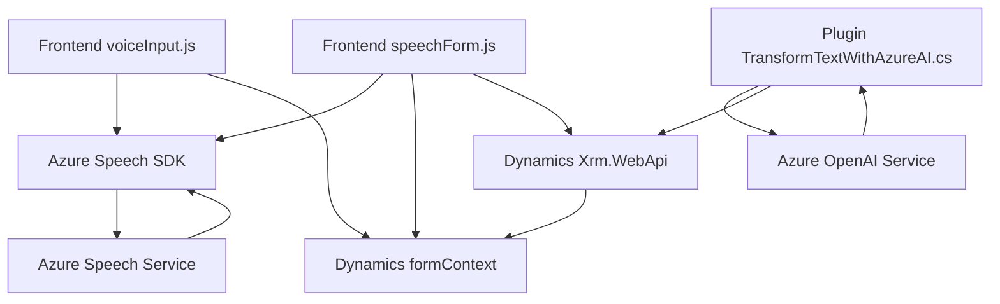

### Breve resumen técnico

Los archivos proporcionados forman parte de una solución que integra reconocimiento y síntesis de voz en un sistema basado en Dynamics CRM, utilizando servicios de Azure (Speech SDK y OpenAI) para mejorar la interacción con los formularios y automatizar el procesamiento de datos. El objetivo de la solución es facilitar la captura y generación de información por medio de voz, además de transformar textual mediante inteligencia artificial.

---

### Descripción de arquitectura

La arquitectura observada está basada en capas y funcionalidades específicas:
1. **Frontend**:
   - Alojado en archivos JavaScript que manejan tanto la interacción con reconocimiento de voz (Speech Recognition) como la síntesis de voz (Text-to-Speech).
   - Modularidad clara con funciones independientes que procesan datos.

2. **Backend**:
   - Implementado como un plugin de Dynamics CRM utilizando el Framework de Plugins (usando la interfaz `IPlugin`).
   - Dependencia directa de un servicio de Azure OpenAI para transformar texto en JSON según reglas personalizadas.

### Tipo de arquitectura
La solución tiene características de arquitectura **n-capas**:
1. **Capa de presentación**: Representada por `voiceInput.js` y `speechForm.js`, que interactúan directamente con el usuario y los servicios de Azure Speech SDK.
2. **Capa de aplicación**: Representada por el plugin `TransformTextWithAzureAI.cs` que orquesta y conecta el procesamiento textual con Azure OpenAI Service.
3. **Capa de integración**: Comunicación directa con Dynamics CRM y servicios de Azure conforme a las necesidades de la solución.

---

### Tecnologías usadas

1. **Frontend**
   - **JavaScript**: Lenguaje principal en los archivos `voiceInput.js` y `speechForm.js`.
   - **Azure Speech SDK**: Biblioteca para reconocimiento y síntesis de voz.
   - **Dynamics CRM API**: Acceso y manipulación de entidades del CRM con el objeto `formContext`.
   
2. **Backend**
   - **C# con Dynamics Plugin Framework** (`Microsoft.Xrm.Sdk`).
   - **Azure OpenAI Service**: Procesamiento y transformación textual con IA generativa.
   - **JSON Libraries**:
     - `System.Text.Json` y `Newtonsoft.Json.Linq`.

3. **Servicios externos**
   - Azure Speech Service.
   - Azure OpenAI Service.

---

### Dependencias o componentes externos

1. **Azure Speech SDK**: Reconocimiento de voz y síntesis de texto en tiempo real.
2. **Dynamics CRM APIs**:
   - `formContext` para manejar datos del formulario.
   - `Xrm.WebApi` para comunicación con entidades de Dynamics.
3. **Azure OpenAI Service**: Transformación de texto basado en inteligencia artificial.
4. **HTTP Requests y JSON Management**: Manejo de solicitudes externas hacia servicios de Azure OpenAI y manipulación de datos JSON.

---

### Diagrama Mermaid

---

### Conclusión final

La solución está diseñada para aprovechar los servicios cloud de Azure y las capacidades de Dynamics CRM, consolidando tecnologías frontend y backend en una arquitectura **n-capas**. Este diseño permite una alta modularidad y un enfoque orientado a servicios. La integración transparente con SDK externos (Speech SDK y OpenAI) y Dynamics hace que esta solución sea escalable y efectiva para aplicaciones de interacción con voz y procesamiento avanzado de datos.