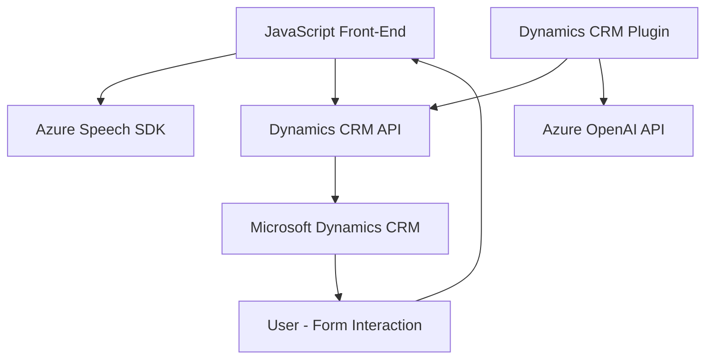

# Breve Resumen Técnico

El conjunto de archivos y su estructura comprenden una solución orientada al procesamiento de voz, texto y formulación en un sistema CRM (Microsoft Dynamics), con interacción de servicios externos (Azure Speech SDK y Azure OpenAI API). La arquitectura combina la modularidad y los patrones de integración orientados a servicios para facilitar la interacción con APIs externas y sistemas clientes.

---

# Descripción de Arquitectura

La solución incluye diferentes componentes enfocados en funcionalidades específicas:

1. **Front-End**:
    - Implementación en JavaScript para interactuar con formularios de Dynamics CRM, permitir entrada de voz, transcripción y síntesis de audio usando herramientas como Azure Speech SDK. 
    - Modularización funcional que organiza tareas específicas como manipulación de datos de formularios visibles, lógica de reconocimiento de voz, síntesis de texto, e integración con Azure Speech SDK.

2. **Plugin (Back-End)**:
    - Implementación como un **plugin para Microsoft Dynamics CRM** capaz de procesar texto mediante Azure OpenAI API, transformándolo según normas predefinidas. 
    - Se adhiere al patrón de responsabilidad única y utiliza API web para realizar llamadas al servicio de IA de Azure.

La arquitectura representada es similar a una **n-capas**, donde:
- La capa del cliente (Front-End) interactúa con formularios.
- Los servicios externos se integran desde APIs tales como Azure Speech SDK y Azure OpenAI API.
- El núcleo del sistema CRM proporciona la lógica principal para manejar plugins y comunicación entre servicios.

Se evidencia el uso de patrones como:
- **Facade** en el procesamiento de voz (centralización de tareas en funciones como `startVoiceInput`).
- **Plugin-Based Design**, típico de la arquitectura de extensibilidad de Dynamics CRM.
- **SOA (Service-Oriented Architecture)**: Componentes que interactúan mediante servicios externos (Speech SDK y OpenAI API).

---

# Tecnologías Usadas

### Front-End
1. **JavaScript**:
   - Funciones asíncronas (`async/await`) y promesas.
   - Manipulación del DOM (`document`, `createElement`, etc.).
2. **Azure Speech SDK**: Realiza reconocimiento y síntesis de voz.
3. **Microsoft Dynamics SDK**: Contexto del formulario gestionado mediante `formContext`.

### Back-End
1. **Microsoft Dynamics Framework**: Uso de la interfaz `IPlugin`.
2. **Azure OpenAI API**: Para transformar texto y estructurarlo.
3. **C# (.NET)**:
   - Clases de Manejadores de Plugins (**Dynamics SDK**).
   - Manejo de JSON estructurado con `System.Text.Json` y `Newtonsoft.Json`.
   - Integración con HTTP usando `HttpClient`.

### Protocolo HTTP
- Uso de REST APIs para integrar servicios externos como Azure Speech SDK y Azure OpenAI API.
- Manejo de configuración basada en regiones y claves API.

---

# Diagrama Mermaid

---

# Conclusión Final

La solución presentada construida sobre Microsoft Dynamics CRM está notablemente orientada a tareas específicas tanto en el cliente (front-end) como en el servidor (back-end), usando patrones modernos como Facade y Plugin Design para organizar el flujo de operaciones. Además, sus dependencias externas (Azure Speech SDK y Azure OpenAI API) y la arquitectura n-capas claramente delimitada representan una integración eficiente con servicios en la nube, principalmente usados para reconocimiento y procesamiento avanzado de voz y texto.

Este enfoque hace que la solución sea escalable al permitir extender funcionalidades (mediante plugins) o mejorar servicios mediante cambios en las configuraciones de la API. A pesar de la modularidad, la dependencia central en Dynamics CRM y servicios externos podría ser un punto crítico para asegurar disponibilidad y escalabilidad.