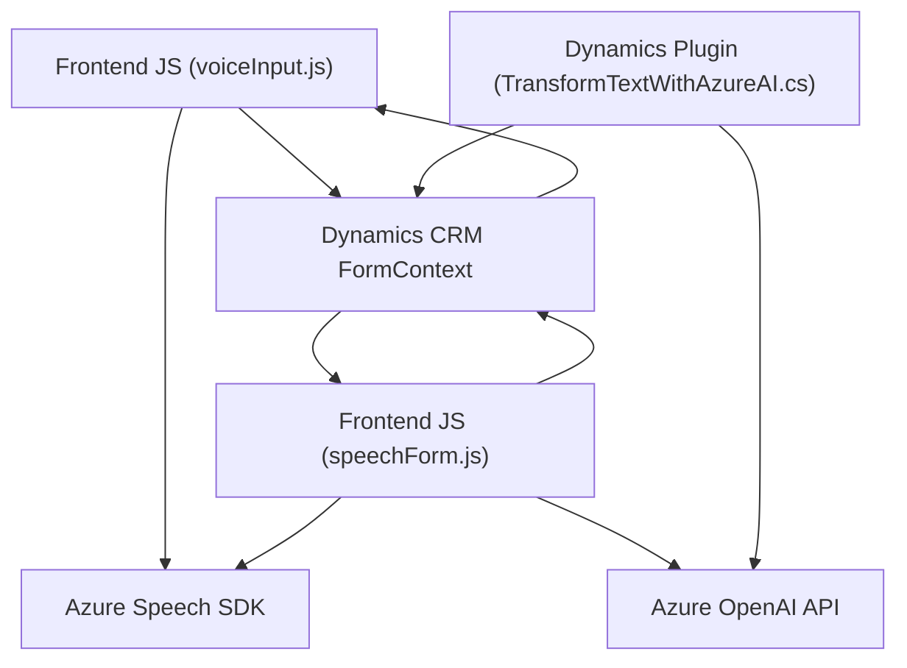

### Breve resumen técnico
El repositorio contiene archivos que implementan funcionalidades relacionadas con la interacción de formularios y datos mediante reconocimiento de voz, síntesis de texto a voz, y manipulación de datos con servicios de nube como Azure Speech SDK y Azure OpenAI API. Además, integra plugins para Dynamics CRM con APIs externas y sigue una estructura modular y funcional.

---

### Descripción de arquitectura
1. **Tipo de solución**: Este repositorio parece ser parte de un sistema híbrido que conecta el front-end (en JavaScript) y el back-end basado en Dynamics CRM (C# Plugin). La funcionalidad está enfocada en la interacción con formularios en una plataforma CRM. 
   - *Front-end*: JavaScript interactúa con la interfaz del usuario y la API de Azure Speech SDK.
   - *Back-end*: Dynamics CRM Plugin (`TransformTextWithAzureAI.cs`) es responsable de procesar los datos de entrada y realizar llamadas a la Azure OpenAI API para estructurar la información.

2. **Arquitectura software**:
   - A nivel general, la solución sigue una **arquitectura de n-capas**, ya que separa la lógica de negocio (plugins en C#), interacción con cliente (JavaScript frontend) y servicios externos (Azure Speech SDK, Azure OpenAI API).
   - Dentro de cada componente, se usan patrones como **modularización funcional** en el frontend, y **Plugin Architecture** en CRM.

---

### Tecnologías y frameworks usados
1. **Front-end:**
   - Lenguaje: JavaScript.
   - Framework: Potencial uso del modelo de DOM de Dynamics CRM.
   - Servicio externo: Azure Speech SDK (para interacción de voz y síntesis de texto).
   - API de interacción interna: `Xrm.WebApi.online.execute` para llamada integrada al CRM.

2. **Back-end:**
   - Lenguaje: C#.
   - Framework: Microsoft Dynamics CRM SDK.
   - Servicio externo: Azure OpenAI API.
   - Dependencias:
     - `System.Net.Http`: Para manejo de comunicación HTTP.
     - `System.Text.Json` y `Newtonsoft.Json.Linq`: Para manipulación de JSON.

---

### Dependencias y componentes externos
- **Azure Speech SDK**: Carga en tiempo de ejecución desde una URL pública. Es responsable de la síntesis y reconocimiento de voz.
- **Azure OpenAI API**: Usada por el plugin para estructura y transformación de texto.
- **Microsoft Dynamics CRM SDK**: Critical para la integración con Dynamics CRM en el back-end.
- **Formulario CRM**: El contexto del formulario es la base sobre la cual opera la funcionalidad del frontend y del plugin.

---

### Diagrama Mermaid compatible con GitHub Markdown

---

### Conclusión final
La solución en este repositorio es una mezcla de frontend en JavaScript y un backend en forma de plugins para Dynamics CRM en C#, ambos haciendo uso de servicios cloud (Azure Speech SDK y Azure OpenAI API). Se implementan patrones comunes como modularización en el frontend y arquitectura basada en Plugins en CRM. El enfoque parece orientado hacia una arquitectura híbrida y funcional en capas, adecuada para escenarios empresariales con integración en sistemas CRM.