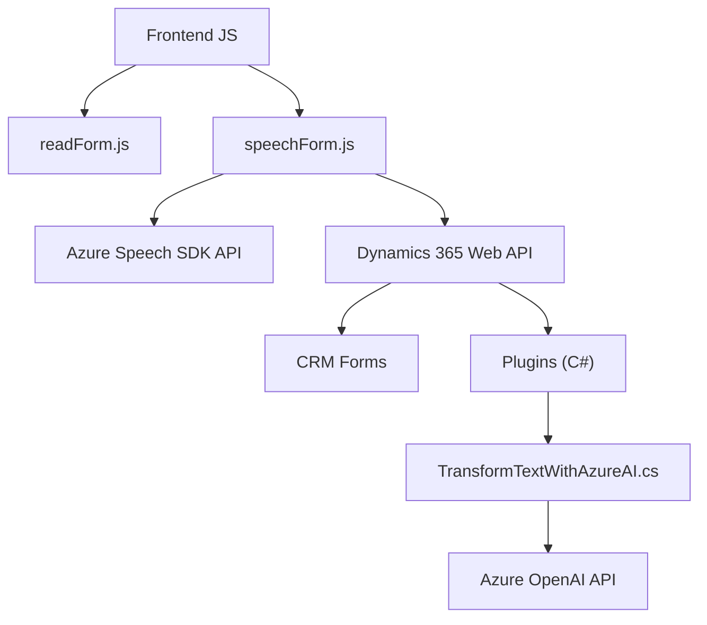

### Breve resumen técnico
El repositorio presenta una solución integrada que combina funcionalidad frontend con integración de servicios de backend. Los componentes proporcionados interactúan mediante llamadas a SDKs de Azure y a servicios de Dynamics CRM. Los archivos implementan funcionalidades que procesan datos del usuario, integran reconocimiento de voz, permiten transformaciones semánticas mediante IA y actualizan dinámicamente formularios y registros en un sistema CRM.

---

### Descripción de arquitectura
La solución implementa una arquitectura **multicapa** que sigue un modelo híbrido entre aplicaciones **n-capas** y **hexagonal**, combinando componentes frontend (JavaScript) con lógica backend (C# Plugins) sin ser completamente desacoplados. Estos componentes, aunque modulares, dependen directamente de servicios externos como el SDK de Azure Speech, APIs personalizadas, y el sistema Dynamics CRM.

#### Capas identificadas:
1. **Capa de Presentación (Frontend):**
   - Archivos JS como `readForm.js` y `speechForm.js` contienen lógica del cliente para interacción basada en voz y actualización de datos en formularios interactivos.
   - Uso de funciones como `startVoiceInput` o `processTranscript` para transformar la entrada hablada en operaciones dinámicas sobre formularios.

2. **Capa de servicio/aplicación:**
   - API de Azure OpenAI se utiliza para la transformación de datos textuales según reglas específicas (ej. del plugin en C# `TransformTextWithAzureAI`).
   - Azure Speech SDK para procesamiento de texto a voz y reconocimiento de entrada hablada.

3. **Capa de almacenamiento/datos (CRM Backend):**
   - Integración directa con Dynamics 365 CRM utilizando interfaces como `IOrganizationService` y `IPluginExecutionContext` para interactuar con los datos del sistema.

---

### Tecnologías usadas
1. **Frontend:**
   - **JavaScript:** Para el desarrollo del cliente web interactivo.
   - **Azure Speech SDK:** Procesamiento de entrada de texto o síntesis de voz.

2. **Backend:**
   - **C#** (Microsoft Dynamics Plugin Architecture): Implementa lógica que interactúa con Dynamics CRM.
   - **Azure OpenAI API:** Propósito de AI semántica para procesamiento de texto.
   - **ASP.NET Ecosystem (IServiceProvider, IOrganizationService, etc.):** Para interacción con Dynamics y contextos server-side.

3. **Dependencias y Servicios Externos:**
   - `Azure Speech SDK API`: Lógica de síntesis de voz y reconocimiento.
   - `Azure OpenAI API`: Procesamiento de texto usando IA y consumo de servicios POST.
   - `Dynamics 365 Web API`: Interacción directa con datos y servicios de CRM.
   - Serialización JSON (System.Text.Json, JSON.Net).

4. **Patrones:**
   - **Patrón API Gateway:** Comunicación dinámica entre frontend, servicios externos, y backend centralizado (Dynamics CRM / Plugin).
   - **Carga dinámica de dependencias:** Arquitectura que permite importar bibliotecas externas como Azure Speech SDK de manera dinámica.
   - **Desacoplamiento por interfaces:** En el plugin `TransformTextWithAzureAI`, se observa que las clases están desacopladas en entidades individuales.

---

### Diagrama Mermaid

---

### Conclusión final
Esta solución combina un frontend basado en JavaScript que interactúa con Azure Speech SDK y Dynamics CRM para procesamiento de formularios mediante entrada de voz. La arquitectura, aunque modular, presenta una dependencia significativa de servicios externos (Azure SDK y APIs Dynamics/OpenAI), y está orientada a un entorno de CRM empresarial. Su diseño sigue patrones como arquitectura de **plugins**, **n-capas** y una integración flexible con servicios REST y SDK dinámicos. 

Hay margen para mejorar en términos de acoplamiento, por ejemplo, separando las dependencias de las capas con ayuda de patrones como la **arquitectura hexagonal**, lo que permitiría un mayor desacoplamiento y extensibilidad del sistema frente a cambios en los proveedores.