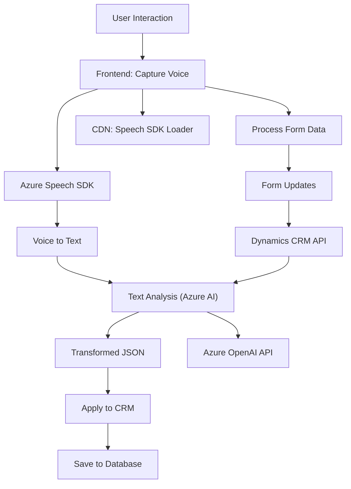

### Breve resumen técnico:
El repositorio contiene código para una solución empresarial compuesta por varios módulos que interactúan con Dynamics CRM. La funcionalidad incluye el procesamiento de voz (usando Azure Speech SDK), transformación de datos con Azure OpenAI y manipulación directa de formularios en el sistema CRM. Estas capacidades sugieren un sistema híbrido con módulos frontend y backend, en conexión con servicios externos de Azure.

---

### Descripción de arquitectura:
La arquitectura utiliza un enfoque **modular** y **basado en eventos**. En el frontend, está estructurado alrededor de la interacción entre formularios de Dynamics CRM y el SDK de Azure Speech. En el backend, se utiliza un plugin para Dynamics CRM que conecta con Azure OpenAI, transformando datos y regresándolos en un formato procesable. Dado que se integran diferentes componentes (frontend, SDK, APIs externas), la solución toma aspectos de **arquitectura de servicios**.

#### Características arquitectónicas:
1. **Frontend Modular:** Funciones específicas para captura y síntesis de voz, así como actualización de formularios.
2. **Integración de APIs Externas:** SDK de Azure Speech y servicios de Azure OpenAI conectados de manera dinámica.
3. **Plugin en Dynamics CRM:** Backend que ejecuta lógica personalizada y consume servicios AI.
4. **Lazy Loading:** En el frontend, algunas dependencias como el SDK de Azure Speech son cargadas dinámicamente desde CDNs.
5. **Microservicio y eventos:** Aunque no es un diseño completamente desacoplado, la interacción en el backend y frontend usa patrones de microinteracciones vía APIs.

---

### Tecnologías utilizadas:
1. **Frontend:**
   - **Azure Speech SDK**: Para captura de voz y síntesis de texto.
   - **Browser APIs**: Manipulación DOM y carga dinámica de scripts.
   - **JavaScript ES6**: Lógica de aplicación modular.
   - **Dynamics CRM Web API**: Para manipulación de formularios y llamadas a servicios web.

2. **Backend:**
   - **Azure OpenAI API**: Consume servicios AI para transformación de texto en JSON estructurado.
   - **Microsoft.Xrm.Sdk**: Framework SDK para extensiones en Dynamics CRM.
   - **Newtonsoft.Json** y **System.Text.Json**: Procesamiento JSON.
   - **System.Net.Http**: Comunicación HTTP para la API de Azure OpenAI.

3. **General:**
   - Utilización de CDN para carga de dependencias externas.
   - Interacción con plugins CRM y recursos en tiempo de ejecución.

---

### Diagrama Mermaid:

---

### Conclusión final:
El repositorio implementa una solución empresarial que conecta la captura y procesamiento de voz con la manipulación de formularios y servicios de inteligencia artificial. La arquitectura sigue principios de modularidad y desacoplamiento, utilizando SDKs dinámicos y APIs externas. Aunque no es completamente un sistema basado en microservicios, la integración de servicios externos permite ampliar su funcionalidad fácilmente. Se recomienda documentar claramente los requisitos de las dependencias externas (como claves de Azure) para garantizar una implementación sin problemas.