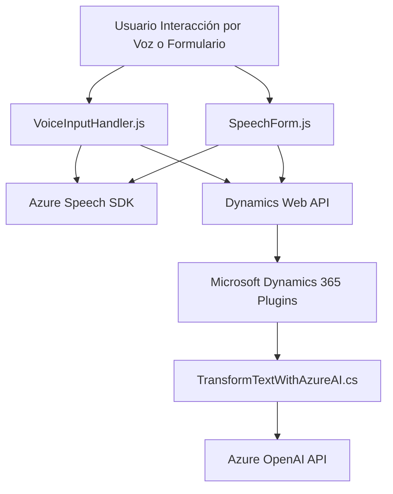

### Resumen técnico:
El repositorio contiene archivos que implementan funcionalidades avanzadas utilizando voz y texto en aplicaciones integradas con **Microsoft Dynamics 365**. La solución se conecta con servicios externos (como Azure Speech SDK y Azure OpenAI) para entrada/salida de voz, procesamiento y transformación de texto.

---

### Descripción de arquitectura:
- **Tipo de solución**: La solución es **híbrida**. Incluye componentes para frontend (lógica en JavaScript para manejar formularios) y backend (plugin en C# para Dynamics CRM).
  
- **Arquitectura**:
  - **Frontend**: Se observa una arquitectura modular centrada en la reutilización de funciones.
  - **Backend**: El plugin adopta el **patrón de desarrollo de Dynamics CRM**, con funciones específicamente diseñadas para interactuar con Dynamics 365 y Azure OpenAI.
  - **Global**: En conjunto, se alinea con un enfoque orientado a servicios (**SOA**) y podría ser extendida hacia **microservicios** debido a la integración con APIs externas.

---

### Tecnologías usadas:
1. **Frontend**:
   - **JavaScript**:
     - Modularización de funciones para extracción y síntesis de datos.
     - Uso de **callbacks** y promesas para manejar asincronismo.
   - **Framework o Servicio Externo**:
     - **Azure Speech SDK**: Para síntesis y reconocimiento de voz.
     - **Dynamics Web API**: Para manipulación de formularios en Dynamics 365.

2. **Backend**:
   - **C# Plugin**:
     - **Microsoft Dynamics CRM SDK**: Para integrar los datos de CRM en el flujo de trabajo.
     - **Azure OpenAI API**:
       - Comunicación HTTP usando `System.Net.Http`.
       - Consumo de modelos avanzados (`gpt-4o`) para transformación del texto.
   - **Manipulación JSON**:
     - `Newtonsoft.Json.Linq` y `System.Text.Json`.

3. **Patrones arquitectónicos**:
   - **Integración con servicios externos**: Uso de SDK y API.
   - **Separación de responsabilidades**: Modularidad en el código que separa funcionalidades como cargar SDK, leer datos y sintetizar voz.

---

### Dependencias o componentes externos:
1. **Azure Speech SDK**:
   - Funcionalidades: Síntesis de voz, reconocimiento de texto.
   - Requiere clave API y región configurada.

2. **Dynamics Web API**:
   - Operaciones sobre entidades del formulario.

3. **Azure OpenAI API**:
   - Consumo de IA avanzada para transformación del texto.
   - Requiere configuración segura de claves y regiones.

4. **Librerías auxiliares**:
   - `System.Net.Http`: Necesaria para la comunicación cliente-servidor con Azure.
   - `Newtonsoft.Json`: Manejo avanzado de datos JSON.

5. **Entorno Dynamics 365**:
   - Contexto del formulario (`executionContext`) para actualizar campos.

---

### Diagrama Mermaid válido para GitHub:

---

### Conclusión final:
El repositorio proporciona una solución avanzada que combina componentes de **frontend** y **backend**, integrando APIs de Azure y Dynamics 365 para potenciar capacidades de voz y procesamiento de texto. Su arquitectura modular facilita la integración en proyectos más grandes basados en **SOA** o **microservicios**. Sin embargo, las dependencias con servicios externos, como las de Azure, requieren un manejo de seguridad y estabilidad cuidadoso, especialmente para claves API y configuraciones regionales.