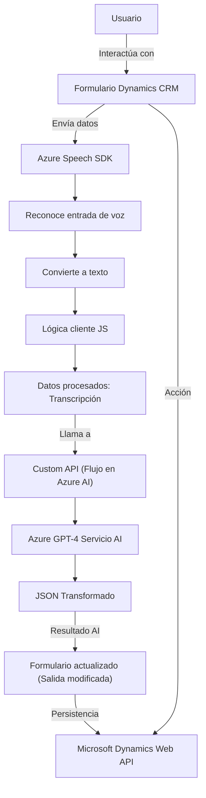

### Breve resumen técnico

La estructura presentada define un sistema compuesto por distintos módulos que colaboran en integrar funcionalidades de procesamiento de voz y texto con servicios de Microsoft Dynamics CRM y Azure. Los archivos muestran una solución híbrida que incluye elementos de frontend en JavaScript para diseño de interacción cliente, y un backend basado en plugins de Dynamics CRM y servicios de IA en Azure para ampliar capacidades.

---

### Descripción de arquitectura

La arquitectura está dirigida hacia **n-capas** con el siguiente enfoque:

1. **Frontend**: Los archivos en `/FRONTEND/JS` representan un cliente JavaScript que interactúa con contextos del formulario en Dynamics CRM, gestionan datos del usuario, y establecen la conexión con Azure Speech SDK para procesamiento de voz.
2. **Backend**: Los plugins, como `TransformTextWithAzureAI.cs`, extienden capacidades de Dynamics CRM mediante lógica personalizada que utiliza Azure OpenAI para realizar transformaciones de texto y devolver JSON estructurado.
3. **Servicios externos**: Se apoya en componentes de Azure, como el Azure Speech SDK para síntesis de voz, y Azure OpenAI para procesamiento de texto basado en IA. También interactúa con APIs personalizadas posiblemente alojadas en servicios HTTP externos.

Lo anterior define una arquitectura con capas que separa claramente las responsabilidades (Frontend para interacción y Backend para lógica pesada). Sin embargo, existe una alta dependencia hacia servicios externos proporcionados por Azure, lo cual podría considerarse como elementos de un enfoque híbrido con características de **Microservicios**.

---

### Tecnologías usadas

1. **Frontend**:
   - **Javascript (ES6)**: Implementa la interacción con formularios y SDKs.
   - **Azure Speech SDK**: Para el reconocimiento, síntesis y transcripción de voz.
   - **Microsoft Dynamics Web API** (`Xrm.WebApi`): Para operaciones relacionadas con formularios, entidades y datos en Dynamics.

2. **Backend**:
   - **Microsoft Dynamics CRM (Xrm SDK)**: Principal entorno extensible mediante plugins .NET.
   - **Azure OpenAI (GPT-4)**: Servicio IA para transformar texto.
   - **Librerías en .NET**:
     - `Newtonsoft.Json` o `System.Text.Json` para procesamiento JSON.
     - `Regex` y `LINQ` para manipulación textual.
     - `HttpClient` para realizar peticiones HTTP hacia Azure.

3. **Patrones**:
   - **Modularidad**: Funciones y clases tienen asignaciones de responsabilidades específicas.
   - **Interacción basada en contexto**: Uso de `executionContext` para operaciones relacionadas con el formulario y su estado dinámico.
   - **Integración desacoplada**: Uso de servicios externos como Azure y APIs personalizadas sin acoplamiento directo a la arquitectura.

---

### Diagrama Mermaid

---

### Conclusión final

La solución presentada es un **sistema n-capas** que extiende las capacidades de Microsoft Dynamics CRM utilizando tanto frontend basado en JavaScript como backend mediante plugins en .NET. Destaca por su integración con servicios de Azure como Speech SDK y OpenAI para implementar funcionalidades de procesamiento de voz y transformación de texto con inteligencia artificial.

Esta arquitectura está bien diseñada en términos de modularidad y separación de responsabilidades. Podría beneficiarse de un nivel más profundo de gestión para desacoplar la dependencia hacia Azure y mejorar la integración entre los diversos módulos mediante herramientas más modernas de microservicios o event-driven architectures. También es recomendable analizar el impacto de la latencia y disponibilidad de servicios externos en el tiempo de respuesta de la solución final.