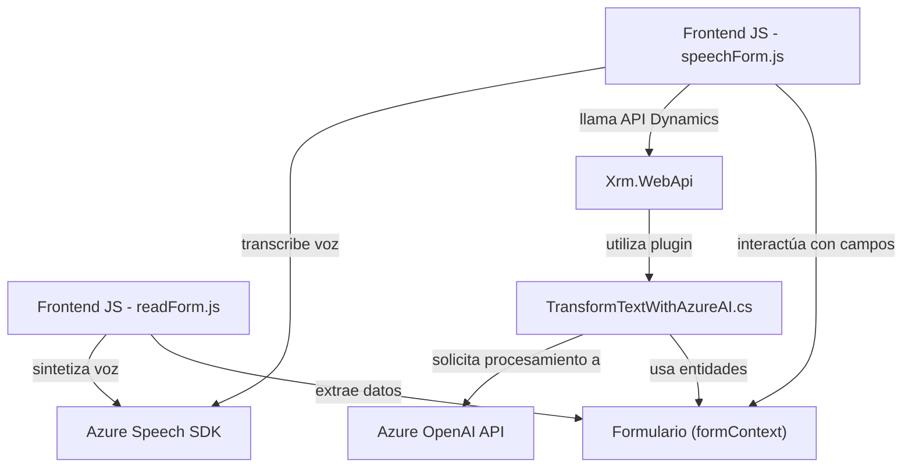

## Breve resumen técnico

La solución se compone de una serie de archivos que implementan funcionalidades orientadas a la integración entre un sistema CRM (Dynamics) y servicios externos, como Azure Speech SDK y Azure OpenAI. La solución tiene como objetivo mejorar la experiencia de usuario en el entorno del CRM, proporcionando capacidades de reconocimiento de voz, síntesis de voz, y procesamiento de texto mediante inteligencia artificial.

---

## Descripción de la arquitectura

La arquitectura combina módulos de frontend y plugins en una configuración **n-capas** tradicional que interactúa con un sistema CRM (Dynamics) en el backend, además de dependencias con servicios externos (Azure). Los archivos de JavaScript (`readForm.js`, `speechForm.js`) se integran en el frontend al trabajar directamente con los atributos y contexto del formulario. El archivo C# del plugin (`TransformTextWithAzureAI.cs`) actúa en el backend como una extensión que interactúa con servicios como Dynamics CRM y Azure OpenAI API.

Esta arquitectura puede ser clasificada como **n-capas orientada al servicio**, ya que se divide claramente en capas de presentación, lógica de negocio y acceso a datos, aprovechando servicios externos para funcionalidad avanzada.

---

## Tecnologías usadas

1. **Lenguajes de programación:**
   - **JavaScript**: En los archivos frontend para la interacción con el SDK.
   - **C#**: En el backend para la personalización del CRM mediante plugins.

2. **Frameworks y bibliotecas:**
   - **Azure Speech SDK**: Reconocimiento y síntesis de voz.
   - **Azure OpenAI API**: Para el procesamiento inteligente del texto.
   - **Microsoft Dynamics CRM SDK**: Extensión y personalización de funcionalidades de CRM.
   - **Newtonsoft.Json**: Manejo avanzado de JSON en C#.
   - **System.Net.Http**: Para solicitudes HTTP.

3. **Patrones de arquitectura:**
   - **Modular Design**: División de responsabilidades y funciones en módulos independientes.
   - **n-capas**: Separación clara entre la lógica de negocio (plugins en C#) y la capa de presentación (JavaScript en el navegador).
   - **Plugin Pattern**: Para extender la funcionalidad del CRM.
   - **Service-oriented architecture**: Predominancia de servicios externos en la ejecución de procesos, como Azure Speech y Azure OpenAI.
   - **Factory/Builder Pattern**: Usado por SDK externos para la creación de servicios.

---

## Dependencias o componentes externos

1. **Azure Speech SDK**:
   - Procesamiento de síntesis y reconocimiento de voz.
   - Requiere una clave de Azure Speech y una región específica.
   - URL de carga dinámica a través de CDN: `https://aka.ms/csspeech/jsbrowserpackageraw`.

2. **Azure OpenAI API**:
   - Procesamiento de texto con modelos GPT.
   - Requiere autenticación mediante una clave API válida.
   - URL de comunicación: `https://openai-netcore.openai.azure.com/`.

3. **Dynamics CRM SDK y External APIs**:
   - Utilización de plugins mediante `Microsoft.Xrm.Sdk` para procesos relacionados con el CRM.
   - Integración de APIs internas propias y externas para ampliar funcionalidades.

4. **Contexto de Dynamics CRM**:
   - Los archivos interactúan con el contexto de formularios (`formContext`) y parámetros de ejecución del CRM.

---

## Diagrama Mermaid válido para GitHub

---

## Conclusión final

La solución analizada es una arquitectura n-capas integrada con servicios externos. Utiliza las capacidades avanzadas de Azure Speech SDK y Azure OpenAI API para mejorar la funcionalidad de interacción y procesamiento de datos en un entorno Dynamics CRM. La implementación muestra un diseño modular orientado al servicio, promoviendo una clara responsabilidad entre las capas (frontend, backend, integración con servicios). Adicionalmente, el uso de patrones como plugin, integración por servicios y programación asíncrona refuerzan su escalabilidad y adaptabilidad en un entorno empresarial.