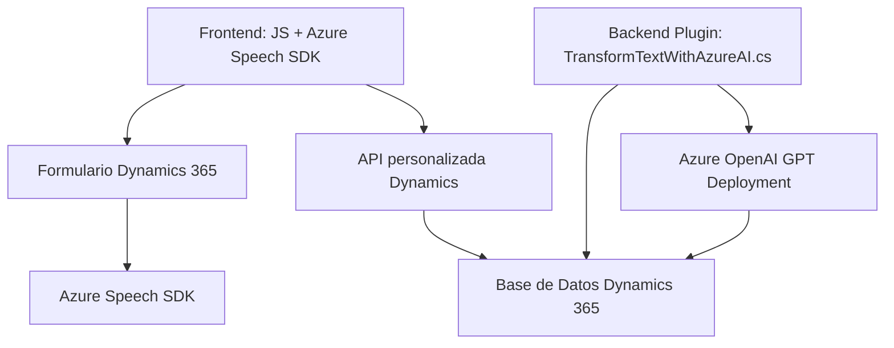

# Resumen técnico general del código y repositorio

Este repositorio se centra en integrar funcionalidades avanzadas de inteligencia artificial (IA) y procesamiento de voz basadas en Azure en aplicaciones empresariales, particularmente en el contexto de Dynamics CRM y Dynamics 365. Los archivos analizados están centrados en dos áreas: procesamiento y síntesis de voz en el frontend (JavaScript) y transformación de texto utilizando IA en el backend (Plugins).

---

# Descripción de arquitectura

1. **Tipo de solución**:
   - Frontend basado en JavaScript para interacción con usuarios (formularios visuales y voz).
   - Backend basado en un Plugin de Dynamics CRM que actúa como middleware para integración con Azure OpenAI.

2. **Arquitectura**:
   - **FrontEnd**: Modular y orientada a servicios. Apoya una arquitectura en capas donde el SDK de Azure Speech actúa como una capa externa.
   - **Plugin Backend**: Sencillo, con un patrón basado en eventos que responde al flujo de ejecución de Dynamics CRM (`IPluginExecutionContext`).
   - En general, es una arquitectura **cliente-servidor basada en servicios externos**, donde el cliente (frontend y plugin) delega tareas específicas al SDK de Azure Speech o Azure OpenAI.

3. **Capas identificadas** (N capas en diseño):
   - **Presentación**: Formulario y transcripción en Dynamics CRM (frontend JS).
   - **Negocio**: Transformaciones y procesamiento de datos (SDK Speech en frontend, Plugin en backend).
   - **Datos**:
     - El contenido se integra con Dynamics 365 formContext y APIs personalizadas en el frontend.
     - El plugin utiliza JSON y peticiones HTTP para interactuar con Azure OpenAI.

---

# Tecnologías usadas

1. **Frontend (JavaScript)**:
   - **SDK de Azure Speech**: Para síntesis y reconocimiento de voz.
   - **Dynamics 365 formContext**: Contexto nativo de formularios en Dynamics 365.

2. **Backend (C# Plugin)**:
   - **Microsoft Xrm SDK**: Framework para interacción con Dynamics CRM.
   - **Azure OpenAI**: Uso de modelos GPT para transformación avanzada de texto.
   - **Newtonsoft.Json** y **System.Net.Http**: Para manejar formatos y peticiones JSON.

---

# Dependencias o componentes externos presentes

1. **Azure Speech SDK**: Sistema para síntesis y reconocimiento de voz.
2. **Azure OpenAI**: Servicio de modelo GPT en procesos de texto avanzado.
3. **Plugins Dynamics CRM**: Middleware dentro del ecosistema de Dynamics 365.
4. **JavaScript dinámico dinámico (ejemplo referenciado): https://aka.ms/csspeech/jsbrowserpackageraw**

---

# Diagrama **Mermaid** (100% compatible con Markdown)

---

# Conclusión final

El repositorio representa una arquitectura moderna que combina tecnologías avanzadas como IA (Azure OpenAI + Speech SDK) y soluciones empresariales (Dynamics CRM/365). Es modular y flexible, integrando servicios externos mediante SDK y APIs. La estructura está orientada a un flujo basado en eventos y servicios con una disposición de capas bien definida (n capas). La dependencia de productos de Azure lo hace ideal para entornos empresariales que ya utilizan soluciones de Microsoft.