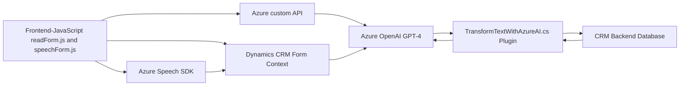

### Breve resumen técnico
El repositorio contiene tres archivos principales que implementan diferentes funcionalidades relacionadas con reconocimiento de voz y procesamiento de texto en formularios. Estas hacen uso de tecnologías como el SDK de Azure Speech y Azure OpenAI, además de integrarse con Dynamics 365. La solución está orientada a facilitar la interacción con formularios mediante comandos de voz y generación de texto procesado.

### Descripción de arquitectura
- **Tipo de solución**: La solución es un híbrido entre frontend y backend, ya que incluye archivos JavaScript que ejecutan lógica en el navegador y se conectan a APIs externas, mientras el archivo en C# funciona como una integración backend en Dynamics 365.
- **Tipo de arquitectura**: La solución combina arquitectura en capas n-tier, donde las capas son el cliente frontend (JavaScript) y la lógica backend (Dynamics CRM plugin). Existe integración con microservicios externos como Azure Speech SDK y Azure OpenAI para procesar voz y texto.
- **Propósito**: Solución personalizada que combina módulos frontend para entrada/salida de voz sobre formularios y módulos backend para procesamiento de datos mediante AI alojada en Azure.

### Tecnologías usadas
1. **Frontend**:
   - JavaScript: Usado como base para manipulación de formularios y lógica del cliente.
   - Azure Speech SDK: Provee servicios de reconocimiento de voz, síntesis de voz y entrada de audio.
   - Dynamics 365 Xrm Context: Interacción con los datos y campos de los formularios del CRM.
2. **Backend**:
   - C#: Implementación de plugins personalizados para Dynamics CRM.
   - Microsoft Dynamics SDK: Para manipulación directa de datos en la plataforma CRM.
   - Azure OpenAI API (GPT): Para transformar el texto en estructura JSON según reglas específicas.
   - Newtonsoft.Json y System.Text.Json: Para manejo avanzado de estructuras JSON.
   - HttpClient: Para realizar solicitudes API HTTP a servicios externos.

### Dependencias o componentes externos
1. **Azure Speech SDK**: Utilizado por los archivos de JavaScript para sintetizar texto a voz y realizar reconocimiento de voz.
2. **Azure OpenAI (GPT-4)**: Para transformar texto según reglas específicas en formato JSON.
3. **Microsoft Dynamics CRM**: Para almacenamiento, manipulación y automatización de datos asociados a los formularios.
4. **Browser APIs**: Acceso a micrófonos y otros periféricos para entrada de datos.
5. **Xrm.WebApi**: Para realizar llamadas a la API de Dynamics 365 directamente desde los componentes frontend.
6. **HttpClient**: Para enviar solicitudes al servicio OpenAI desde el backend.
7. **JSON Libraries (JSON.NET, System.Text.Json)**: Para serialización de datos hacia servicios externos y lógica interna.

---
### Diagrama **Mermaid** válido para GitHub Markdown

### Conclusión final
La solución representa una arquitectura híbrida que combina elementos del frontend y backend en un entorno de Microsoft Dynamics CRM, complementado con servicios avanzados en la nube (Azure Speech SDK y OpenAI GPT). Permite reconocimiento y síntesis de voz en formularios, además de integrar procesamiento avanzado mediante un microservicio externo basado en AI. Está diseñado con patrones de modularidad, reutilización de funciones y programación asincrónica.