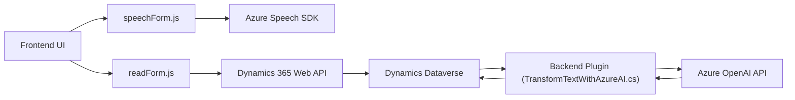

### Breve Resumen Técnico
El repositorio contiene tres principales componentes orientados hacia la interacción clara con Azure. Cada archivo tiene un propósito definido:
1. **Frontend (JavaScript)**:
   - Utiliza Azure Speech SDK y **Dynamics 365 Web API** para lectura de formularios, procesamiento de voz, y síntesis de audio.
   - Están diseñados para operar en un entorno web integrado con Microsoft Dynamics CRM en el frontend.

2. **Plugin Backend**:
   - Implementa un plugin en C# para Dynamics CRM/Dataverse que transforma texto usando la API de Azure OpenAI, integrando servicios cloud para procesamiento avanzado.

### Descripción de Arquitectura
En este caso, la arquitectura observada tiene características **modulares** y utiliza una combinación de enfoque de **monolito con varias capas**:
1. **Frontend Modular**:
   - Los archivos `readForm.js` y `speechForm.js` tienen una estructura basada en eventos, con funciones independientes para el manejo de datos y dependencias externas.
2. **Backend**:
   - El plugin C# sigue el patrón de plugins que Dynamics CRM implementa, ejecutándose de manera reactiva en el servidor cada vez que se dispara un evento.

En general, la arquitectura mezcla los principios de **n-capas** (integración de servicios: UI, SDK, backend CRM, API externa) con una **resolución desacoplada por funciones específicas**.

### Tecnologías Usadas
1. **Frontend**:
   - **Azure Speech SDK**: Manejo de síntesis y reconocimiento de voz.
   - **JavaScript ES6**.
   - **Dynamics 365 Web API** (Xrm.WebApi): Para interacción con formularios en el cliente.
2. **Backend**:
   - **C#/.NET Framework**: Estructuración y ejecución de plugins en Dynamics CRM.
   - **Microsoft.Xrm.Sdk**: API del dominio CRM para el manejo de datos.
   - **Azure OpenAI**: Respuestas transformadas de GPT-4 instanciadas en API REST.
   - **System.Net.Http**: Manejo de solicitudes HTTP.
   - **Newtonsoft.Json** y **System.Text.Json**: Procesamiento de JSON.

### Observación sobre Dependencias Externas
- **SDKs**: Azure Speech SDK cargado dinámicamente en el frontend desde la URL proporcionada.
- **Servicios en la nube**:
  - Uso de Azure Speech y Azure OpenAI para procesamiento avanzado de texto y voz.
- **Dynamics CRM/Dataverse**:
  - Dependencias implícitas como XRM SDK y contexto ejecutable.
- **Configuración y autenticación**:
  - Se observa manejo explícito de claves API (ejemplo en el plugin); esto debería ser más seguro utilizando un almacenamiento de configuración externo como Azure Key Vault.

### Diagrama Mermaid
Representación simplificada del flujo general y las interacciones de componentes.

### Conclusión Final
Esta solución está diseñada para integrarse profundamente en sistemas corporativos (Dynamics CRM/Dataverse), aprovechando servicios cloud avanzados de Azure como Speech SDK y OpenAI API. En términos arquitectónicos:
1. El frontend se basa en la funcionalidad dinámica de SDKs externos y APIs para UI/UX enriquecida.
2. El backend adopta principios de plugins que encapsulan la lógica en eventos específicos del sistema.
Estos desarrollos representan una integración híbrida de n-capas, mostrando desacoplamiento en la ejecución de servicios externos mientras mantienen una estructura gobernada por CRM.