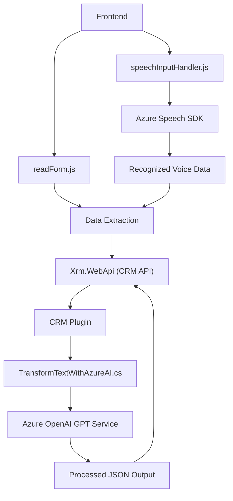

### Breve resumen técnico

Este repositorio implementa una solución que combina **frontend** con **Microsoft Dynamics CRM plugins**, integrando servicios avanzados como **Azure Speech SDK** y **Azure OpenAI GPT**. El objetivo principal es mejorar la interacción con formularios en Dynamics CRM a través del reconocimiento de voz y transformación de datos en formato estándar.

---

### Descripción de arquitectura

1. **Frontend** (carpeta `FRONTEND`):
   - La solución tiene un enfoque funcional, con múltiples métodos para interactuar con formularios de CRM, realizar reconocimiento de voz (con Azure Speech SDK), extraer datos visibles y procesar transcripciones de voz.
   - Arquitectura modular, basada en funciones independientes dentro de un contexto de formulario.
   - Se integra con el backend (CRM y Azure OpenAI) mediante llamadas a API REST para procesamiento y generación de contenido.

2. **Backend** (carpeta `Plugins`):
   - Arquitectura orientada a plugins extensibles de Dynamics CRM. Implementa la interfaz `IPlugin` para extender el comportamiento del CRM.
   - La responsabilidad principal del plugin es realizar transformaciones de texto dinámico utilizando Azure OpenAI GPT, devolviendo JSON estructurado según reglas predefinidas.

3. **Global architecture**:
   - La arquitectura es híbrida, combinando **frontend orientado a servicios** con **backend extensible (plugin)**. La solución sigue principios de **integración de servicios en la nube** mediante APIs como Azure Speech y Azure OpenAI.

---

### Tecnologías usadas

#### Frontend
- **JavaScript (ES6)**: Programación funcional para reconocer voz y manipular formularios.
- **Azure Speech SDK**: Analiza entrada de voz y sintetiza texto.
- **APIs de Dynamics CRM**: Usa objetos como `Xrm.WebApi` para interactuar directamente con CRM.

#### Backend
- **C# (.NET Framework)**: Plugins desarrollados para Dynamics CRM.
- **RESTful APIs**: Integración con Azure OpenAI (GPT model) y formateo estructurado de texto.
- **Microsoft Dynamics SDK**: Proporciona acceso al contexto CRM, atributos, y API internas.

---

### Componentes y dependencias externas
1. **Azure Speech SDK**: Para reconocimiento de voz y análisis de entrada.
2. **Azure OpenAI GPT**: Transformación de texto en estructuras JSON mediante modelos de aprendizaje automático.
3. **Microsoft Dynamics CRM API**: Framework que permite leer y actualizar datos en formularios CRM.
4. **HTTP Client (System.Net.Http)**: Para comunicación entre el plugin de CRM y Azure OpenAI.
5. **System.Text.Json** y **Newtonsoft.Json**: Para manipulación JSON (aunque redundante en el backend).

---

### Diagrama Mermaid para **GitHub Markdown**

---

### Conclusión final

Este repositorio implementa una solución integral que combina interacción avanzada con formularios en Dynamics CRM mediante reconocimiento de voz y procesamiento inteligente con Azure OpenAI. La arquitectura es híbrida, donde el **frontend modular** extrae y transforma datos mediante APIs, y el **backend extensible** realiza transformaciones más complejas con Azure OpenAI. 

Es una solución altamente escalable para automatizar y optimizar la entrada de datos en formularios CRM mediante IA, con un diseño orientado a servicios y funciones claramente delegadas. Sin embargo, el uso de componentes como Azure OpenAI y Speech SDK depende de una configuración adecuada de claves de API y datos sensibles.