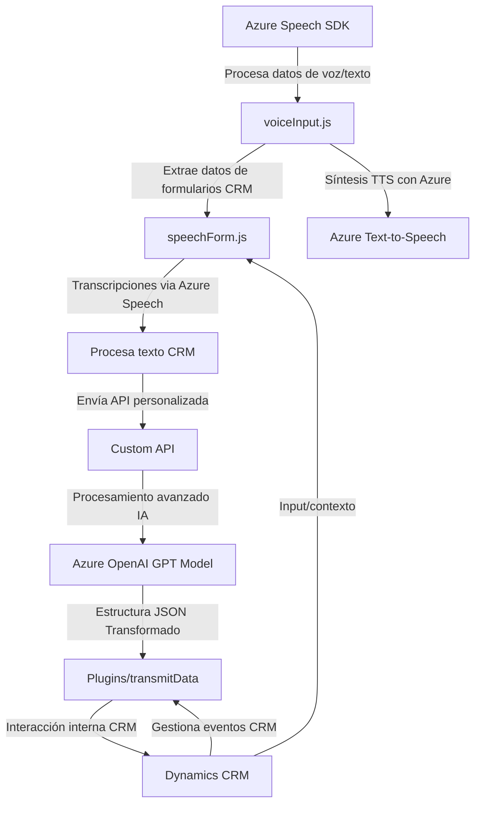

### Análisis técnico del repositorio

#### Breve resumen técnico:
El repositorio combina múltiples componentes destinados a habilitar funcionalidad avanzada basada en Servicios Azure dentro de un contexto de CRM. Su enfoque principal se centra en el procesamiento de voz (a texto y viceversa), la interacción entre usuarios y formularios dinámicos, y la transformación avanzada de texto con Inteligencia Artificial. Está compuesto por componentes en **JavaScript** para frontend, mientras que las extensiones específicas del CRM están implementadas en **C#** como plugins.

---

#### Descripción de arquitectura:
La arquitectura de esta solución parece ser híbrida. Mientras que las interacciones entre clientes y formularios (frontend) están basadas en un modelo modular y orientado a eventos, la lógica avanzada que interactúa con el CRM y servicios externos utiliza plugins y comunicación orientada a servicios (SOA). Los puntos a destacar son:

- **N Capas**: Claramente existen capas separadas de presentación (frontend) y lógica de negocio en el CRM (plugins `.cs`).
- **Microservicios de terceros**: Uso de APIs externas distribuidas para la síntesis de voz (Azure Speech SDK) y procesamiento más avanzado (Azure OpenAI GPT).

---

#### Tecnologías usadas:
1. **Frontend**:
   - **Lenguaje**: JavaScript.
   - **Servicios utilizados**: Azure Speech SDK para síntesis y reconocimiento de voz.
   - **Frameworks externos**: Ninguno específico mencionado, aunque interactúa con la API form-context de CRM.

2. **Backend (CRM Plugins)**:
   - **Lenguaje**: C#.
   - **Plataforma**: Microsoft Dynamics CRM (uso del `IPlugin` Framework).
   - **Integraciones**:
     - `Microsoft.Xrm.Sdk` para extensibilidad CRM.
     - Azure OpenAI (GPT-4o) para procesamiento avanzado de texto.

3. **Patrones de diseño**:
   - **Modularidad** en JavaScript: Separación de lógica en funciones distintas para simplificar la comprensión y escalabilidad.
   - **Plugin Pattern** en C#: Extensión de eventos "dinámicos" dentro de Dynamics CRM.
   - **Service-Oriented Architecture** (SOA): Comunicación activa con servicios externos como APIs de Azure.

---

#### Dependencias y componentes externos:
- **Externas**:
  1. **Azure Speech SDK**: Servicios para reconocimiento de voz y síntesis de texto a voz.
  2. **Azure OpenAI GPT-4**: Para transformar y estructurar texto.
  3. **Dynamics CRM SDK**: Para extender funcionalidades internas del CRM mediante eventos dinámicos.
  4. **JSON Manipulation** (Newtonsoft.Json y System.Text.Json): Manejo de JSON estructurado.
  5. **HTTP Client API** (System.Net.Http): Comunicación con servicios externos.

- **Internas**:
  - Llamadas a la API de Dynamics CRM (Xrm.WebApi).
  - Mapas de atributos del formulario para gestión de campos específicos.

---

#### Diagrama Mermaid válido para GitHub:

---

### Conclusión final:
Este repositorio representa una solución con arquitectura híbrida, donde:
- El frontend está construido sobre JavaScript y depende fuertemente de integraciones con Azure Speech SDK para ofrecer funcionalidades de interacción por voz.
- El backend configura extensiones de Dynamics CRM mediante plugins en C# con acceso a la API de Azure OpenAI. 
- Utiliza una combinación de procesamiento local, APIs REST y consumo de servicios en la nube para mayor dinamismo.

La solución está bien estructurada con varios patrones modernos como SOA, modularidad y extendibilidad en frameworks. Sería importante revisar la seguridad de los datos en comunicación con Azure (por ejemplo, proteger las claves de acceso en el SDK). Si el objetivo es escalabilidad y mejor manejo de microservicios, puede considerarse migrar la lógica de plugins a endpoints de microservicios en lugar de ejecutarlos directamente en el CRM.