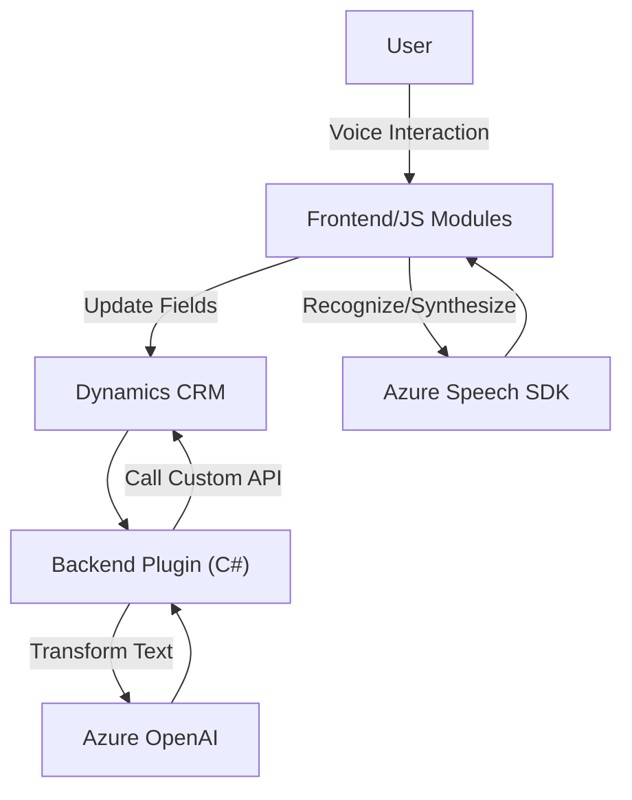

### Breve resumen técnico:

Este repositorio implementa una solución que integra funcionalidades de reconocimiento de voz, síntesis de voz y procesamiento de lenguaje natural usando servicios de Microsoft Azure. Está compuesto por módulos de frontend basados en JavaScript que interactúan con formularios en Dynamics CRM y plugins C# que se comunican con Azure OpenAI para análisis de texto.

---

### Descripción de arquitectura:

La solución sigue una **arquitectura mixta**:
1. **Frontend:** 
   - Modulos JavaScript como `readForm.js` y `speechForm.js` manejan la interacción con el SDK de Azure Speech, integrando reconocimiento y síntesis de voz para trabajar con formularios de Dynamics.
   - Se integra con las APIs internas de Dynamics (como `Xrm.WebApi`) para aplicar valores a los formularios y manipular información.

2. **Backend (Plugins):**
   - El plugin C#, `TransformTextWithAzureAI`, implementa una capa de integración con Azure OpenAI. Este plugin actúa como interfaz dinámica entre Dynamics CRM y los servicios de IA de Azure, transformando texto y devolviendo datos estructurados.

La arquitectura general puede considerarse **multicapa**: con una separación clara entre la **capa de presentación** (frontend), **capa de lógica de negocio** (plugins) y **capa de servicios externos** (Azure Speech SDK y Azure OpenAI).

---

### Tecnologías usadas:

1. **Frontend**:
   - **JavaScript**: Para funciones de reconocimiento y síntesis de voz.
   - **Microsoft Azure Speech SDK**: Reconocimiento de voz y síntesis de texto a voz.
   - **Dynamics Xrm.WebApi**: Manipulación y actualización de datos en el modelo CRM.

2. **Backend**:
   - **C#**: Desarrollo de plugins para Dynamics CRM.
   - **Microsoft.Xrm.Sdk**: Para operaciones dentro del entorno Dynamics.
   - **Azure OpenAI**: Para análisis y reformulación inteligente de texto.
   - **System.Net.Http** y **System.Text.Json**: Comunicación con APIs REST y manipulación de respuesta JSON.

3. **Patrones de diseño**:
   - **Modularidad**: Código segmentado en funciones claras para mejora del mantenimiento.
   - **Facade Pattern**: Abstracción para servicios externos como Azure Speech SDK y OpenAI.
   - **Plugin Pattern**: Implementación de tareas específicas en Dynamics.
   - **Event-driven Programming**: Callbacks y promesas para la ejecución asíncrona.

---

### Diagrama Mermaid:

---

### Conclusión final:

Este repositorio implementa una solución híbrida para mejorar la interacción entre usuarios y formulación de datos en un sistema Dynamics CRM. Utiliza reconocimiento de voz, procesamiento de lenguaje natural e inteligencia artificial a través de servicios de Microsoft Azure, con una arquitectura multicapa y patrones bien definidos. Las integraciones externas centrales, como Azure Speech SDK y Azure OpenAI, dan soporte a funciones avanzadas impulsadas por IA y voz.