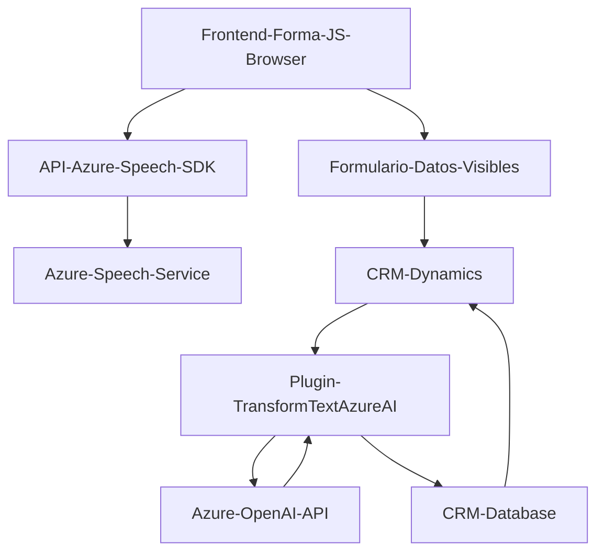

### Resumen técnico
El repositorio analizado muestra evidencia de una solución que combina un **front-end interactivo** con un SDK de procesamiento de voz, una integración de servicios externos (Azure Speech y Azure OpenAI APIs), y un **plugin** para Microsoft Dynamics CRM backend. La solución parece tener como objetivo ofrecer funcionalidad que permite leer, transformar y almacenar datos en un formulario mediante el reconocimiento de voz y la conversión de texto en lenguaje natural.

---

### Descripción de arquitectura
La arquitectura del proyecto se define en tres capas que interactúan como sigue:

1. **Capa de presentación (Frontend)**  
   - Compuesta por archivos JavaScript en el directorio `FRONTEND/JS`.  
   - Manejo de la interfaz de usuario utilizando datos de formularios de CRM y reconocimiento/síntesis de voz mediante Azure Speech SDK.  
   - Modularidad lograda con funciones que se encargan de tareas específicas (lectura de formularios, reconocimiento de voz, procesamiento y síntesis).  

2. **Capa de lógica/servidores intermedios (Aplicativa)**    
   - Backend basado en Microsoft Dynamics Plugins.  
   - Los archivos como `TransformTextWithAzureAI.cs` utilizan **Web APIs (Azure OpenAI API)** para realizar procesamientos avanzados como la transformación de texto en JSON estructurado útil.  
   - Uso de middlewares y servicios para construir una lógica robusta y procesar eventos del sistema CRM.  

3. **Servicios externos y APIs**  
   - **Azure Speech SDK:** Para reconocimiento de voz, síntesis de texto en habla, y procesamiento.  
   - **Azure OpenAI API:** Para la implementación de transformación de texto según reglas en lenguaje natural.  

El repositorio tiene una arquitectura de *n-capas* con integración de servicios externos, siendo la capa intermedia de backend responsable de orquestar la lógica y transformación entre las aplicaciones externas (Azure) y el sistema CRM.

---

### Tecnologías y frameworks usados
1. **Frontend:**  
   - **JavaScript puro** (sin evidencia de frameworks como React o Angular).  
   - SDK de Azure Speech para interacción con servicios de voz.  
   - Dependencias del lado del cliente, como APIs REST y manejo del DOM.  

2. **Backend:**  
   - Desarrollo orientado a **Microsoft Dynamics CRM Plugins** (C# con `.NET Framework` o `.NET SDK`).  
   - Integración basada en **IPluginExecutionContext** y servicios del CRM.  
   - Usos de bibliotecas como `NewtonSoft.Json` para deserialización de JSON en el backend.  

3. **Servicios externos:**  
   - **Azure Speech SDK:** Con carga dinámica desde `https://aka.ms/csspeech/jsbrowserpackageraw`.  
   - **Azure OpenAI API:** Usada para el procesamiento de lenguaje natural y generación de JSON estructurado.  

4. **Patrones arquitectónicos:**  
   - Modularización en funciones específicas que siguen la lógica de una separación por responsabilidades.  
   - Arquetipo típico de *n-capas* con enfoque en servicios externos.  
   - Implementación de Wrappers para simplificar el uso de SDK (Azure Speech).  

---

### Diagrama Mermaid válido para GitHub

---

### Conclusión final
Este proyecto representa una solución integral orientada a la interacción asistida por voz con formularios CRM. 

- La arquitectura empleada es una **n-capas**, optimizada para integrar servicios externos como Azure Speech SDK y OpenAI, además del uso de plugins personalizados para Microsoft Dynamics CRM. 
- La solución presenta modularidad en el diseño de funciones en el frontend y separación de responsabilidades en el backend mediante un enfoque de plugin y conexión API.
- Puede ser escalable hacia otros servicios de CRM o hacia una arquitectura más distribuida, como microservicios, dependiendo de los requisitos futuros. 

Es eficiente en su integración con tecnología avanzada como IA (Azure OpenAI) y voz/síntesis (Azure Speech SDK) para una experiencia interactiva más natural en sistemas empresariales backend.