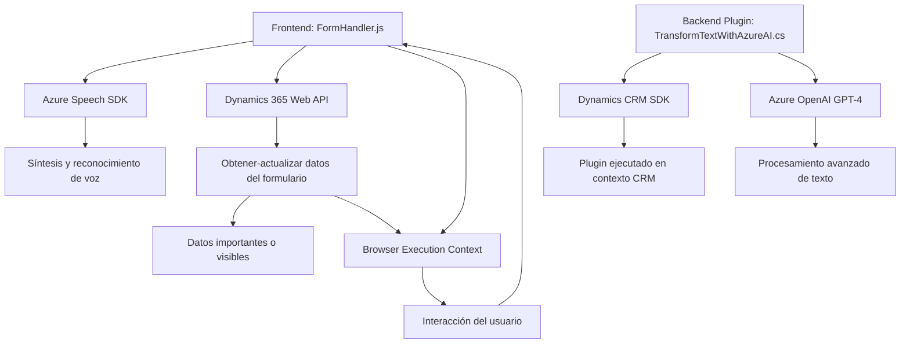

### Breve resumen técnico
El repositorio presentado contiene varios archivos que están claramente relacionados con el desarrollo de una solución completa que integra interacción con formularios de Dynamics CRM y servicios de inteligencia artificial y síntesis/reconocimiento de voz provistos por Azure. Cada archivo desempeña funciones específicas y se integra con APIs externas.

---

### Descripción de arquitectura
Este sistema presenta características de una **arquitectura de microservicios**, donde diferentes piezas de funcionalidad trabajan juntas para construir una solución integral. El frontend, desarrollado principalmente en JavaScript, utiliza las APIs del navegador junto con el SDK de Azure Speech y la API de Dynamics 365 para leer formularios y manejar entrada/salida de voz. Por otro lado, el backend implementa plugins de Dynamics CRM desarrollados en C#, con integración directa con Azure OpenAI para procesamiento avanzado de texto.

Además, la arquitectura sigue patrones de **n-capas**, ya que la lógica está distribuida en:
1. Presentación (frontend: interacción con el usuario).
2. Aplicación (procesamiento y flujo de datos).
3. Servicios externos (Azure APIs y Dynamics 365 Plugins).

---

### Tecnologías usadas
1. **Frontend (JavaScript):**
   - Azure Speech SDK: Gestiones de síntesis y reconocimiento de voz.
   - Dynamics 365 Web API: Integración con formularios y lógica CRM.
   - Modularización de funciones para separar responsabilidades.
   - Event-driven programming: Orientado a manejar eventos, como la activación de reconocimiento de voz.

2. **Backend (C#):**
   - Dynamics CRM SDK (`Microsoft.Xrm.Sdk`): Desarrollo de plugins y procesamiento de datos.
   - Azure OpenAI: Utilización de GPT para procesamiento y reestructuración de texto.
   - Newtonsoft.Json y System.Text.Json: Manipulación de JSON estructurados.
   - Uso de llamadas API HTTP mediante `System.Net.Http`.

3. **Patrones principales:**
   - **Facades:** Funciones encapsuladoras como `startVoiceInput` y `GetOpenAIResponse` simplifican accesos complejos a APIs externas.
   - **Modularización:** Separación lógica clara de funcionalidades en el frontend, como lectura de formularios, limpieza de datos y procesamiento de voz.
   - **Event-driven y Client-heavy:** Procesamiento en tiempo real en el cliente, con dependencia de SDKs externos para interacción directa.
   - **Integración con Servicios Externos:** Dependencia explícita de Azure Speech SDK para procesamiento de voz y Azure OpenAI para transformación de texto en el backend.

---

### Diagrama **Mermaid**

---

### Conclusión final
Este repositorio representa una arquitectura **cliente-servidor dinámica** que combina funcionalidades específicas del frontend con la lógica avanzada del backend, apoyándose en API y SDK externos para interacción con Dynamics 365 y procesamiento de voz/texto. La solución puede considerarse parte de una arquitectura **microservicios distribuida**, donde cada bloque funcional tiene una responsabilidad clara, y utiliza patrones como **facade** para simplificar la interacción entre módulos y servicios. 

Es una solución bien estructurada y tecnológica que permite implementar capacidades avanzadas, como síntesis de voz y reconocimiento de entrada, sobre sistemas Dynamics 365.