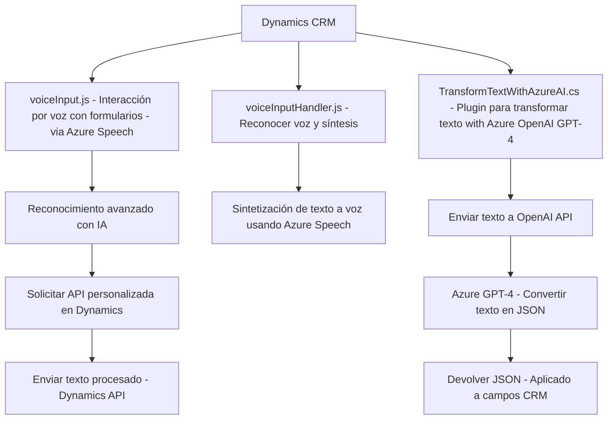

### Análisis técnico del repositorio

#### Breve resumen técnico:
El repositorio contiene archivos que implementan funcionalidades tanto del lado del cliente (JavaScript para el frontend) como del lado del servidor (plugin en C#). Se enfocan en la integración con dos servicios de Azure:
- **Azure Speech SDK:** Para funcionalidades relacionadas con el reconocimiento y síntesis de voz.
- **Azure OpenAI GPT-4:** Para transformación avanzada de texto en el plugin.

Las funcionalidades son específicas para integrarse con la plataforma **Dynamics 365 CRM**, facilitando la interacción con formularios y campos mediante voz o texto.

---

#### Descripción de arquitectura:
La arquitectura se presenta como **modular y basada en capas funcionales**. Aunque el sistema no emplea una arquitectura estricta como **hexagonal** o **microservicios**, exhibe integración a servicios externos como parte de su diseño. A continuación, se detallan los componentes:
- **Frontend (JavaScript):** Define módulos para interacción con formularios en Dynamics 365, por ejemplo:
  - *Capturar los datos visibles del formulario y sintetizarlos a voz.*
  - *Registrar entradas por voz y procesarlas en los campos respectivos.*

- **Backend (C# Plugin):** Extiende Dynamics 365 con habilidad para transformar texto usando Azure OpenAI. Este componente se instala como un **plugin** estructurado bajo los principios y limitaciones de Dynamics Plugin Architecture.

La solución es un **monolito funcional especificado** para Dynamics 365, divido entre frontend y backend altamente integrado.

---

#### Tecnologías usadas:
1. **Frontend:**
   - **JavaScript.**
   - **Azure Speech SDK:** Reconocimiento y síntesis de voz mediante el paquete web del SDK.
   - **Dynamics CRM Javascript API:** para interacción con formularios y atributos, incluyendo mapeo de campos de entidad.

2. **Backend:**
   - **C# (.NET Framework):** Implementación del plugin de Dynamics 365.
   - **Microsoft Dynamics CRM SDK:** Para interacción con datos y contexto del CRM, así como para extender su funcionalidad.
   - **Azure OpenAI:** Uso del modelo GPT-4 para transformación de texto.
   - **NuGet libraries:** `Newtonsoft.Json`, `System.Net.Http`.

3. **General:**
   - Integración dinámica de SDKs mediante carga de librerías desde Azure.

---

#### Dependencias o componentes externos:
- **Azure Platform:** 
  - Azure Speech SDK (para reconocimiento y síntesis de voz).
  - Azure OpenAI GPT-4 (para transformación avanzada de texto).
- **Microsoft Dynamics CRM:** Plataforma central donde se registran los plugins y se gestionan los datos del usuario (mediante APIs como `Xrm.WebApi`).
- **Web-based SDK:** Carga dinámica de librerías desde URLs (Azure Speech SDK en el frontend).

---

### Diagrama **Mermaid**:

---

### Conclusión final:
Este repositorio implementa una solución integrada con **Azure servicios en la nube** y **Dynamics 365** que brinda capacidades avanzadas de voz y procesamiento de texto. La arquitectura refleja un diseño centrado en servicios externos, organizado como un monolito funcional dividido en capas de frontend y backend, con una estructura orientada a módulos en JavaScript y C#. La elección de tecnología Microsoft Azure y Dynamics establece un ecosistema que potencia características específicas de aplicaciones empresariales, aprovechando los servicios modernos de IA y reconocimiento de voz.