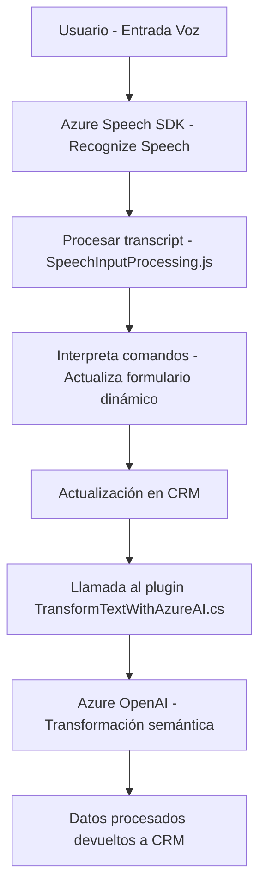

### **Breve resumen técnico**
El repositorio incluye archivos destinados a la integración de entrada de voz, procesamiento de comandos hablados en español, y actualización de formularios dinámicos en Microsoft Dynamics CRM mediante Azure Speech SDK y Azure OpenAI. Este enfoque combina una interfaz de frontend modular en JavaScript con lógica backend en C# como plugin.

---

### **Descripción de arquitectura**
#### Arquitectura general: **Componentes acoplados**
1. **Frontend**:
   - Modularidad basada en JavaScript utilizando Azure Speech SDK.
   - Implementación de patrones procesales y conversión de datos de comandos hablados a valores para formularios dinámicos.
2. **Backend**:
   - Plugin en C# para Dynamics 365 CRM que actúa como mediador entre el sistema CRM y Azure OpenAI utilizando un patrón de integración de servicios.

#### Patrones identificados:
- **Integración de servicios**: Uso directo de Azure AI.
- **Adaptador de datos**: Procesa datos desde comandos hablados hacia el esquema de los formularios CRM.
- **Plugin Architecture**: Backend estructurado según la arquitectura de plugins de Dynamics CRM.
- **External Service Integration**: Comunicación con Azure OpenAI vía API REST.

---

### **Tecnologías usadas**
#### **Frontend**:
- **Azure Speech SDK**: Reconocimiento y síntesis de voz.
- **JavaScript**: Lógica procesal y modularización.
- **Dynamic forms (Microsoft Dynamics)**: Como contexto del sistema.

#### **Backend**:
- **Azure OpenAI**: Transformación semántica de texto.
- **Microsoft Dynamics API**: Gestión de formularios y datos.
- **C#**: Desarrollo del plugin.
- **Libraries**: `System.Net.Http`, `System.Text.Json`, `Newtonsoft.Json.Linq`.

---

### **Dependencias o componentes externos**
1. **Azure Speech SDK**: Reconocimiento de voz y síntesis TTS (Text to Speech).
2. **Azure OpenAI Service**: Procesamiento semántico y generación de texto estructurado.
3. **Microsoft Dynamics SDK**: API de extensibilidad y conexión para gestionar formularios y entidades.
4. **APIs externas**:
   - Endpoint del Azure Speech SDK: `https://aka.ms/csspeech/jsbrowserpackageraw`.
   - Endpoint Azure OpenAI (configurado en el backend).

---

### **Diagrama Mermaid**

---

### **Conclusión final**
El repositorio representa un sistema altamente funcional e integrado con dos componentes principales: un frontend en JavaScript para capturar y procesar comandos hablados mediante Azure Speech SDK, y un backend como plugin en C# para Dynamics CRM que utiliza Azure OpenAI para mejorar la semántica de los textos procesados. La arquitectura está enfocada en modularidad y conexión a servicios externos, apuntando hacia una integración eficiente entre voz, formularios dinámicos, y capacidades de inteligencia artificial. Sin embargo, la seguridad del sistema puede mejorar al externalizar claves API en configuración en lugar de incluirlas directamente en el código fuente.