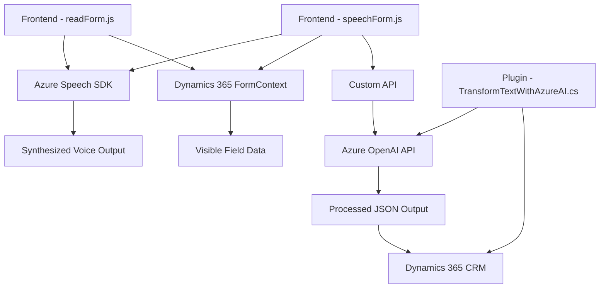

### Breve resumen técnico
El repositorio estructura varios componentes de una solución que integra formularios en Dynamics CRM con servicios de Azure, tanto para síntesis de voz (Azure Speech SDK) como procesamiento de texto avanzado mediante IA (Azure OpenAI). Las funcionalidades principales se centran en capturar datos visuales del formulario, realizar síntesis de voz, procesar transcripciones de entrada y actualizar formularios en CRM.

---

### Descripción de arquitectura
1. **Tipo de solución**: La solución es una integración basada en APIs y plugins para Dynamics CRM junto con módulos frontend en JavaScript para interacción visual y procesamiento de datos. Los servicios externos (Azure Speech SDK y Azure OpenAI) juegan un rol central.
2. **Arquitectura**: La solución presenta una arquitectura de **n capas**:
   - **Capa de presentación**: Implementada en JavaScript para manejar el frontend y comunicación visual/formularios.
   - **Capa de negocio**: Plugins de Dynamics CRM encapsulan la lógica avanzada de procesamiento de datos.
   - **Capa de servicios externos**: Integración directa con APIs de Azure Speech y Azure OpenAI para operaciones de síntesis de voz y texto.

---

### Tecnologías usadas
1. **Frontend**:
   - **JavaScript**: Módulos como `readForm.js` y `speechForm.js` incluyen lógica para procesamiento visual y voz.
   - **Azure Speech SDK**: Proporciona síntesis y transcripción de voz.
   
2. **Backend (CRM plugins)**:
   - **Dynamics CRM SDK**: Librerías como `Microsoft.Xrm.Sdk` para interacción directa con formularios CRM.
   - **Azure OpenAI Service**: Uso de GPT-4 para transformaciones avanzadas de texto.
   - **C#**: Es usado para crear plugins que procesan datos en el flujo backend del CRM.

3. **Comunicaciones**:
   - **HTTP API calls**: Llamadas al servicio Azure OpenAI desde el plugin backend.

4. **Patrones:**
   - Modularidad: Separación clara de funciones en el frontend y el backend.
   - Integración API: Llamadas directas a servicios de terceros.
   - Event-driven: Uso de callbacks para cargar SDKs y manejar respuestas asincrónicas.

---

### Dependencias o componentes externos
1. **Azure Speech SDK**: Procesa síntesis de voz y transcripción del frontend.
2. **Azure OpenAI**: Transformaciones avanzadas de texto mediante IA desde el backend.
3. **Microsoft Dynamics 365 SDK**: Interacción directa con formularios CRM.
4. **System.Net.Http**: Interfaz para hacer llamadas a APIs externas.
5. **System.Text.Json** o **Newtonsoft.Json**: Manejo de JSON en las respuestas de Azure OpenAI.

---

### Diagrama Mermaid válido para GitHub

---

### Conclusión final
La solución presenta una integración avanzada entre la capa de presentación, la capa de negocio de Dynamics CRM y APIs de Azure. Es un sistema que utiliza una arquitectura de **n capas** para desacoplar la lógica del frontend, el backend (CRM plugin) y los servicios externos de Azure. Su enfoque modular permite un mantenimiento sencillo y una mayor escalabilidad.

La dependencia externa de Azure (Speech y OpenAI) asegura funcionalidades potentes en síntesis de voz y procesamiento de texto basado en IA, mientras que la integración con Dynamics CRM permite una manipulación personalizada de datos en contextos empresariales.