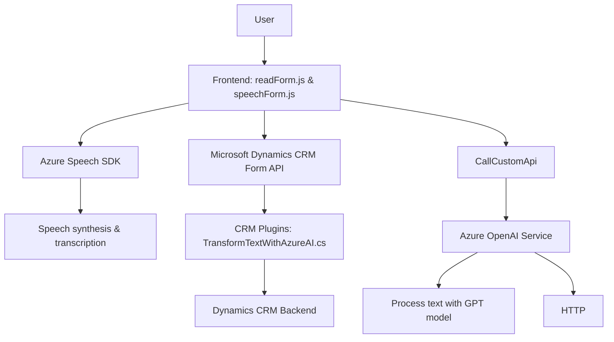

### Análisis técnico del repositorio

#### Breve resumen técnico
El repositorio contiene módulos relacionados con captura de voz, síntesis de texto y procesamiento con inteligencia artificial. Está orientado principalmente a la integración con Microsoft Dynamics CRM, aprovechando servicios como **Azure Speech SDK** y **Azure OpenAI Service**. La estructura incluye código JavaScript para el frontend (procesos y manipulación en formularios del CRM) y un archivo en **C#** que implementa un plugin con lógica avanzada ejecutada en el backend del CRM.

#### Descripción de arquitectura
La arquitectura se puede considerar **híbrida**:
1. **Frontend:** Basado en JavaScript, con una estructuración funcional que permite la interacción con los formularios del CRM y llamadas a APIs externas.
2. **Backend:** Uso de **plugins** en C#, que aprovechan las capacidades de Dynamics CRM mediante la interfaz `IPlugin`. Este diseño responde al patrón de arquitectura basado en plugins.
3. **Servicios externos:** Azure Speech SDK (captura y síntesis de voz) y Azure OpenAI Service (transformación y procesamiento de texto) constituyen una arquitectura dependiente de **microservicios en la nube**.

#### Tecnologías usadas
1. **JavaScript:** Para la manipulación del DOM y ejecución de lógica frontend.
2. **Azure Speech SDK:** Servicios para captura de entrada de voz y síntesis de texto en voz.
3. **Azure OpenAI Service:** Modelo de procesamiento de texto avanzado (GPT-4o) para estructuración del texto.
4. **Microsoft Dynamics CRM:** Sistema CRM usado como entorno principal para formularios y plugins.
5. **C#:** Implementación de lógica de backend usando la API de plugins de Dynamics 365.
6. **JSON Handling:** Uso de bibliotecas como Newtonsoft.Json y System.Text.Json en C# para procesar datos estructurados.

#### Dependencias o componentes externos
1. **Azure Speech SDK:** Para captura y síntesis de voz en frontend.
2. **Azure OpenAI Service:** Procesamiento y transformación de texto basado en inteligencia artificial.
3. **Dynamics 365 WebAPI:** (`Xrm.WebApi.online`, `Xrm.WebApi.retrieveMultipleRecords`) para manipulación de datos en el CRM.
4. **HTTP API:** Para interacción con servicios externos como `OpenAI` usando solicitudes `POST`.

### Diagrama **Mermaid**  

#### Conclusión final
La solución presentada es una **integración avanzada entre frontend, backend y servicios en la nube** para capturar voz, procesar texto mediante inteligencia artificial, y manipular formularios en Dynamics CRM. La estructura híbrida combina módulos frontend ejecutados directamente en el navegador con lógica backend mediante plugins del CRM.

Aunque la arquitectura está bien estructurada para tareas específicas, hay áreas de mejora:
1. **Gestión centralizada de configuración** para claves y regiones de Azure.
2. **Manejo de errores robusto** para solicitudes HTTP y APIs.
3. **Modularización adicional**, especialmente en la lógica de procesamiento de voz y texto, para mejorar la escalabilidad.

Esta solución sería adecuada para entornos corporativos donde la integración de servicios en la nube y CRM es crítica para procesos automatizados basados en voz e inteligencia artificial.