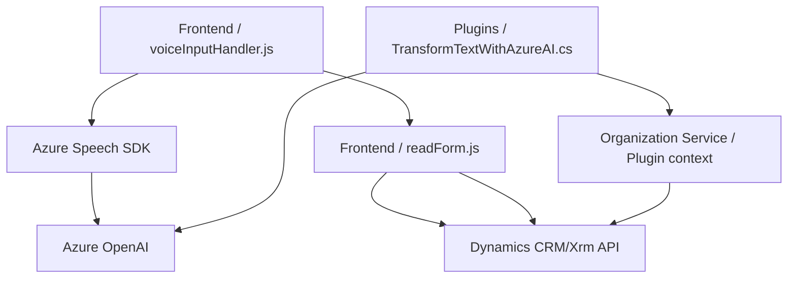

### Breve Resumen Técnico:

El conjunto de archivos analizados permite implementar funcionalidades relacionadas con la síntesis de voz y el reconocimiento de voz mediante Azure Speech SDK, además de incluir procesamiento avanzado de texto mediante Azure AI para formularios y datos en entornos CRM (Microsoft Dynamics). La solución combina un frontend en JavaScript con backend en .NET mediante plugins para integrar capacidades de inteligencia artificial y accesibilidad en plataformas que utilizan Dynamics CRM.

---

### Descripción de Arquitectura:

La arquitectura es híbrida y se puede dividir en dos principales componentes:

1. **Frontend:**
   - Maneja la interacción del usuario con formularios.
   - Captura datos de los campos, los procesa y realiza síntesis de texto a voz para accesibilidad, utilizando el SDK de Azure Speech.
   - También ofrece la opción de reconocimiento de voz, con capacidades para mapear dinámicamente datos obtenidos del usuario a campos del formulario.

2. **Backend:**
   - Implementado como un plugin de Dynamics CRM que procesa datos enviados por el frontend.
   - Utiliza Azure OpenAI para transformar texto según reglas específicas.
   - Se ejecuta como una extensión importada en la plataforma CRM, actuando sobre eventos definidos.

La solución utiliza arquitectura modular con diversos patrones integrados:
- Plugins (en backend).
- Modularidad funcional (en frontend).
- Integración de servicios externos (SDK y APIs de Azure).

La solución está orientada a una **n-capas** debido a las divisiones entre frontend y backend, y a una arquitectura **orientada a servicios** en cuanto al uso de APIs externas.

---

### Tecnologías Usadas:

1. **Frontend:**
   - Lenguaje: JavaScript.
   - Azure Speech SDK para síntesis y reconocimiento de voz.
   - Dynamics CRM/Xrm para acceso y manipulación de datos del formulario.

2. **Backend:**
   - Lenguaje: C# (.NET Framework).
   - Microsoft Dynamics SDK (`IPlugin`, `IPluginExecutionContext`).
   - Azure OpenAI para procesamiento de texto con IA.
   - API REST para integración con servicios remotos.
   - `Newtonsoft.Json` y `System.Text.Json` para manejo de JSON.
   
3. **Componente externo:**
   - Azure Services (Key Management, Speech SDK, OpenAI).

---

### Diagrama Mermaid Válido para GitHub:

---

### Conclusión Final:

La solución presenta una arquitectura modular, escalable, y extensible, combinando un frontend basado en JavaScript que facilita la interacción de los usuarios con los formularios y la inclusión de accesibilidad, con un backend orientado a servicios, desarrollado como un plugin de Dynamics CRM. La integración con APIs de Azure (Speech SDK y OpenAI) es un punto clave que posibilita el manejo de voz, reconocimiento y transformación de datos mediante procesos avanzados de IA. Sin embargo, algunos detalles como la configuración sensible (hardcodeada) podrían mejorarse para aumentar seguridad y flexibilidad. La solución está bien adaptada para entornos empresariales que usan Dynamics CRM y buscan expandir funcionalidades mediante servicios externos.