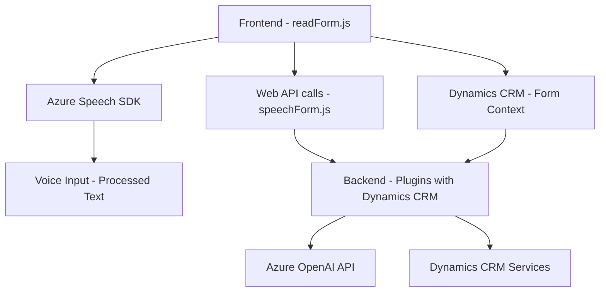

### Breve resumen técnico
El repositorio define una solución que integra tres principales componentes:
1. **Frontend**: Scripts en JavaScript para manejar formularios interactivos mediante entradas de voz y síntesis de voz utilizando el Azure Speech SDK. También realiza comunicación directa con APIs externas y asignaciones dinámicas de datos a campos específicos.
2. **Backend/Plugins**: Un plugin para Microsoft Dynamics CRM que transforma texto en formato JSON mediante Azure OpenAI, con un flujo que propone reglas dinámicas predefinidas.

La solución utiliza herramientas como **Microsoft Dynamics CRM**, **Azure Speech SDK**, **Azure OpenAI**, y depende de diversos patrones de diseño como modularidad funcional, integración de APIs y arquitectura de plugins.

---

### Descripción de arquitectura
La arquitectura general del sistema incluye las siguientes características:

1. **Multicomponente**:
   - **Frontend** interactúa con el usuario para entrada y síntesis de voz y se comunica por Web API con el backend para transformaciones avanzadas.
   - **Plugins de Dynamics 365 CRM**: Procesa texto y realiza llamadas a la API de Azure OpenAI para transformar datos.

2. **Orientación hacia Integración con Servicios Externos**:
   - Uso del **Azure Speech SDK** para reconocimiento y síntesis de voz.
   - Interacción activa con APIs externas mediante un plugin y scripts.

3. **Arquitectura n capas**:
   - **Presentación (frontend)** proporciona la interfaz de usuario.
   - **Lógica de negocio (backend/plugin)** realiza validaciones, formatea texto, y delega a servicios externos.
   - **Integración con APIs externas** como Azure Speech SDK y Azure OpenAI.

---

### Tecnologías usadas
1. **Frontend**:
   - **Azure Speech SDK** para reconocimiento de voz y síntesis.
   - **JavaScript** como lenguaje principal.
   - **Microsoft Dynamics CRM (Form Context)** para manejar datos relacionados con formularios del usuario.

2. **Backend**:
   - **C#** para desarrollo del plugin.
   - **Dynamics 365 Plugin Framework** para interceptar eventos en CRM.
   - **Azure OpenAI API** para procesamiento avanzado del texto.
   - **System.Net.Http** para solicitudes HTTP hacia APIs.
   - **Newtonsoft.Json** y **System.Text.Json** para manejo de JSON.

---

### Dependencias y componentes externos
1. **Azure Speech SDK** (frontend): Para reconocimiento y síntesis de voz.
2. **Azure OpenAI** (backend/plugin): Para transformación avanzada de texto.
3. **Microsoft Dynamics CRM SDK** (plugin): Para integrar lógica de negocio y funciones en el contexto de la solución CRM.
4. **Xrm.WebApi.online.execute**: Para llamadas a APIs desde Dynamics 365.
5. **Otros posibles SDKs/plugins** dependiendo de extensiones añadidas al Dynamics CRM.

---

### Diagrama Mermaid

---

### Conclusión final
La solución combina interacción directa entre un **frontend dinámico** y un **plugin backend** en un sistema **n capas**. Está diseñada para entornos empresariales que utilizan **Microsoft Dynamics CRM**, permitiendo a los usuarios capturar entradas de voz, procesarlas en tiempo real con SDK de Azure Speech, y automatizar tareas como síntesis de voz, asignación a formularios y transformación avanzada de datos mediante **Azure OpenAI**.

Aunque la arquitectura es funcional, se puede mejorar la configuración de las dependencias (por ejemplo, la API Key) para que sean variables y gestionadas externamente en lugar de hardcoded.