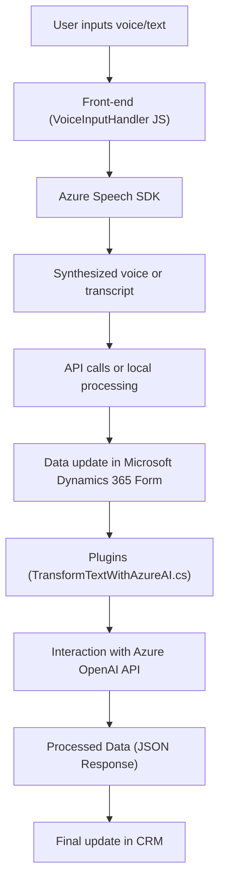

### Breve resumen técnico

El repositorio analizado integra varias capacidades basadas en el reconocimiento y síntesis de voz, manipulando formularios y datos dinámicos en un sistema CRM como Microsoft Dynamics 365. Las funciones hacen uso de tecnologías avanzadas como **Azure Speech SDK** y **Azure OpenAI API** para interacción vocal y transformación de texto. Une la experiencia de voz y texto con reglas dinámicas configurables, mostrando un enfoque híbrido entre extensiones front-end y lógica de negocio en back-end.

---

### Descripción de arquitectura

1. **Tipo de solución:**  
   - Principalmente orientada a sistemas **CRM extendidos** integrados con **servicios de voz e inteligencia artificial**. Combina componentes **front-end**, procesamiento de voz, interacción con APIs externas, y lógica basada en plugins para Dynamics CRM.

2. **Arquitectura:**  
   - Se trata de un **n capas** integrado con un esquema de SOA parcial.  
   - Las capas principales incluyen:
     - **Capa de interacción:** Front-end (JS manejando formularios, sintetizando voz y manipulando datos dinámicos).
     - **Capa de servicio:** APIs externas de Azure Speech SDK, Azure OpenAI, y servicios de Dynamics CRM.
     - **Capa de lógica de negocio:** Plugins en Dynamics 365 que procesan y transforman datos con reglas específicas mediante interacción con APIs externas.

---

### Tecnologías usadas

1. **Lenguajes:**
   - **Front-end:** JavaScript (manipulación del DOM, reconocimiento y síntesis de voz mediante SDK).
   - **Back-end:** C# (plugins para Dynamics CRM).

2. **Principales dependencias:**
   - **Framework:** Microsoft Dynamics CRM SDK.
   - **API Externa:** Azure Speech SDK y Azure OpenAI API.
   - **Paquetes:** Newtonsoft.Json para JSON handling.

3. **Patrones:**
   - Modularización funcional: Diseño claro y separado por responsabilidades (voz, texto, datos).
   - Service-Oriented Architecture (SOA): Integración con APIs externas (Azure Speech SDK/ OpenAI).
   - SDK Loader Pattern: Asegura la disponibilidad dinámica del Azure Speech SDK antes de usarlo.
   - Plugin architecture: Sistema basado en eventos y extensiones del CRM.

---

### Diagrama Mermaid válido para GitHub

---

### Conclusión final

El repositorio claramente muestra una **fully integrated CRM solution** que emplea capacidades avanzadas como el reconocimiento de voz, síntesis de audio, y transformación de texto con inteligencia artificial. La solución adoptó una **n-capas con elementos SOA** orientada hacia la extensibilidad y modularidad.  
A través de la interacción entre **front-end dinámico**, **servicios externos en la nube (Azure)**, y **lógica interna potente (CRM plugins)**, este sistema optimiza la relación usuario-software añadiendo innovaciones como el reconocimiento y procesamiento vocal, generando una experiencia más automatizada y eficiente para la gestión de formularios y datos dinámicos en Microsoft Dynamics 365.