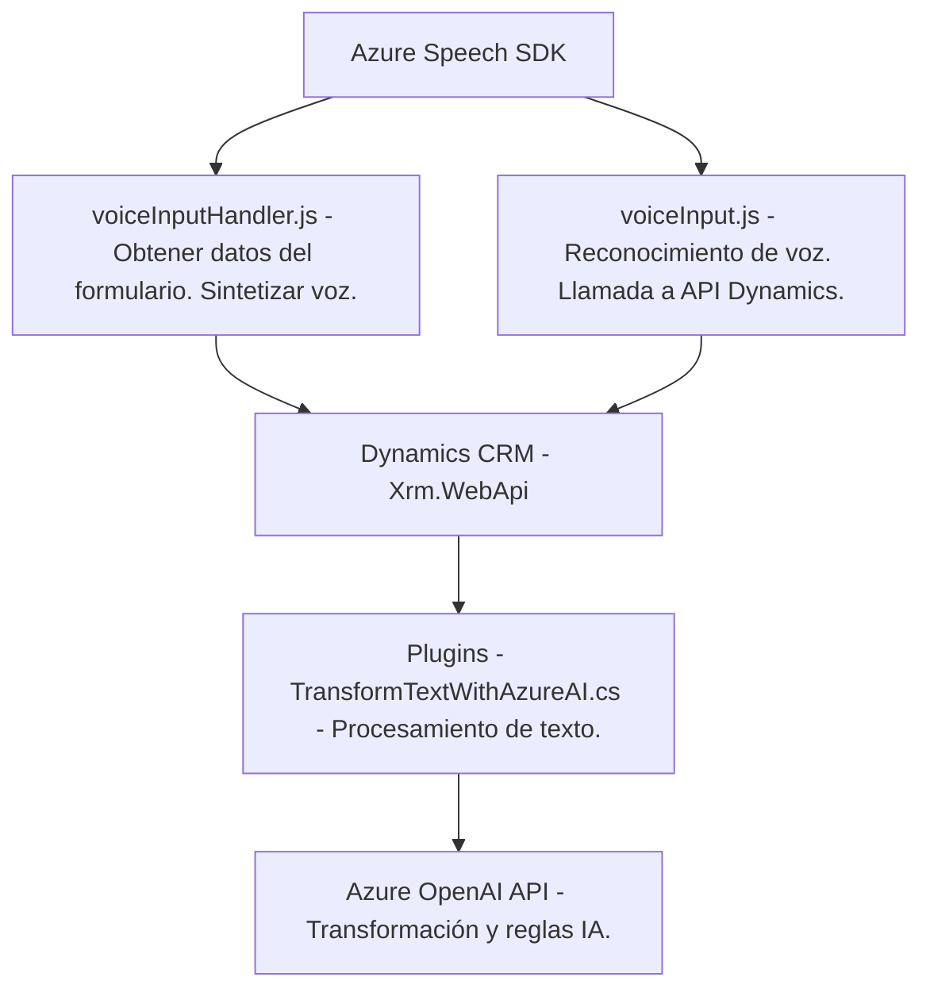

### Breve resumen técnico
El repositorio implementa capacidades de procesamiento de voz y texto en un entorno integrado con Dynamics CRM, utilizando tecnologías como el Azure Speech SDK y Azure OpenAI. Los archivos proporcionan funcionalidades para interactuar con formularios mediante voz, sintetizar texto y transformar datos con inteligencia artificial, todo ello con integración directa a APIs externas y una arquitectura basada en eventos y servicios.

---

### Descripción de arquitectura
La solución combina los siguientes elementos arquitectónicos:
- **Arquitectura de capas**:
  - **Frontend:** Código JavaScript para interacción de usuario (captura de entrada de voz, procesamiento de formularios).
  - **Backend:** Código en C# diseñado como un plugin para Dynamics CRM, encargado de transformar datos y conectarse con Azure OpenAI.
- **Integración de SDK y servicios externos:** El Frontend utiliza Azure Speech SDK para síntesis de voz, mientras que el plugin backend conecta con Azure OpenAI para procesamiento avanzado de texto.
- **Eventos dinámicos:** A nivel de frontend, la ejecución depende de activadores como el inicio de entrada de voz o interacción del usuario con formularios. A nivel backend, el plugin responde al contexto de ejecución en Dynamics CRM.

---

### Tecnologías usadas
1. **Frontend**:
   - `Azure Speech SDK` (JavaScript): Para síntesis y reconocimiento de voz.
   - APIs de `Dynamics CRM`: Manipulación programática del contexto de formularios (`Xrm.WebApi`).

2. **Backend (Plugins)**:
   - `Microsoft Dynamics SDK` (C#): Para implementar un plugin que interactúa con Dynamics CRM vía la interfaz `IPlugin`.
   - `Azure OpenAI API`: Para transformar y procesar texto usando modelos GPT.
   - `System.Net.Http`: Para realizar solicitudes REST a Azure OpenAI.

3. **Otros**:
   - Serializadores JSON como `Newtonsoft.Json.Linq` y `System.Text.Json`.

---

### Diagrama Mermaid válido para GitHub

---

### Conclusión final
Esta solución implementa una integración eficaz entre un frontend basado en JavaScript y un backend plugin en C# para Dynamics CRM. La funcionalidad principal gira en torno a procesar datos de formularios y permitir una interacción por voz utilizando Azure Speech SDK, mientras que el backend aprovecha Azure OpenAI para transformar y manipular el texto según reglas definidas. La arquitectura es de tipo n-capas, con eventos dinámicos y dependencias clave en servicios externos de Azure y Dynamics CRM.