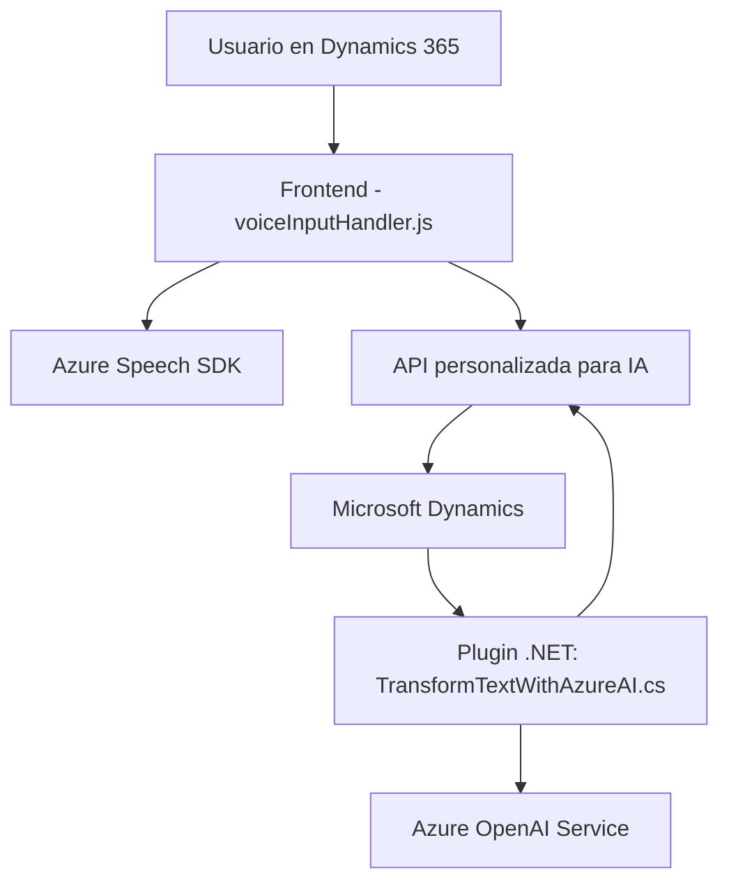

---

### Breve resumen técnico:
El repositorio parece ser parte de un sistema diseñado para un entorno CRM, probablemente Microsoft Dynamics 365. Se implementan soluciones que conectan un frontend basado en JavaScript y un backend en .NET, integrando tecnologías como Azure Speech SDK y Azure OpenAI Service. El propósito general del sistema es facilitar la interacción entre usuarios y formularios mediante el reconocimiento de voz, generación de texto sintetizado, procesamiento de datos con inteligencia artificial, y transformación mediante reglas específicas.

---

### Descripción de arquitectura:

La arquitectura general se presenta como una combinación de las siguientes características:
1. **N-capas:** Donde el frontend (JavaScript) obtiene datos de la capa del modelo (formularios/entidades de Dynamics CRM) y hace llamadas al backend (Plugins .NET) que contienen la lógica de negocio y la integración con APIs externas.
2. **Plug-ins en Dynamics CRM:** La funcionalidad del sistema está centrada en eventos definidos por el CRM (como la creación, actualización o consulta de entidades).
3. **Servicio externo dependiente:** Utiliza comunicación con el servicio Azure OpenAI y SDK de Azure Speech para la integración con IA y de voz.
4. **Integración de código modular:** Las funciones del frontend están estructuradas en módulos claros que separan responsabilidades, mientras que el backend contiene lógica encapsulada en un plugin con una estructura de responsabilidad única.

---

### Tecnologías usadas:

#### 1. Frontend:
- **HTML/JavaScript:** Tecnología básica del cliente, probablemente usando una interfaz dentro de Dynamics 365. Funciones organizadas en formatos modulares.
- **Azure Speech SDK:** Usado para habilitar la transcripción de voz y síntesis de texto.

#### 2. Backend:
- **Microsoft Dynamics SDK (.NET):** Para desarrollo de plugins y gestión de contexto en CRM.
- **Azure OpenAI Service (GPT):** Uso de un modelo GPT hospedado como servicio para transformar texto.
- **C#/.NET Framework:** Base para el desarrollo del plugin, incluyendo las librerías relacionadas.

---

### Diagrama Mermaid:

---

### Conclusión final:

El sistema se presenta como un conjunto de módulos que trabajan en sincronía: el frontend (con herramientas de JavaScript y Azure Speech SDK) se integra con Microsoft Dynamics 365 para procesar información de voz y texto, mientras que el backend interactúa con servicios externos (Azure OpenAI Service) para realizar transformaciones avanzadas basadas en inteligencia artificial. La arquitectura puede clasificarse como híbrida entre **cliente-servidor, N-capas**, y con integración mediante **Plug-ins para Dynamics CRM**. Es una solución potente para mejorar la experiencia de usuario en entornos empresariales donde el uso de voz y procesamiento de datos inteligentes son clave.