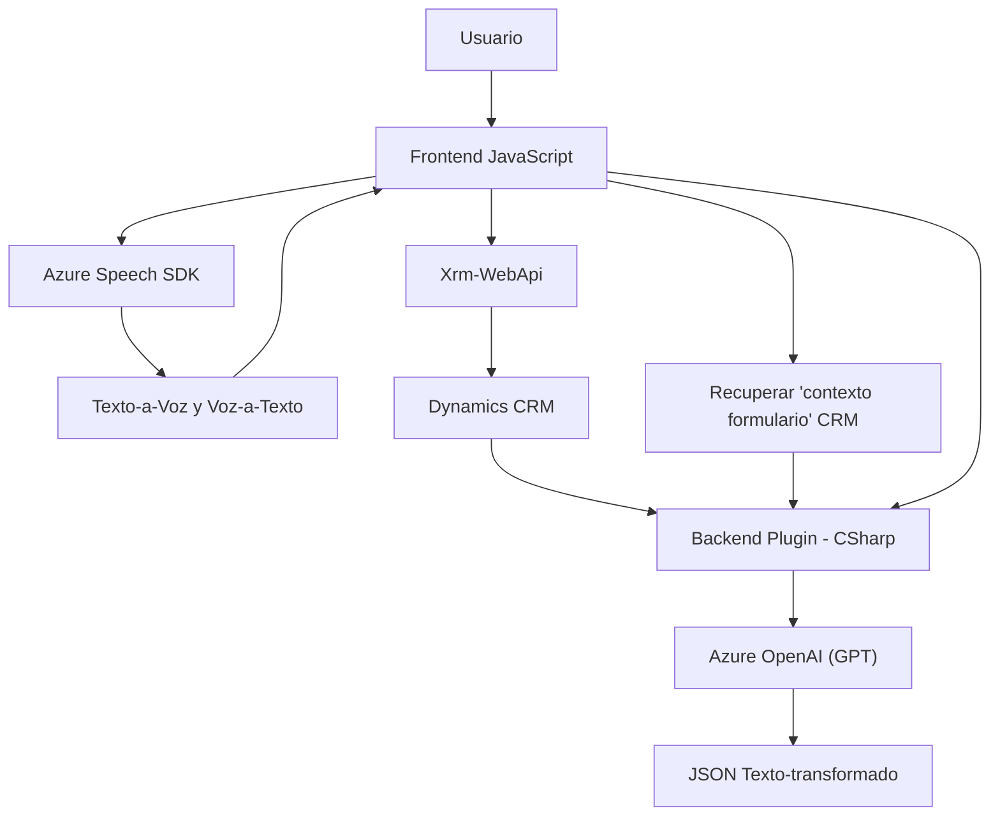

### Breve resumen técnico
El repositorio analiza una solución orientada a procesar y transformar datos mediante interacción con voz y texto. Utiliza tecnologías como Azure Speech SDK, Azure OpenAI, y Dynamics CRM. Se compone esencialmente de dos componentes principales: un frontend basado en JavaScript y un backend soportado por plugins en .NET para Dynamics CRM. Esto sugiere que se trata de una solución híbrida orientada a la integración de APIs y SDKs para automatizar procesos en formularios empresariales.

---

### Descripción de arquitectura
La arquitectura de este sistema muestra características de una combinación de **n-capas** y sistemas **event-driven**. Está constituida principalmente por un frontend que interactúa con un SDK para trabajar con texto y voz. Por otro lado, el backend opera como un plugin en Dynamics CRM para interactuar con la API de Azure OpenAI, transformando texto según reglas definidas. Aunque muestra modularidad y separación de responsabilidades, también evidencia cierto acoplamiento con las herramientas externas (Azure y Dynamics CRM).

---

### Tecnologías usadas
1. **Frontend**: Lenguaje JavaScript.
    - Azure Speech SDK para reconocimiento y síntesis de voz.
    - Xrm.WebApi para integrarse con Dynamics CRM.
    - Event-driven architecture con callbacks para cargar SDK y procesar eventos.
    
2. **Backend**:
    - **C# con .NET**:
      - Dynamics CRM Plugins (Microsoft.Xrm.Sdk).
      - System.Net.Http y System.Text.Json para interactuar con Azure OpenAI.
      - "gpt-4o" modelo en Azure OpenAI para transformación avanzada de texto.

3. **Servicios integrados**:
    - **Azure Speech SDK**: Reconocimiento de voz y síntesis de texto a voz.
    - **Azure OpenAI API**: Interacción con el servicio GPT-4 para procesamiento de texto.
    - **Dynamics CRM Web API**: Operaciones en línea con registros y entidades.

4. **Patrones detectados**:
    - Modularización funcional.
    - Event-driven programming con callbacks (frontend).
    - Integración con servicios externos vía APIs.
    - Plugin como arquitectura extensible en Dynamics CRM.
    - Gestión de dependencias.
    - Aplicación de valores a formularios basada en contexto del atributo y estructura del campo, el cual utiliza estrategias como el patrón "Strategy".

---

### Diagrama Mermaid válido para GitHub

El siguiente diagrama muestra las relaciones entre los componentes de la solución y representa el flujo general de datos y servicios. Es compatible con GitHub Markdown.

---

### Conclusión final
Esta solución es un sistema híbrido que utiliza componentes de frontend y backend, con integración en tiempo real con servicios en la nube como Azure Speech SDK y Azure OpenAI API. Su arquitectura basada en **n-capas**, con modularidad y enfoque en servicios externos, permite una implementación eficaz para casos como accesibilidad o interacción por comandos de voz.

Aunque está bien estructurado y aprovecha patrones como modularidad y uso de callbacks/event-driven programming, cabe señalar el acoplamiento evidente a Dynamics CRM y servicios específicos de Azure. Es una solución ideal para sistemas que necesitan interacción con voz o transformación de texto, pero es altamente dependiente de la disponibilidad y la configuración de los servicios externos.