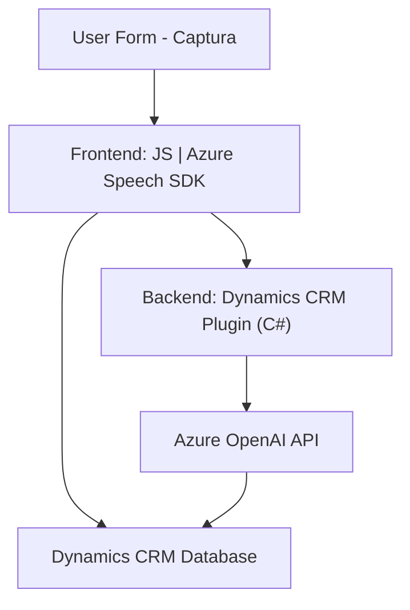

### Breve resumen técnico:
El repositorio analiza una solución que integra Azure Speech SDK (frontend) y Azure OpenAI (backend) dentro de un entorno Dynamics CRM para procesos interactivos entre voz, datos estructurados y eventos de CRM. Esto incluye reconocimiento y síntesis de voz, procesamiento de datos mediante IA y manipulación de formularios y APIs de Dynamics CRM.

---

### Descripción de Arquitectura:
La arquitectura combina patrones de **n-capas** y **integración híbrida**:
1. **Frontend**:
   - Procesa datos de formularios de usuario en tiempo real y aplica **reconocimiento/síntesis de voz** usando Azure Speech SDK.
   - Modularidad centrada en rutinas de interacción con el formulario y capturas basadas en eventos.
2. **Backend**:
   - Es un plugin adjunto a Dynamics CRM que procesa texto con Azure OpenAI mediante REST para estructurarlo como JSON.
   - Utiliza un estilo de **Plugin-based Architecture**, común en Dynamics CRM.
3. **Dependencias externas**:
   - Azure Speech SDK.
   - OpenAI (GPT) hospedado en Azure para generar JSON estructurado.
   - Dynamics CRM como punto central que orquesta las entradas y salidas.

--- 

### Tecnologías usadas:
1. **Frontend**:
   - **Azure Speech SDK (JavaScript):** Reconocimiento y síntesis de voz.
   - **Dynamics CRM JavaScript APIs** (Xrm.WebApi).
   - **Asincronía:** Callbacks y promesas (`ensureSpeechSDKLoaded`, API calls).
2. **Backend**:
   - **C#:** Plugin para Dynamics que usa `Microsoft.Xrm.Sdk` para acceso al entorno CRM.
   - **Azure OpenAI API:** GPT para texto a JSON estructurado.
   - **HTTP Client:** Manejo de solicitudes RESTful
3. **Diseño modular:** Uso de funciones específicas y desacopladas.
4. **Patrones:** 
   - Modular, integración externa, delegación de responsabilidades, y mapping de datos.

---

### Diagrama Mermaid válido para GitHub:

---

### Conclusión final:
La solución representa una arquitectura híbrida que combina capacidades de frontend basadas en JavaScript (icónico en sistemas de entrada de voz) y backend enchufado en Dynamics CRM mediante C#. Es ideal para automatización de campos críticos en entornos empresariales usando IA y servicios de voz. La integración de SDKs de Azure y la estructura modular permiten escalabilidad y extensibilidad, aunque es dependiente de APIs externas (Azure Speech/OpenAI).