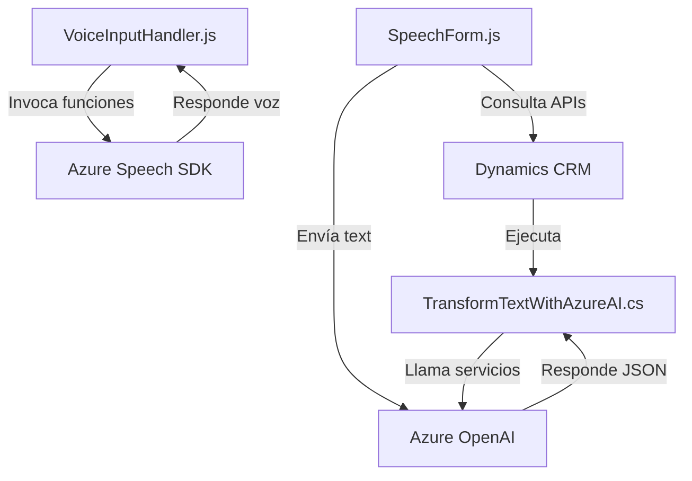

### Breve resumen técnico
El repositorio incluye tres archivos principales que parecen formar parte de una solución mayor orientada a integrar funcionalidades de voz, inteligencia artificial y datos estructurados en un entorno CRM (Customer Relationship Management). Utiliza tecnologías de Microsoft Azure Speech y OpenAI, mediante SDKs y servicios en la nube.

---

### Descripción de arquitectura
La arquitectura parece ser **orientada a servicios**, donde cada componente tiene responsabilidades definidas y se apoya en servicios externos:
1. **Frontend:** JavaScript para interactuar con formularios y proporcionar funciones como síntesis/reconocimiento de voz.
2. **Backend:** Un plugin de Dynamics CRM escrito en C#, que transforma texto mediante Azure OpenAI y regresa estructuras JSON.
3. **Servicios externos:** Integración directa con APIs externas como Azure Speech SDK y Azure OpenAI.

La arquitectura refleja principios de **n capas**:
- **Capa de presentación:** Funciones JavaScript interactúan con el usuario.
- **Capa de negocio:** Plugin transforma datos y sigue reglas predefinidas.
- **Capa de integración/servicios:** Comunicación con APIs externas (Azure Speech y OpenAI).

---

### Tecnologías usadas
1. **Frontend:**
   - JavaScript, ES6+ (modularidad funcional).
   - Azure Speech SDK.
   - Xrm.WebApi (integración directa con Dynamics CRM).

2. **Backend:**
   - C# para desarrollo del plugin en Dynamics CRM.
   - Microsoft.Xrm.Sdk para interacción con el entorno CRM.
   - System.Text.Json y Newtonsoft.Json.Linq para manipulación de JSON.
   - System.Net.Http para comunicaciones con APIs externas.

3. **Servicios externos:**
   - Azure Speech SDK: Para reconocimiento y síntesis de voz.
   - Azure OpenAI: Para transformar texto en JSON utilizando IA.

---

### Diagrama Mermaid válido para GitHub

---

### Conclusión final
Este repositorio implementa una solución híbrida que combina componentes de frontend y backend, utilizados para interactuar con formularios dentro de un sistema CRM. La integración con servicios de Azure Speech y OpenAI demuestra un diseño orientado a servicios, modular, con especial énfasis en la reutilización de lógica y desacoplamiento. Aunque funcional, podría beneficiarse de más robustez en el manejo de errores y configuración dinámica.