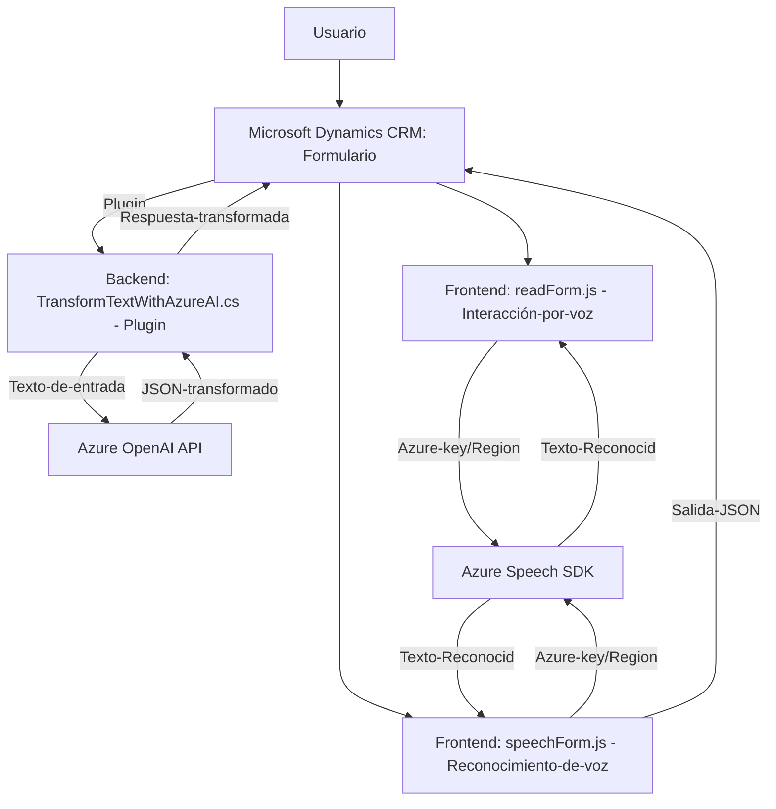

# Análisis técnico del repositorio

## Breve resumen técnico

Este proyecto parece ser una solución orientada a integrar capacidades de reconocimiento de voz y síntesis de texto a voz en un sistema de gestión (Microsoft Dynamics CRM), además de transformar datos texto mediante un servicio basado en inteligencia artificial (Azure OpenAI). 

La solución combina elementos de frontend y backend:
- El frontend maneja la interacción del usuario con el formulario y la entrada/salida de datos mediante voz.
- El backend, representado por el plugin, gestiona toda la lógica de transformación de texto en el entorno Dynamics CRM utilizando servicios externos de Azure.

---

## Descripción de arquitectura

La arquitectura de este software es híbrida; un enfoque **monolítico de Dynamics CRM** extendido con funciones personalizadas integradas a través de plugins. Estas extensiones se comunican con servicios externos como APIs de Azure para reconocimiento de voz y transformación de texto. Los archivos del frontend y plugin funcionan como componentes especializados dentro de una plataforma, conectados mediante eventos asincrónicos y respuestas HTTP.

Los principales patrones incluyen:

1. **Integración con API externa**: Tanto el frontend como el plugin llaman APIs externas para realizar tareas complejas (Azure Speech SDK y OpenAI).
2. **Modularidad**: Las funcionalidades están organizadas en funciones reutilizables, promoviendo mantenibilidad.
3. **Event-driven architecture**: Especialmente en el frontend, los flujos dependen de eventos activados por interacción del usuario o respuestas de servicios externos.
4. **Plugin Architecture**: En el backend, la lógica se ejecuta como un plugin de Dynamics CRM utilizando la interfaz `IPlugin`.

---

## Tecnologías, frameworks y patrones usados

### **Frontend**
1. **Lenguaje**: JavaScript.
2. **Servicios externos**: 
   - Azure Speech SDK: Captura y procesamiento de voz.
   - Microsoft Dynamics CRM SDK (a nivel de comunicación con el contexto del formulario).
3. **Patrones de diseño:**
   - Modular.
   - Cargador dinámico de SDK.
   - Factory pattern para configuraciones de servicios.

### **Backend**
1. **Lenguaje**: C# (.NET Framework), con enfoque en backend para Dynamics CRM.
2. **Servicios externos**:
   - Azure OpenAI API: Procesamiento avanzado basado en inteligencia artificial.
3. **Frameworks/Librerías**:
   - Microsoft Dynamics CRM SDK para implementar plugins.
   - Newtonsoft.Json para manipulación de datos JSON.
4. **Patrones de diseño:**
   - Plugin-based architecture.
   - Adopción de un microservicio externo (Azure OpenAI).

---

## Dependencias o componentes externos esperados

1. **Azure Speech SDK**: Para las interfaces de reconocimiento y síntesis de voz en el frontend.
2. **Azure OpenAI API**: Para transformar texto en el backend.
3. **Dynamics CRM SDK**: Para manejar datos dentro del contexto del formulario CRM.
4. **Newtonsoft.Json NuGet Package**: Dependencia de C# para procesamiento de JSON en plugins.
5. **HTTP Client Libraries (.NET)**: Para comunicación con API REST.

---

## Diagrama Mermaid

---

## Conclusión final

Este repositorio demuestra una solución compuesta que apalanca la integración de reconocimiento de voz y procesamiento avanzado basado en inteligencia artificial para extender las capacidades de Microsoft Dynamics CRM. La arquitectura combinada de frontend y plugins sigue un enfoque modular y está diseñada para combinar servicios locales y externos de manera eficiente. 

### Ventajas:
1. Reutilización: Funciones y métodos adecuadamente encapsulados, facilitando la mantenibilidad.
2. Escalabilidad: Uso de servicios como Azure OpenAI permite manejar necesidades de procesamiento de texto más complejas.
3. Dinámica: La carga de SDK dinámica habilita su uso solo cuando es necesario.

### Areas de mejora:
1. **Gestión segura de parámetros sensibles:** Debería utilizarse un sistema seguro para claves de Azure (ej. Azure Key Vault o variables de entorno).
2. **Validación del rendimiento:** La carga dinámica del SDK podría introducir latencia, especialmente en escenarios de uso intensivo. Esto debería evaluarse.
3. **Acoplamiento con servicios externos:** La dependencia directa a Azure puede ser una limitación si se deseara migrar a alternativas en el futuro. Abstraer las integraciones podría mejorar la flexibilidad a largo plazo.