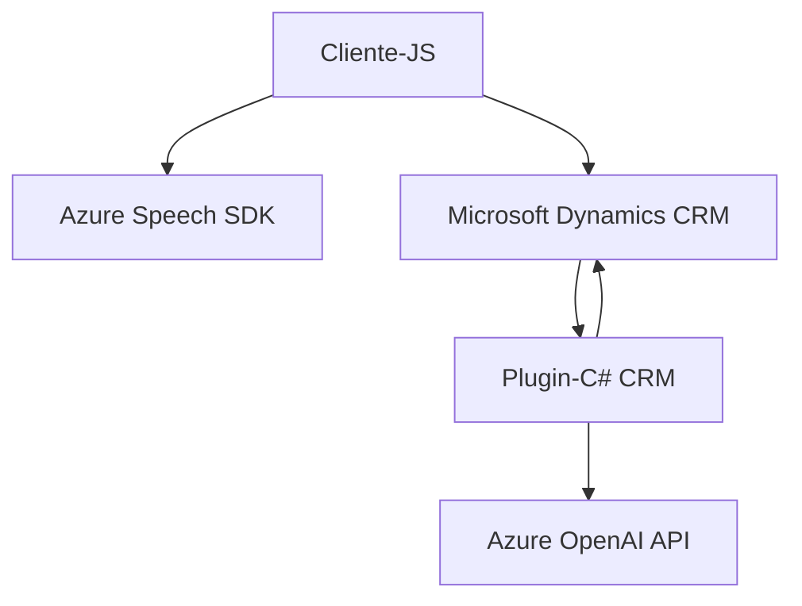

---

### Breve resumen técnico  
El repositorio describe una solución para la implementación de interacción por voz (síntesis y reconocimiento) en formularios dentro de aplicaciones que utilizan Microsoft Dynamics CRM. También incluye un plugin para integrar funciones de texto enriquecido mediante el uso de Azure OpenAI. La solución se basa principalmente en la interacción con servicios de Microsoft Azure y los SDK correspondientes, orientada hacia el procesamiento avanzado de datos de entrada y salida.

---

### Descripción de arquitectura  
1. **Tipo de solución:**  
   - Basado en los nombres de los archivos (`readForm.js`, `speechForm.js`) y la funcionalidad descrita, la solución es una combinación híbrida de una capa de "frontend" que interactúa con formularios dinámicos y un plugin que opera como lógica de negocio en el backend del CRM.  
   - Es una solución que apoya un sistema al estilo **CRM**, con funcionalidades conectadas a servicios de inteligencia artificial y síntesis de voz para mejorar la interacción de usuario.

2. **Arquitectura:**  
   - Por las características de los scripts (`readForm.js`, `speechForm.js`), pertenecen a una capa de cliente (frontend), aunque están diseñados para interactuar estrechamente con una API y/o SDKs del CRM y de Azure.  
   - Los plugins descritos (`TransformTextWithAzureAI.cs`), al implementarse mediante `IPlugin`, corresponden a un estilo de arquitectura **plugin-based** con una orientación lógica hacia un diseño de **microservicios**, dado que interactúan directamente con APIs especializadas (Azure OpenAI).  
   - La solución global podría ser categorizada como una variante modular de arquitectura **n-capas**, donde:
     - La capa del cliente interactúa con APIs externas,
     - Y el backend usa plugins y extensiones para administrar la lógica empresarial.

---

### Tecnologías usadas  
1. **Frontend:**  
   - **JavaScript:** Para la lógica interactiva en el frontend como la captura y síntesis de voz.  
   - **Azure Speech SDK:** Para transcribir voz, sintetizar texto y habilitar entrada por voz en formularios.  
   - **Microsoft Dynamics CRM SDK (`Xrm`):** Para comunicación con el entorno nativo del CRM (ej. recuperación de datos, aplicación de valores).

2. **Backend (plugin):**  
   - **Microsoft Dynamics CRM SDK (`IPlugin`, `Xrm.Sdk`):** Arquitectura de plugins sobre Microsoft Dynamics CRM.  
   - **Azure OpenAI SDK:** Integración con el servicio de OpenAI para procesamiento y transformación de texto.  
   - **Librerías auxiliares:**
     - `System.Net.Http` para realizar solicitudes a APIs externas.  
     - `Newtonsoft.Json` y `System.Text.Json` para manejar operaciones con datos JSON.  

---

### Dependencias o componentes externos  
1. **Azure Speech SDK (https://aka.ms/csspeech):** Para procesamiento y síntesis de voz en el cliente.  
2. **Microsoft Dynamics CRM SDK:** Para integración directa con el CRM (atención a formularios dinámicos, lógica de negocio).  
3. **Azure OpenAI (`https://openai-netcore.openai.azure.com`):** Servicio para transformación avanzada de texto.  
4. **Hardcoded values:** Claves y configuraciones como las regiones geográficas (`westeurope`) que podrían ser externos y deberían implementarse dinámicamente desde un sistema de administración de configuración.

---

### Diagrama Mermaid  

---

### Conclusión final  
La solución está bien estructurada para integrarse dentro del ecosistema de Microsoft Dynamics CRM, con uso extensivo de SDKs y servicios de Azure. Aunque muestra solidez en la funcionalidad, la inclusión de valores hardcoded como claves de Azure y configuraciones geográficas podría ser un punto de mejora notable para garantizar mayor seguridad y flexibilidad en un entorno empresarial. La arquitectura modular basada en APIs y plugins asegura escalabilidad y separación de responsabilidades.