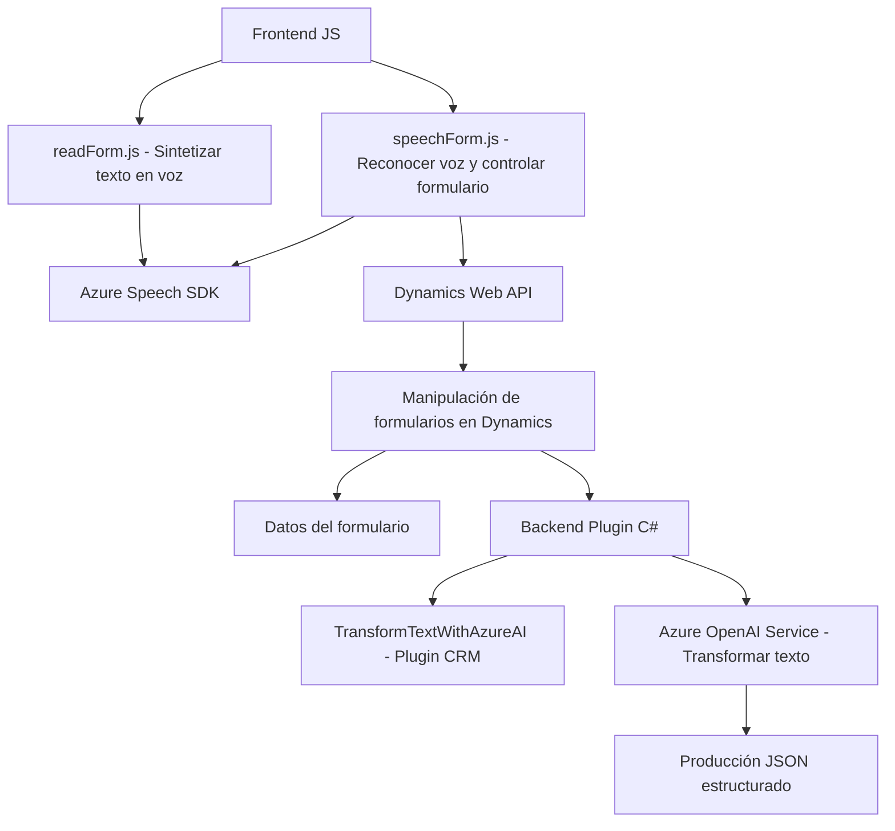

### Breve resumen técnico

El repositorio en análisis contiene los siguientes archivos y está enfocado en integrar funcionalidad de Azure Cognitive Services (Speech SDK y OpenAI) con formularios de Dynamics 365. Las funcionalidades principales están orientadas a:
1. **FRONTEND/JS/readForm.js**: Sumar accesibilidad mediante la síntesis de voz de los datos visibles en un formulario.
2. **FRONTEND/JS/speechForm.js**: Reconocer voz y usar comandos hablados para manipular formularios en Dynamics 365.
3. **Plugins/TransformTextWithAzureAI.cs**: Plugin para transformar texto en Dynamics 365 utilizando Azure OpenAI en formato JSON estructurado.

---

### Descripción de arquitectura

La solución está dividida en dos capas principales:
1. **Frontend**: 
   - Scripts en JavaScript que incluyen interacción entre Dynamics 365 y Azure Speech SDK. Usan programación funcional para modularizar tareas específicas.
   - Funciones del frontend cargan dinámicamente Azure Speech SDK para sintetizar voz o reconocer comandos hablados que son luego vinculados con formularios de Dynamics 365.

2. **Backend/plugin en Dynamics**:
   - Componente en .NET que ejecuta transformación de texto con OpenAI.
   - Es un ejemplo de plugin de Dynamics CRM que amplía funcionalidades específicas del sistema y usa la API de Azure para tareas avanzadas como transformación textual.

La arquitectura parece ser **híbrida**: combina la modularidad de scripts frontend con el plugin backend en Dynamics 365 para manejar de manera efectiva tanto interfaz de usuario como servicios externos.

---

### Tecnologías usadas

1. **Frontend**:
   - **JavaScript**: Implementación de la lógica de síntesis y reconocimiento de voz.
   - **Azure Cognitive Services Speech SDK**: Se carga dinámicamente para manejo de voz (reconocimiento y síntesis).
   - **Dynamics 365 Web API**: Manipulación de datos en formularios de Dynamics.

2. **Backend/plugin**:
   - **C# .NET**: Base para el desarrollo del plugin de Dynamics CRM.
   - **Azure OpenAI Service**: Servicio para procesamiento de texto vía inteligencia artificial.
   - **Microsoft Xrm SDK**: Para integración y procesamiento de datos en Dynamics 365.
   - **System.Net.Http**: Para realizar llamadas HTTP a servicios externos.

---

### Diagrama **Mermaid** válido para **GitHub Markdown**

---

### Conclusión final

La solución presentada tiene varias piezas conectadas e integrándose para ofrecer accesibilidad mediante voz y transformación textual avanzada en un entorno de Dynamics 365. Se basa en una arquitectura modular:
- **Frontend**: Gestión en tiempo real de voz y texto con Azure Speech SDK para formularios dinámicos.
- **Backend**: Plugin de Dynamics CRM que utiliza Azure OpenAI para lógica avanzada de transformación textual.

El uso de tecnologías como Azure Speech SDK y OpenAI en combinación con Dynamics demuestra un enfoque arquitectónico moderno que aprovecha microservicios externos y funcionalidades dinámicas en un entorno empresarial.