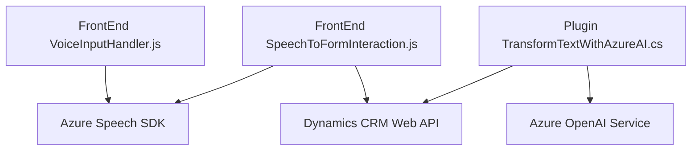

### Breve resumen técnico

El repositorio contiene tres módulos que se integran para implementar una solución que combina administración de formularios en Microsoft Dynamics CRM con capacidades de reconocimiento y síntesis de voz (Azure Speech SDK) y procesamiento avanzado de datos con Azure OpenAI Service. La solución está orientada a mejorar la experiencia de usuario a través de interfaces enriquecidas y automatización.

---

### Descripción de arquitectura

La arquitectura presentada en los tres archivos indica un sistema híbrido de integración, donde se combinan funcionalidades de frontend (interacción con formularios vía reconocimiento y síntesis de voz) y backend (procesamiento de datos y operaciones en CRM). Los siguientes componentes clave de la arquitectura son observables:

1. **Frontend:**
   - Ofrece una interfaz interactiva en JavaScript empaquetada en los formularios de Microsoft Dynamics CRM.
   - Contiene módulos para reconocimiento de voz, síntesis de voz y automatización de la manipulación del formulario en base a datos reconocidos.

2. **Backend:**
   - Incluye un plugin (.NET) para Dynamics CRM que se conecta con Azure OpenAI Service para transformación de datos mediante inteligencia artificial.
   - El plugin actúa como un adaptador para gestionar solicitudes HTTP hacia el servicio de Azure OpenAI y retornar un JSON estructurado a Dynamics CRM.

3. **SaaS Integration:**
   - Utiliza APIs externas, como Azure Speech SDK para voz y Azure OpenAI Service para inteligencia artificial.

El diseño general emplea una **arquitectura de n capas** en un entorno **orientado a servicios**. Aunque el sistema tiene componentes modularizados y desacoplados para manejo de síntesis y reconocimiento de voz, así como transformación de datos, su relación con Dynamics CRM sugiere que está limitado por una arquitectura monolítica con capacidades extendidas mediante plugins y servicios.

---

### Tecnologías usadas

1. **Frontend (JavaScript):**
   - **Azure Speech SDK:** Reconocimiento y síntesis de voz.
   - **Dynamics CRM JavaScript API (executionContext, formContext):** Manipulación de datos y eventos del CRM.
   - **Callback-flow:** Gestión asincrónica de eventos mediante callbacks para carga dinámica del SDK.

2. **Backend (.NET):**
   - **ASP.NET vía `IPlugin` de Dynamics CRM:** Extensibilidad mediante plugins.
   - **Azure OpenAI Service:** Procesamiento avanzado usando IA para reglas personalizadas.
   - **Newtonsoft.Json / System.Text.Json:** Serialización y deserialización de datos JSON.
   - **System.Net.Http:** Comunicación HTTP con Azure OpenAI Service.

3. **Arquitectura:**
   - Diseño modular (separación de funciones y responsabilidades en el código).
   - Orientación a servicios (interacción en tiempo real con APIs de Azure y Dynamics CRM).

---

### Diagrama Mermaid válido para GitHub

---

### Conclusión final

La solución corresponde a un sistema interactivo basado en **n capas** donde cada capa cumple roles específicos:
- **Frontend:** Interacción del usuario mediante voz para manipulación de formularios.
- **Backend:** Extensión personalizada de Dynamics CRM con capacidades de IA en Azure OpenAI para procesamiento avanzado de datos.

Se utiliza una combinación de tecnologías modernas asociadas a Azure (Speech SDK y OpenAI Service), junto con la extensibilidad estándar de Dynamics CRM a través de plugins. El diseño modular y orientado a servicios garantiza escalabilidad y posibilidad de seguir integrando capacidades futuras.

