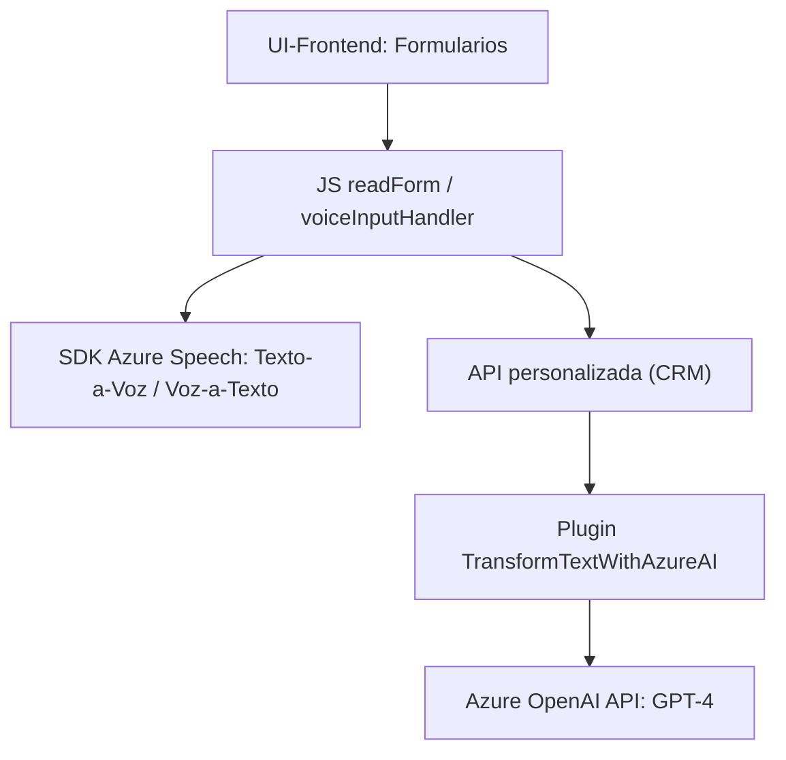

### Análisis Detallado

#### Breve resumen técnico
El repositorio está compuesto por varias capas de un sistema que amplía las capacidades de un CRM (probablemente Microsoft Dynamics CRM) mediante integración externa con **Azure Speech SDK** y **Azure OpenAI**. La solución proporciona funcionalidad avanzada de entrada y transformación de datos, utilizando servicios en la nube para reconocimiento de voz, generación de texto hablado y procesamiento/formateo de contenidos.

---

### Descripción de la arquitectura

La solución sigue una **arquitectura en capas** y combina orientación funcional con integración de servicios externos. Los archivos proporcionados sugieren:
1. **Frontend (JavaScript):** Gestión de formularios interactivos basados en navegadores y eventos de reconocimiento de voz. Integran SDK de Azure Speech para la entrada y procesamiento de voz.
2. **Backend (Plugin en C#):** Extensión al CRM mediante programación de plugins que implementan la lógica del servidor para integrar datos del CRM con un servicio de transformación de texto utilizando **Azure OpenAI API**.

El sistema tiene características de una arquitectura **hexagonal** debido a su enfoque en la integración de servicios externos (Azure Speech y OpenAI) y en el modelado de datos dentro de un contexto específico del dominio (Microsoft Dynamics CRM).

---

### Tecnologías usadas

**Front-End:**
1. **JavaScript**: Uso para la funcionalidad dinámica en el cliente (gestión de formularios y eventos de reconocimiento de voz).
2. **Azure Speech SDK**: Reconocimiento y síntesis de voz en el navegador.
3. **Event-driven architecture**: Uso de eventos y callbacks para gestionar la interacción de usuario con el sistema.

**Back-End:**
1. **Microsoft Dynamics CRM (SDK)**: Funcionalidades del CRM para extender su comportamiento, accediendo a servicios como `IPluginExecutionContext` y `IOrganizationService`.
2. **C#/.NET (Microsoft.Xrm.Sdk)**: Desarrollo de plugins que interactúan con el CRM y gestionan procesos del negocio.
3. **Azure OpenAI API**: Transformación automatizada de texto en objetos estructurados (JSON).
4. **RESTful API**: Comunicación con el servicio en la nube de Azure OpenAI mediante solicitudes HTTP.
5. **JSON**: Estructuración de datos para API externas y CRM.

**Patrones:**
1. **Modularidad funcional:** Separación de cada funcionalidad en sus propias funciones dentro del archivo de JavaScript, y servicios como plugins CRM.
2. **Patrón Gateway:** Comunicación con Azure OpenAI y Azure Speech actúa como un gateway para integrar servicios en nube.
3. **Patrón de extensibilidad CRM:** Uso del plugin para inyectar programación personalizada en Dynamics CRM.
4. **Capa de entrada e integración:** Uso de servicios como SDK y API externa para gestionar inputs del usuario y transformar datos.

---

### Dependencias o Componentes externos
1. **Azure Speech SDK:** Para reconocimiento y síntesis de voz en JavaScript.
2. **Azure OpenAI API:** Para transformación de texto en el servidor CRM mediante solicitudes REST.
3. **Microsoft Dynamics CRM SDK:** Extensión del CRM y acceso a datos de formularios del sistema.
4. **Librerías de manejo de JSON:**
   - *System.Text.Json* y *Newtonsoft.Json.Linq* en el backend para procesar respuestas API.

---

### Diagrama Mermaid 
El siguiente diagrama muestra cómo se conectan los componentes de la arquitectura en el repositorio. Los nodos representan principalmente las capas y sus interacciones:

---

### Conclusión final
La solución presentada es una extensión avanzada de **Microsoft Dynamics CRM**, que integra servicios de Azure para reconocimiento de voz (Speech SDK) y transformación de texto mediante inteligencia artificial (OpenAI API). Su arquitectura es modular y sigue un enfoque de **integración en capas**, con combinación de patrones de programación orientados a eventos y extensibilidad. Proporciona capacidades personalizadas y accesibilidad mejorada en el contexto de formularios dinámicos. El diseño permite una fácil escalabilidad para nuevos flujos de trabajo y servicios.