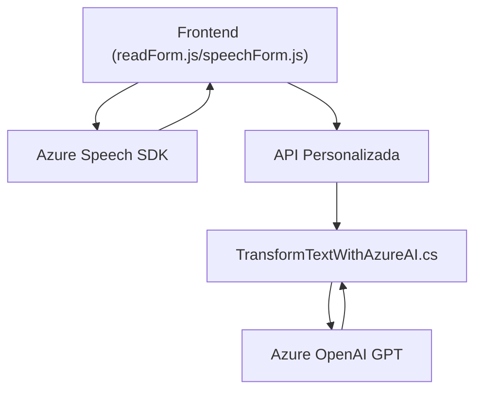

# Resumen técnico

El repositorio contiene tres archivos con funcionalidades que se integran para proporcionar una solución. Los archivos analizados `readForm.js`, `speechForm.js`, y `TransformTextWithAzureAI.cs` sugieren que el proyecto tiene un enfoque orientado a proporcionar una **solución híbrida basada en integración con APIs externas**, relacionada con entrada/salida de voz, procesamiento de datos y transformación de texto utilizando servicios de Azure. Los componentes están integrados principalmente con Microsoft Dynamics CRM, el SDK de Azure Speech y el servicio de Azure OpenAI. 

# Descripción de arquitectura

La arquitectura es principalmente basada en una **estructura de capas** que interactúan entre sí. Contiene las siguientes capas:
1. **Frontend (JavaScript):**
   - Realiza la entrada y salida de voz desde el cliente.
   - Usa el SDK de Azure Speech para reconocimiento de voz y síntesis de voz.
   - Realiza llamadas a funciones internas y externas (APIs personalizadas).
   - Extrae datos de formularios y se integra con Dynamics CRM para operaciones como el mapeo y actualización de campos.

2. **Backend (C# Plugin):**
   - Diseñado específicamente para ejecutarse en un entorno de servidor de Microsoft Dynamics CRM.
   - Consume el servicio Azure OpenAI para procesar y transformar textos según normas específicas.
   - Enfocado en procesamiento de datos y transformación con reglas personalizadas.

La arquitectura es una **n-capas** con interacciones fuertes a nivel de integración externa, un enfoque típico de un **Service-Oriented Architecture (SOA)**. Aunque no podemos confirmar si es un monolito o parte de un sistema más modulado, hay trazas del uso de patrones de **modularidad y separación de responsabilidades**.

# Tecnologías usadas
1. **Lenguajes:**
   - **JavaScript**: Para los archivos de frontend (`readForm.js` y `speechForm.js`).
   - **C# (.NET)**: Para el archivo del backend (`TransformTextWithAzureAI.cs`) como un plugin de Dynamics CRM.

2. **Frameworks y SDKs:**
   - **Microsoft Azure Speech SDK**: Reconocimiento y síntesis de voz.
   - **Microsoft Azure OpenAI GPT API**: Transformación de textos mediante modelos de lenguaje avanzados.
   - **Microsoft Dynamics CRM SDK**: Desarrollo de plugins para la interacción con el entorno CRM.

3. **Patrones:**
   - **Event-driven programming**: Utilizado en las funciones de reconocimiento y síntesis de voz.
   - **Callback Pattern**: Implementado para manejar funciones asíncronas, como cargar el SDK de Azure Speech.
   - **Facade Pattern**: Se centralizan varias funcionalidades relacionadas con el SDK de voz y el API del sistema en funciones específicas.
   - **Service-Oriented Architecture (SOA)**: La solución interactúa con APIs distribuidas (Azure Speech y OpenAI GPT).
   - **Helper Methods**: Separación modular para funciones auxiliares y específicas.

4. **Dependencias y componentes externos:**
   - **Azure Speech SDK**: Para entrada y salida de voz.
   - **Azure OpenAI GPT API**: Para procesamiento de texto avanzado.
   - **Microsoft Dynamics CRM APIs**: Utilizadas para la manipulación y actualización de datos de formularios.
   - **JSON** (`Newtonsoft.Json.Linq` y `System.Text.Json`): Para procesar y formatear datos.

# Diagrama Mermaid

# Conclusión final

Este repositorio implementa una **solución integrada basada en voz y texto** que utiliza servicios de voz (Azure Speech SDK) y procesamiento avanzado de texto (Azure OpenAI GPT). Se integra con Microsoft Dynamics CRM mediante un plugin diseñado para manejar el procesamiento y actualización de datos del CRM. La arquitectura subyacente es una solución **n-capas** con un enfoque en **SOA** debido al uso de múltiples APIs externas. La modularidad y los patrones de diseño como el **Facade Pattern** y la programación orientada a eventos ayudan a mantener una buena separación de intereses y potencial para ampliar funcionalidades en el futuro.