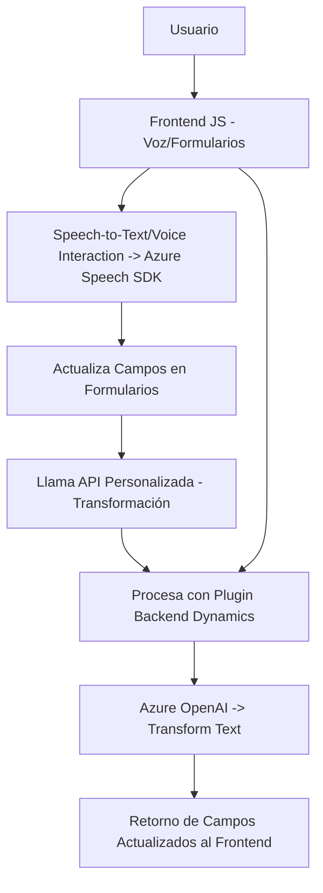

### Breve Resumen Técnico

El repositorio descrito consta de tres componentes principales:
1. **Frontend para Voz (JavaScript)**: Gestiona la interacción entre formularios y capacidades de Speech-to-Text/Text-to-Speech using Azure Speech SDK.
2. **Llamadas a APIs Dinámicas (JavaScript)**: Procesan formularios dinámicos utilizando reconocimiento de voz, IA basada en Azure y manipulación de atributos en Dynamics CRM.
3. **Plugins en Backend (.NET / C#)**: Implementan lógica avanzada dentro de Dynamics CRM utilizando Azure OpenAI para transformación de texto.

### Descripción de Arquitectura

La solución es un **sistema con arquitectura de capas híbridas**, compuesto de:
- **Frontend**: Basado en JavaScript, con dos archivos que interactúan directamente con el DOM y Azure Speech SDK.
- **Backend**: Compuesto por un _plugin_ desarrollado en C# que extiende las funcionalidades de Microsoft Dynamics CRM y conecta con Azure OpenAI.
- **Integración con API Externas**: Azure Speech SDK y Azure OpenAI forman dos dependencias principales que interactúan con los componentes del sistema.
- Este diseño tiene características de una **arquitectura n-capas** y utiliza comunicación asincrónica entre cliente (frontend) y servidores externos.

### Tecnologías Usadas

1. **Frontend**:
   - Lenguaje: JavaScript (modular).
   - Integración: Azure Speech SDK para TTS (Text-to-Speech) y STT (Speech-to-Text).
   - Frameworks/Librerías: Xrm.WebApi (Dynamics).
   - Patrones: Modularidad, integración asincrónica con SDK y APIs.

2. **Backend**:
   - Lenguaje: C# sobre .NET Framework.
   - Servicios Azure: OpenAI (GPT-4), Dynamics CRM SDK (IPlugin).
   - Librerías: Newtonsoft.Json, System.Net.Http, System.Text.Json.
   - Patrones: Plugin-based architecture, DTO (data transfer objects), integración con APIs REST.

3. **APIs Externas**:
   - **Azure Speech SDK**: Procesa síntesis y reconocimiento de voz.
   - **Azure OpenAI**: Transformación y modelado de texto.

### Diagrama Mermaid

### Conclusión Final

La solución combina **múltiples tecnologías en una arquitectura n-capas** buscando un entorno interactivo basado en formularios y accesibilidad por voz. Aprovecha componentes modernos como el **Azure Speech SDK** para procesamiento de voz y **Azure OpenAI** para IA avanzada, integrando la lógica en Dynamics CRM mediante un diseño modular y extensible.

Este tipo de arquitectura es adecuada para sistemas interactivos empresariales (como CRM) que aprovechan tanto datos estructurados como interacciones avanzadas de usuarios para mejorar la experiencia.