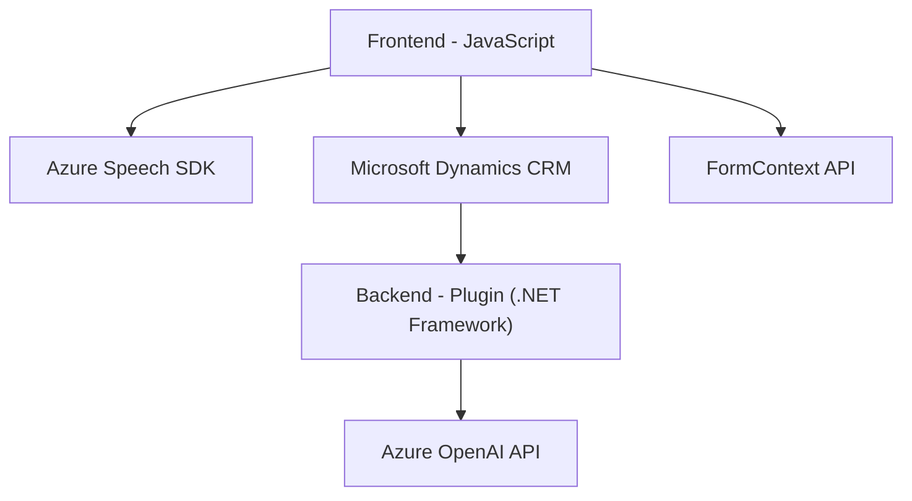

### Breve resumen técnico

El repositorio engloba una solución tecnológica que integra funcionalidades de reconocimiento y síntesis de voz, procesamiento dinámico de formularios y servicios inteligentes basados en la inteligencia artificial (Azure OpenAI). Utiliza configuraciones y dependencias específicas de Microsoft Dynamics 365/CRM, Azure Speech SDK para funcionalidades relacionadas con voz y un plugin de .NET para el procesamiento avanzado de texto.

---

### Descripción de arquitectura

1. **Tipo de solución**: La solución tiene dos componentes principales:
   - **Un front-end JavaScript** que actúa como cliente manejando formularios y conectándose a APIs externas para la síntesis o el reconocimiento de voz.
   - **Un back-end como plugin de Microsoft Dynamics CRM**, que se ejecuta en el servidor como lógica de negocio y gestiona la comunicación con el servicio Azure OpenAI.

2. **Arquitectura**:
   - **Híbrida (Cliente-Servidor)**: El front-end ejecuta tareas locales y solicita servicios externos, mientras que el servidor maneja tareas pesadas de procesamiento inteligente con Azure OpenAI.
   - **Basada en eventos**: En el backend, el diseño sigue la arquitectura de **plugin-based**, actuando de acuerdo con los eventos de Microsoft Dynamics CRM.
   - **Integración de APIs externas**: En ambos extremos (front-end y back-end), se integran servicios cloud como Azure Speech SDK y Azure OpenAI para la funcionalidad principal.

---

### Tecnologías usadas

1. **Cliente (Front-end)**:
   - **JavaScript DOM API**: Manipulación dinámica del DOM para cargar scripts (Azure SDK), gestionar formularios y actualizar campos.
   - **Azure Speech SDK**: Manejo de entrada y salida de voz, además de la síntesis de texto.
   - **Dynamic CRM API (`Xrm.WebApi`, `formContext`)**: Integración con los formularios y datos del sistema CRM.

2. **Servidor (Back-end)**:
   - **Microsoft Dynamics SDK**: Desarrollo de plugins mediante la interface `IPlugin` y servicios específicos como `IOrganizationService`.
   - **Azure OpenAI**: Para procesar texto utilizando inteligencia artificial.
   - **.NET Framework & C#**: Uso de bibliotecas estándar (`HttpClient`, `System.Text.Json`) para el manejo de solicitudes HTTP y JSON.

---

### Dependencias y componentes externos

1. **Azure Speech SDK**:
   - Para entrada y salida de voz en las interfaces cliente.
2. **Azure OpenAI API**:
   - Utilizado en el backend para la transformación de texto a través de IA.
3. **Microsoft Dynamics SDK**:
   - Usado para acceder al contexto de formularios, registros y ejecución de lógica de negocio dentro de Dynamics 365.
4. **Librerías .NET y Tecnologías CI/CD**:
   - `HttpClient`, `System.Text.Json` para emisión y manejo de requests HTTP.
   - Dependencias adicionales como `Newtonsoft.Json` para manipular JSON.

---

### Diagrama Mermaid

---

### Conclusión final

La solución parece estar diseñada para enriquecer formularios de un sistema CRM como Dynamics 365 con capacidades de entrada, salida y procesamiento de voz, integrando inteligencia artificial mediante Azure. La arquitectura es una combinación de cliente-servidor, donde el cliente maneja tareas ligeras como validaciones y llamadas a servicios, y el servidor procesa la lógica de negocio usando plugins y APIs de IA. Aunque cumple su propósito, la solución puede beneficiarse de mejoras como un diseño más modular o desacoplamiento en el manejo de APIs externas para simplificar y estandarizar la integración.