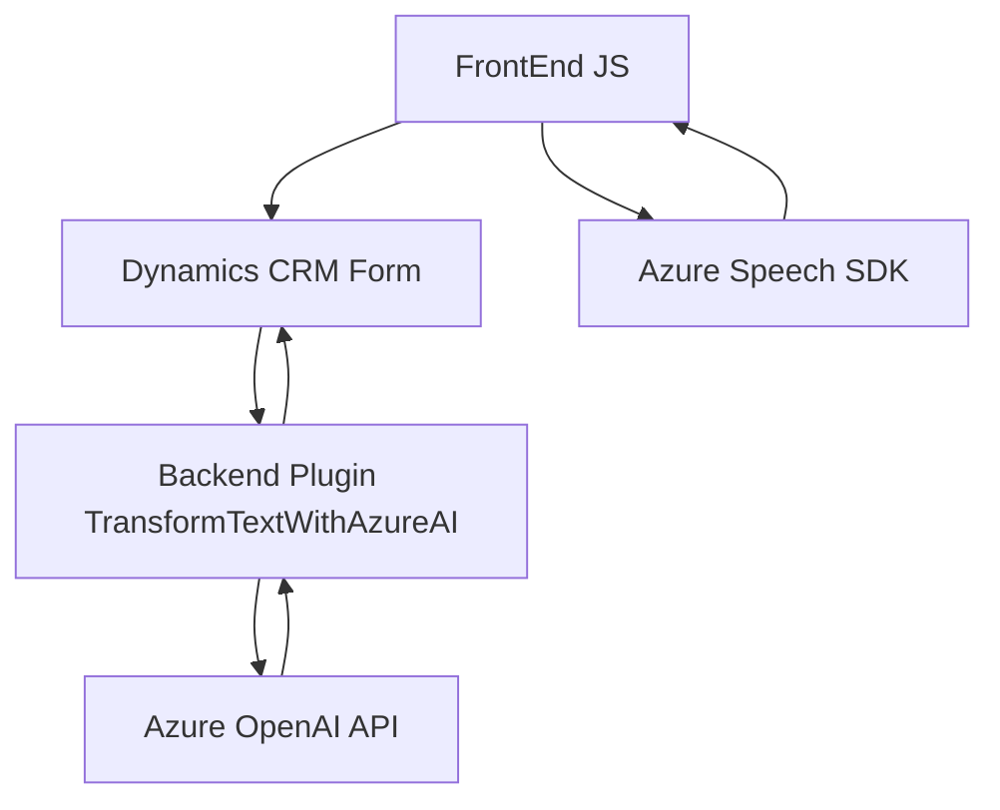

### Breve resumen técnico

El repositorio presenta principalmente tres archivos:
1. **Front-End (JavaScript-based):** 
   - `readForm.js` y `speechForm.js` contienen lógica de reconocimiento y síntesis de voz asociada con formularios de Dynamics CRM.
   - Estas implementaciones interactúan con el SDK de Azure Speech para manejo de voz y lectura de datos en tiempo real.
   - El objetivo es habilitar la integración verbal entre los usuarios y los formularios en el CRM.

2. **Backend Plugin (C#):**
   - `TransformTextWithAzureAI.cs` realiza procesamiento de texto utilizando el servicio Azure OpenAI, alojado en el ecosistema de Dynamics CRM.
   - Este script integra una arquitectura basada en extensiones de plugins y se comunica con servicios externos para transformar datos con inteligencia artificial.

---

### Descripción de arquitectura

1. **Arquitectura general:**
   - **Híbrida:** Combina una solución cliente-servidor en el front-end y plugins basados en eventos en el servidor. Se conecta dinámicamente con servicios externos como Azure Speech SDK y Azure OpenAI.

2. **Componentes individualizados:**
   - **Front-End:** Implementa una arquitectura modular basada en funciones para síntesis y reconocimiento de voz. Utiliza patrones de integración condicional de SDK externos.
   - **Backend Plugin:** Desarrollado para Dynamics CRM con eventos definidos (a través de la interfaz `IPlugin`). Este componente opera como un microservicio en interacción con APIs externas (Azure OpenAI).

---

### Tecnologías, frameworks y patrones usados

#### **Front-End:**
- **JavaScript**
- **Azure Speech SDK:** Para procesamiento de voz (reconocimiento y síntesis).
- **Xrm.WebApi:** Para integraciones con Microsoft Dynamics CRM.
- **Eventos de ejecución dinámica y flujo condicional modular** (e.g., `ensureSpeechSDKLoaded`).

#### **Backend Plugins:**
- **C#:**
  - `Microsoft.Xrm.Sdk`: Interacciones con Dynamics CRM y API de la organización.
  - `System.Net.Http`: Solicitudes HTTP hacia servicios externos.
  - `Newtonsoft.Json` y `System.Text.Json`: Manejo avanzado de JSON.
- **Azure OpenAI:** Para generación de texto basado en inteligencia artificial.
- **Integración con servicios REST** (e.g., `GetOpenAIResponse`).

#### **Patrones arquitectónicos:**
- **Microservicios externos:** Azure OpenAI y Speech SDK integrados en procesos específicos.
- **Arquitectura de eventos:** Plugins activados por eventos definidos en Dynamics CRM.
- **DTO (Data Transfer Object):** JSON estructurado para transformar y transferir datos.
- **Modularización:** Front-end organizado por funciones independientes.

---

### Diagrama Mermaid válido para GitHub

---

### Conclusión final

Este repositorio implementa una solución híbrida basada en integración de servicios de voz e inteligencia artificial dentro de formularios de Dynamics CRM. Adopta:
- **Una arquitectura modular:** En el front-end para funcionalidades de síntesis y reconocimiento de voz mediante Azure Speech SDK.
- **Una arquitectura plugin-based:** En el backend para transformar texto con reglas dinámicas a través de Azure OpenAI.

La solución es altamente dependiente de servicios externos (Azure) y diseñada bajo un enfoque de eventos y modularización, permitiendo una escalabilidad limitada dentro del ecosistema específico de Dynamics CRM. Esta implementación es ideal para proporcionar una experiencia enriquecida basada en voz e IA en entornos empresariales.