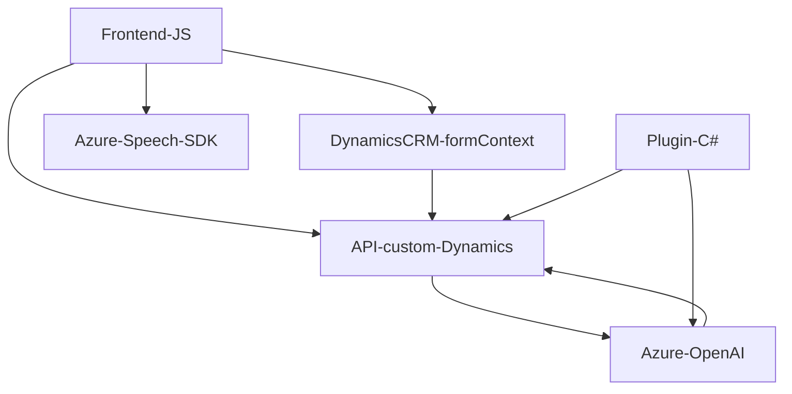

### Breve resumen técnico
El repositorio contiene distintas piezas de código utilizadas principalmente para la gestión de voz y texto dentro de un sistema que se integra con Microsoft Dynamics CRM, aprovechando servicios externos como Azure Speech SDK y Azure OpenAI para síntesis, procesamiento y reconocimiento de texto.

---

### Descripción de arquitectura
La solución presentada en el repositorio tiene una arquitectura **modular orientada a servicios externos**, claramente dividida en dos ámbitos principales:
1. **Frontend (JS)**: Implementa funciones específicas para la interacción con formularios de Dynamics CRM, reconocimiento de voz y modulación de datos mediante el SDK de Azure Speech, empleando un enfoque modular dentro de un único archivo para organizar tareas individuales.
2. **Backend (Plugins en C#)**: Define plugins que integran capacidades avanzadas mediante el uso del servicio Azure OpenAI para transformar texto, invocando APIs externas desde código ejecutable en CRM.

En general, esta solución puede considerarse una arquitectura de **n capas**:
- **Capa externamente conectada**: Servicios externos como Azure Speech y Azure OpenAI.  
- **Capa de presentación (Frontend)**: JS para interactuar con usuarios finales en Dynamics 365.  
- **Capa de lógica**: Plugins en C# que actúan como integraciones personalizadas en Dynamics CRM.  
- **Capa de datos**: Dependencia hacia Dynamics 365 y su modelado de entidades, atributos y registros.

---

### Tecnologías usadas
1. **Microsoft Dynamics CRM**: Framework para la gestión de datos empresariales.
2. **Azure Speech SDK**: Reconocimiento de voz y síntesis para entrada y procesamiento con APIs de nube.
3. **Azure OpenAI**: Procesamiento avanzado de texto y generación de contenido estructurado basado en IA.
4. **JavaScript**: Utilizado para escribir módulos frontend en el navegador.
5. **C#**:
   - Implementación de plugins mediante `IPlugin`.
   - Integración robusta con Dynamics CRM usando APIs propias.
6. **Newtonsoft.Json** y **System.Text.Json**: Manejo de JSON como medio de comunicación con servicios externos.
7. **Event-driven Design**: En ambas capas, la ejecución está frecuentemente disparada por eventos en el sistema (HTTP triggers, contextos de formularios, transcripciones).

---

### Diagrama Mermaid válido para GitHub

---

### Conclusión final
La solución se perfila como una arquitectura de **n capas** con fuertes integraciones hacia servicios externos (Azure Speech SDK y Azure OpenAI). El diseño modular en el frontend permite un desarrollo dirigido por eventos enfocados en tareas específicas (preprocesamiento de datos de formularios y reconocimiento de voz), mientras que el backend, implementado como plugins para Dynamics CRM, coordina entre la capa de dominio del sistema y la interacción con servicios externos. Esta estructura proporciona un modelo escalable que permite ampliar las capacidades futuras de la solución, especialmente en entornos empresariales donde Dynamics y Azure son la base tecnológica.