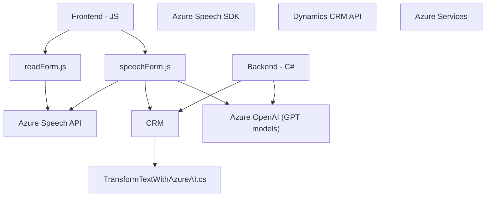

# **Análisis Técnico del Repositorio**

### Breve Resumen Técnico
El repositorio parece implementarse como una solución basada en APIs y scripts para la integración de capacidades de habla y texto mediante el uso de servicios de Azure (Speech SDK y OpenAI). La principal funcionalidad incluye:
1. Un sistema orientado a interactuar con formularios dinámicos en un entorno CRM (como Microsoft Dynamics) mediante reconocimiento de voz y síntesis de voz.
2. Un plugin para transformar texto en un JSON estructurado utilizando inteligencia artificial (Azure OpenAI).

---

### Descripción de la Arquitectura
La solución utiliza una **arquitectura n capas** con integración y consumo de servicios externos. Las principales capas y sus funciones incluyen:

1. **Frontend (JavaScript)**:
   - Maneja la interfaz de usuario. Extrae datos visibles de formularios, realiza síntesis de voz y reconocimiento de voz con datos dentro del CRM (Microsoft Dynamics).
   - Modularización de funciones enfocadas en tareas específicas.
   - Uso de Azure Speech SDK como servicio para convertir texto en voz (texto hablado) o viceversa.

2. **Backend (C# Plugin en Dynamics)**:
   - Amplía las capacidades del CRM añadiendo un plugin para transformar texto con Azure OpenAI. 
   - Utiliza servicios del CRM para obtener parámetros y operar sobre datos contextuales.
   - Maneja solicitudes HTTP para comunicar con el endpoint de Azure.

---

### Tecnologías Usadas
1. **Frontend (JavaScript)**:
   - JavaScript ES6: Principal lenguaje en los scripts que gestionan la interacción de voz con formularios CRM.
   - Azure Speech SDK: Para la síntesis y reconocimiento de voz.
   - Dynamics CRM: Para la gestión de formularios dinámicos y su contexto asociado.
   
2. **Backend (C#)**:
   - .NET Framework y Dynamics CRM SDK para crear extensiones dentro de un CRM.
   - Azure OpenAI API (con OpenAI models como GPT): Para transformar el texto utilizando procesamiento lingüístico avanzado.
   - Newtonsoft.Json para manipulación de JSON.

3. **Servicios Externos**:
   - Azure Speech SDK (`https://aka.ms/csspeech/jsbrowserpackageraw`).
   - Azure OpenAI GPT para inteligencia artificial aplicada en procesamiento de texto (`https://openai-netcore.openai.azure.com/`).

---

### Diagrama Mermaid (Estructura de Componentes)

---

### Conclusión Final
El repositorio implementa una solución **orientada a la integración de CRM con servicios de Azure**. El diseño combina componentes frontend escritos en JavaScript para interactuar con usuarios y formularios dinámicos, con un backend extensible mediante un plugin de Dynamics CRM que transforma textos utilizando **Azure OpenAI**. La arquitectura n capas asegura una separación clara entre presentación, lógica y consumo de APIs.

#### Principales puntos fuertes de la solución:
1. **Flexibilidad**: Uso de SDKs externos (Speech SDK, OpenAI API) para habilitar capacidades avanzadas.
2. **Modularidad**: Organiza funciones específicas en módulos independientes y extensibles.
3. **Escalabilidad**: La inclusión de servicios de Azure hace que la solución pueda adaptarse a mayores volúmenes de datos y funcionalidades futuras.

Este diseño está bien pensado para aplicaciones empresariales integradas con arquitecturas modernas basadas en servicios.