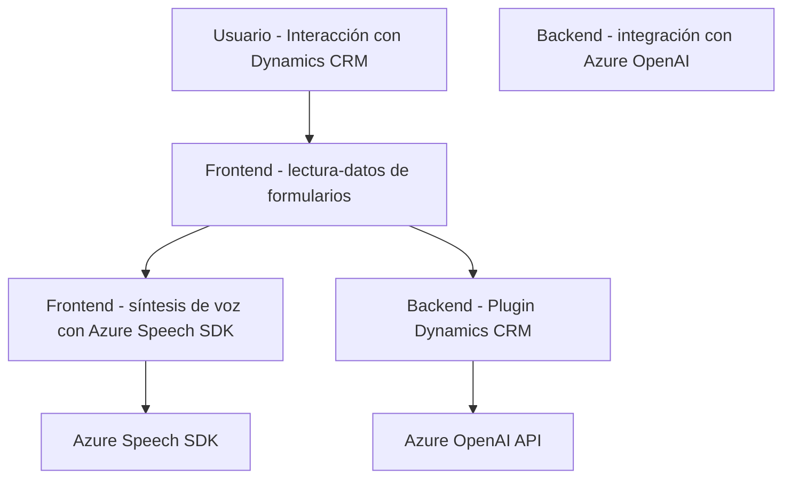

### Breve resumen técnico
El repositorio refleja una solución empresarial que integra interacción con usuarios a través de funcionalidades de síntesis (texto a voz) y reconocimiento de voz (voz a texto), en conjunto con el uso de inteligencia artificial (IA) para transformar texto. Está claramente orientado a entornos de Microsoft Dynamics CRM, con extensiones de cliente (JavaScript) y servidor (plugins .NET). Utiliza tecnologías de Microsoft Azure, específicamente Speech SDK y OpenAI, para ofrecer una experiencia rica en accesibilidad e inteligencia en la gestión de datos de formularios y otros procesos empresariales.

---

### Descripción de arquitectura
La arquitectura de la solución es híbrida. En el lado cliente, se tiene una arquitectura basada en n-capas, con archivos específicos de JavaScript para gestionar la interacción con el usuario, formularios dinámicos y servicios externos. En el lado del servidor, un plugin .NET cumple funciones específicas mediante el patrón de microservicio, delegando el procesamiento avanzado a APIs externas (Azure OpenAI).

1. **Frontend:** implementación de lógica en JavaScript que interactúa con el SDK de Azure Speech y la API de Dynamics CRM.
2. **Backend:** Plugin de Microsoft Dynamics CRM que consume APIs externas y encapsula lógica empresarial utilizando .NET.
3. **Integración con servicios externos:** Usa Azure Speech (SDK en frontend) y Azure OpenAI (API en backend), siguiendo el paradigma "backend-for-frontend".

---

### Tecnologías usadas
#### Frontend
- **JavaScript**:
  - **Azure Speech SDK**: Para síntesis y reconocimiento de voz.
  - **Microsoft Dynamics**: API cliente para formularios dinámicos.
  - **DOM API**: Manipulación dinámica de scripts.

#### Backend
- **.NET Framework/C#**:
  - Microsoft Dynamics SDK: Implementación de plugins con `IPlugin`.
  - `System.Net.Http`, `System.Text.Json`: Comunicación con APIs externas.
  - NewtonSoft JSON para manipulación de estructuras JSON avanzadas.

#### Externos
- **Microsoft Azure Speech SDK**: Gestor de síntesis y reconocimiento de voz.
- **Azure OpenAI Service**: Servicio REST que utiliza modelos de IA como GPT-4 para transformación de datos.

---

### Diagrama Mermaid válido para GitHub

---

### Conclusión final
El repositorio es una solución estructurada que adapta servicios de accesibilidad y IA en un sistema empresarial basado en Microsoft Dynamics CRM. Utiliza una combinación de tecnologías frontend (JavaScript) y backend (.NET), junto con integraciones modernas con Microsoft Azure. La arquitectura es modular y dividida en capas tanto en cliente como en servidor, adoptando principios de extensibilidad y reusabilidad que hacen posible su escalabilidad en entornos corporativos. Esta solución destaca por la fuerte integración con servicios externos para potenciar experiencia de usuario y capacidades de procesamiento, mientras sigue los estándares de diseño orientados a la modularidad y orientación a eventos.