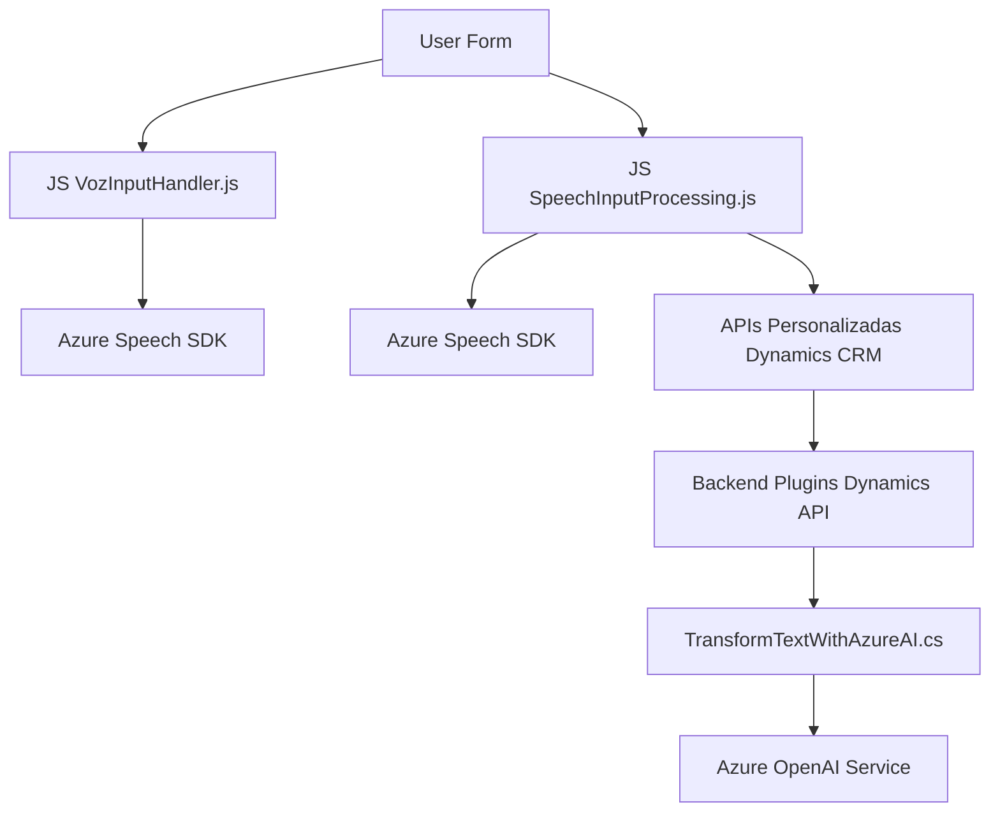

### Breve Resumen Técnico:
El repositorio define componentes relacionados con la interacción entre el usuario y Microsoft Dynamics 365 mediante procesamiento de formularios, voz y funciones de inteligencia artificial. Utiliza Azure Speech SDK para reconocimiento y síntesis de voz y el servicio Azure OpenAI para transformar texto en formatos útiles. Está implementado con una estructura modular y extensible, basada en configuraciones dinámicas y dependencias externas, con una clara separación entre lógica del frontend y la integración con APIs y servicios externos.

---

### Descripción de la Arquitectura:
1. **Tipo de solución**:
   - Combina **APIs y extensiones de Dynamics 365** con un frontend basado en **JavaScript** para manipular formularios.
   - Usa plugins para extender Dynamics CRM, junto con servicios de inteligencia artificial para obtener información estructurada desde texto.

2. **Tipo de arquitectura**:
   - **Dominio Distribuido**, dividido en dos capas principales:
     - **Frontend** (interfaz en JavaScript) para interactuar directamente con usuarios a través de formularios y voz, transformando la interacción en datos procesables.
     - **Backend/Plugins** en Dynamics CRM que actúan como **servicios auxiliares**, con capacidades para enriquecer y manipular datos en contexto.
   - La arquitectura aprovecha el patrón de **hexagonal** en los plugins de Dynamics CRM, utilizando servicios externos (Azure OpenAI y Speech SDK).

---

### Tecnologías, Frameworks y Patrones Usados:
1. **Tecnologías**:
   - Frontend: **JavaScript** (vanilla), DOM API.
   - Backend: **Microsoft Dynamics CRM SDK**.
   - Servicios externos: **Azure Speech SDK**, **Azure OpenAI**.

2. **Frameworks y Dependencias**:
   - `window.SpeechSDK`: SDK de Azure para síntesis y reconocimiento de voz.
   - **Dynamics CRM Web API**: Para obtener y manipular datos de la plataforma.
   - **Newtonsoft.Json** y **System.Text.Json**: Deserialización y manipulación de datos JSON en plugins.

3. **Patrones**:
   - **Factory Pattern**: Usado para inicializar objetos de configuración como `SpeechConfig` en Azure Speech SDK.
   - **Repository Pattern**: Métodos como `searchLookupByName` consultan entidades en Dynamics CRM.
   - **Fail-Safe Pattern**: Verificaciones dinámicas para manejar la ausencia del SDK.
   - **Hexagonal Architecture**: En los plugins, estableciendo límites claros entre la lógica interna y los servicios externos.
   - **Event Driven**: Manejo de eventos en el frontend desencadenados por interacciones con formularios o el reconocimiento de voz.

---

### Dependencias y Componentes Externos:
1. **Componentes externos identificados**:
   - **Azure Speech SDK**:
     - URL de carga dinámica: `https://aka.ms/csspeech/jsbrowserpackageraw`.
     - Usada en voz para síntesis y reconocimiento.
   - **Azure OpenAI Service**:
     - URL: `https://openai-netcore.openai.azure.com/`.
     - Modelo `gpt-4o` para transformar texto en JSON estructurado.
   - **Dynamics CRM Web API**:
     - Métodos: `Xrm.WebApi.online.execute` y `Xrm.WebApi.retrieveMultipleRecords`.
     - Interacción con datos de organizaciones en Microsoft Dynamics 365.
   - **HttpClient**: Usado para invocar servicios REST (plugin).

---

### Diagrama **Mermaid** Compatible con GitHub:

---

### Conclusión Final:
El repositorio implementa una solución bien pensada para trabajar con Microsoft Dynamics 365 y sus formularios, extendiendo sus funcionalidades con una capa de integración con tecnologías modernas como Azure Speech y OpenAI. Esto mejora la interacción entre los usuarios y la plataforma mediante el uso de voz e inteligencia artificial. Esta solución puede considerarse una combinación de **servicios distribuidos** (para AI y voz), con componentes modulares que optimizan el procesamiento de datos y la interacción del usuario.

La arquitectura es robusta, siguiendo patrones bien definidos para modularidad, escalabilidad y separación de responsabilidades. Sin embargo, algunos puntos como la gestión de claves de API deben mejorarse para asegurar la seguridad y confiabilidad del sistema.